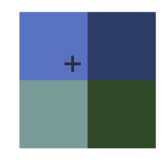
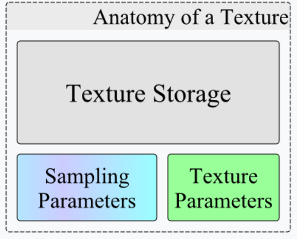

# Texture

> A **texture** is an [OpenGL Object](https://wikis.khronos.org/opengl/OpenGL_Objects) that contains one or more images that all have the same [image format](https://wikis.khronos.org/opengl/Image_Formats). A texture can be used in two ways: it can be the source of a texture access from a [Shader](https://wikis.khronos.org/opengl/Shader), or it can be used as a render target. 

**texture**是一种OpenGL object，有一个或者多张**images**，images有相同的format,有两个用途。

- 在shader中作为纹理源
- 作为render target

## Theory

**什么是images?**:

> an *image* is defined as a single array of pixels of a certain dimensionality (1D, 2D, or 3D), with a particular size, and a specific [format](https://wikis.khronos.org/opengl/Image_Formats). 

image被定义为具有特定维度、尺寸和格式的**像素数组**


texture是images的容器，但是并不存储它们。texture对images有约束，texture的三个特征就是约束的一部分：纹理类型、纹理大小和纹理保存的图像格式。

texture有很多不同的**类型** 详细见 https://wikis.khronos.org/opengl/Texture

- `GL_TEXTURE_{1|2|3}D{_ARRAY}`
- `GL_TEXTURE_BUFFER`
- 等等。

对于texture**大小**也是有限制的：

- 维度最大尺寸：`GL_MAX_TEXTURE_SIZE`

- 数组最大长度：`GL_MAX_ARRAY_TEXTURE_LAYERS `

- 3d特殊维度：`GL_MAX_3D_TEXTURE_SIZE`

建议使用2的次幂作为纹理大小 **why?** :

- mipmap生成 可以整除
- 内存对齐/寻址

**Mipmaps**

主要应对的就是屏幕像素和纹素的匹配问题：

例如一个物体对应的纹理是400x400, 当你拉远距离的时候，屏幕上显示的像素只有200x200。

此时一个像素要对应2x2的纹素。

**如何选择？  - filter**

- `GL_NEAREST` 临近选择
- `GL_LINEAR` 附近插值

再远的情况下：线性过滤会产生摩尔纹。就需要**mipmap**

针对不同层的mipmap选择也有nearest和linear。

每个 mipmap 在链中都是前一级尺寸的一半（向下取整），直至所有维度都缩减为 1。

32x8 -> 16x4 -> 8x2 -> 4x1 -> 2x1 -> 1x1。63x63 -> 31x31。

0层最大，依次减小。但是加载纹理的时候，可以不加载0层，但是必须是连续的层级，**滑动窗口**。

某些纹理类型具有**概念上独立**的mipmap链，比如array纹理中，每个image都有自己mipmap，但是只能设置一套mipmap参数，包含相同数量层级。

## Texture Objects



> 关于这里的组成是针对传统（普遍）意义的，对于opengl4.5+，现在有独立的sampler对象，负责存储采样规则。opengl也明确定义了如果纹理单元绑定了sampler对象，则使用sampler的采样参数。否则使用纹理对象自带的采样参数。

**Texture Completeness**

只有完整了之后，才可以在shader中采样、image load/store、将image绑定到framebuffer object.

下面几项完整了之后，才说texture是**完整的**.

- mipmap completeness
- cubemap completeness
- image format completeness
- sampler objects completeness

## Storage

【详见 texture storage】

## Parameters

`glTextureParameter`

这个函数可以同时为texture parameter和sampling parameters设置。但是后者通常由sampler object指定。

## Sampling parameters

采样是从纹理中指定位置获取数值的过程，glsl控制这主要流程，但是参数也会对此产生影响。

sampler object会覆盖sampling parameters。

## Texture image units

类似于buffer objects和index targets(`glBindBufferBase()`）的关系。

texture可以绑定到多个units。`GL_MAX_COMBINED_TEXTURE_IMAGE_UNITS `

`void glBindTextureUnit(GLuint unit, GLuint texture)`

一个unit支持绑定所有目标，一个texture也可以绑定到多个unit。**那渲染的时候用哪个纹理呢？**

这是由glsl中的sampler类型决定的。

**注意:**最好不要这样做！不同sampler不要采样相同的unit。不同的texture也不要绑定到相同的unit。

## glsl binding

在shader中作为纹理源，是文章开头所说的texture两种用途之一。为了使用，需要特定语法来暴露texture binding points。

- **Sampler**

Sampler是一中uniform，表示可访问的纹理。类型和texture的类型相对应。

Sampler需要配合glsl的纹理访问函数使用。

需要为Sampler配置前述的unit才可以访问这个unit上的texture。

【详见 glsl中的 Sampler】

- **Images**

除了sampler，还有image这一uniform

配合image load/store functions使用

同理也需要配置unit但是这个**image unit != texture image unit** 这是一个独立的unit。

` void glBindImageTexture(GLuint unit, GLuint texture, GLint level, GLboolean layered, GLint layer, GLenum access, GLenum format);`

【详见 image load/store】

## render targets

【详见 framebuffer objects】


## others

### 关于filter

- nearest最近邻选择距离采样点最近的texel
- linear对采样点周围的4个texel插值

生成mipmap（适用于MIN_FILTER）

还有针对mipmap的插值方式。

- 各向异性过滤，对于当视角和表面夹角过大，采样的时候x,y方向梯度变化不同，所以要采用各向异性的mipmap


### 区分

**unit:**（资源槽）

 GL_TEXTUREX 纹理单元或image unit。对于uniform image就不多说了，设置image unit.

uniform sampler的value就是texture unit，表示从哪一个纹理单元去采样。

一个texture unit可以同时有一个texture和一个sampler object.

layout(binding)就是用来设置这个unit（value)

**location:**（uniform自身属性）

用于在程序中找到这个uniform,由编译器分配或者使用layout(location)

**注意：** image和texture不共用unit,有image unit和texture unit

| 绑定操作                                  | 层级                              | 职责                                               | 说明                           |
| ----------------------------------------- | --------------------------------- | -------------------------------------------------- | ------------------------------ |
| `glUniform1i()` / `layout(binding)`       | **Shader 层 → Texture Unit**      | 告诉 shader：这个 sampler uniform 对应哪号纹理单元 | 它只是编号映射，不涉及具体纹理 |
| `glBindTextureUnit()` / `glBindTexture()` | **Texture Unit → Texture Object** | 把纹理对象挂在某个单元上                           | 决定采样数据来源               |
| `glBindSampler()`                         | **Texture Unit → Sampler Object** | 把采样参数（wrap/filter 等）挂到单元上             | 决定采样方式                   |

传统做法：

```
glactivetexutre
glbindtexture
glbindsampler
gluniform1i
```

现在：

```
glbindtextureunit
glbindsampler
```


绑定点设置遵循后覆盖原则。

layoutbinding发生在编译阶段，gluniform发生在运行阶段，所以后者会覆盖前者。

### 关于mipmap

开启opengl mipmap机制可以根据相机距离的远近自动选择合适的mipmap层级。

本质是通过计算相邻像素之间的梯度来选取mipmap层级。（相邻像素在gpu中会同一时刻并行运行，所以可以使用相邻数据。像素块渲染）。

在顶点着色器中就无法自动计算了可以使用textureLod或者textureGrad自行计算梯度或者Lod来选取mipmap等级。

**一些api**：

``` texture```

纹理坐标[0,1]

```textureLod```

同上，需要指定lod级别

```texelFetch```

传入的坐标范围[0, texturesize - 1]

返回值是原始像素值，**没有过滤**，一般用于计算着色器。（过滤指插值结果）

```textureGrad```

纹理坐标[0,1]

- 有mipmap时

gpu自动会计算梯度并选择mipmap层级，但是这里手动指定梯度。

这个梯度指的是纹理坐标在**屏幕空间**x方向和y方向的偏导数。是uv到texel坐标的一个映射。然后对这个映射函数求偏导数。

本身没有各向异性过滤的效果，等同于textureLod()，只是用来制定选择lod的层级。

- 无mipmap时

等效于texure()梯度没有作用

**mipmap占用空间**：

每一级别的原始分辨率是上一级的四分之一（每一维度的一半）。

Mipmap 内存占用 =  M/4 + M/16 + M/64 + ... 

求和的到三分之一。
