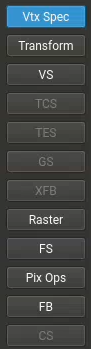

nsight上的截图，大概就是这么个流程。

- **Vertex Specification 顶点规范**
  - [Vertex Rendering 顶点渲染](https://wikis.khronos.org/opengl/Vertex_Rendering)
  - [Primitive 图元](https://wikis.khronos.org/opengl/Primitive)
- [Vertex Processing 顶点处理](https://wikis.khronos.org/opengl/Vertex_Processing)
  - [Vertex Shader 顶点着色器](https://wikis.khronos.org/opengl/Vertex_Shader)
  - [Tessellation 曲面细分](https://wikis.khronos.org/opengl/Tessellation)
  - [Geometry Shader 几何着色器](https://wikis.khronos.org/opengl/Geometry_Shader)
- [Vertex Post-Processing 顶点后处理](https://wikis.khronos.org/opengl/Vertex_Post-Processing)
  - [Transform Feedback 变换反馈](https://wikis.khronos.org/opengl/Transform_Feedback)
- [Primitive Assembly 图元装配](https://wikis.khronos.org/opengl/Primitive_Assembly)
  - [Face Culling 面剔除](https://wikis.khronos.org/opengl/Face_Culling)
- [Rasterization 光栅化](https://wikis.khronos.org/opengl/Rasterization)
- [Fragment Shader 片段着色器](https://wikis.khronos.org/opengl/Fragment_Shader)
- [Per-Sample Processing 逐采样处理](https://wikis.khronos.org/opengl/Per-Sample_Processing)
  - [Scissor Test 裁剪测试](https://wikis.khronos.org/opengl/Scissor_Test)
  - [Stencil Test 模板测试](https://wikis.khronos.org/opengl/Stencil_Test)
  - [Depth Test 深度测试](https://wikis.khronos.org/opengl/Depth_Test)
  - [Blending 混合](https://wikis.khronos.org/opengl/Blending)
  - [Logical Operation 逻辑运算](https://wikis.khronos.org/opengl/Logical_Operation)
  - [Write Mask 写入掩码](https://wikis.khronos.org/opengl/Write_Mask)