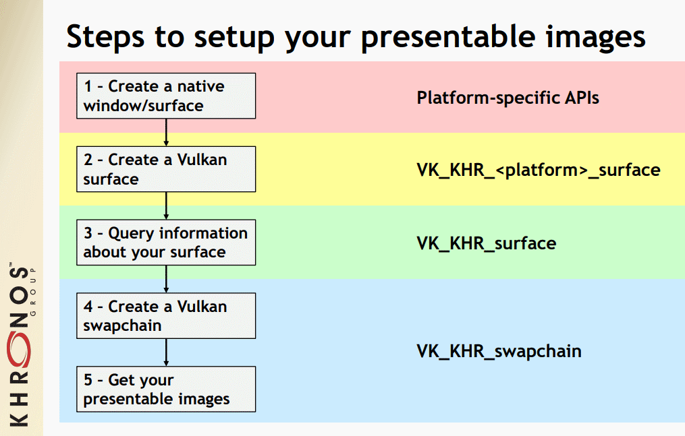

# presentation

## window surface

### 一些概念

- native window / window system 操作系统层面，窗口如何呈现于屏幕。还负责鼠标交互、关闭打开等management
  - wayland
  - x11
  - HWND on Windows

- WSI(window system Integration):Vulkan API extensions 用于连接渲染API和window system的，是桥梁。



平台无关的`VkSurfaceKHR`，是一个跨平台的抽象，传入具体平台的handles，后续就可以通过这个object，来和window system交互。

每个platform都需要自己的扩展和自己的方式来创建object传入这个抽象的surface。

- Libraries 封装了上述两层。对于vulkan API直接调用`glfwCreateWindowSurface`就可以得到抽象窗口，不用关心平台。
  - GLFW
  - SDL

**`VK_KHR_surface` 是instance级别的扩展**

### creation

```c++
surface = vk::raii::SurfaceKHR(instance, c_surface);
```

创建需要在instance create之后立即执行，因为可能会影响physical device的选择。

由于glfw只接受c的形式，所以需要先创建`vkSurfaceKHR`再来构建raii的形式。

### querying for presentation support

需要支持presentation的**queue family**，一般来说之前找的支持图形渲染的管线都有这个功能，但是还是需要检验一下

```C++
physicalDevice.getSurfaceSupportKHR(qfpIndex, *surface)
```

这也是为什么我们需要在physical device选择之前创建surface。

### presentation queue

同之前，physical device查是否支持，那么在logical device里面就要选出来。

## swap chain

vulkan没有default framebuffer。需要一个infrastructure来own buffers让我们渲染到这里，然后再呈现到屏幕上。这个infrastructure就是swap chain。

**本质是一个等待呈现到屏幕的图像队列，目的是和皮哦那光幕的刷新率同步**

application从swap chain中拿，画好了再返回去。

### check support

`VK_KHR_swapchain`

之前已经列出了

```c++
std::vector<const char *> requiredDeviceExtension = {
	    vk::KHRSwapchainExtensionName};
```

extension check

### enable

之前已经做过

```c++
.enabledExtensionCount = static_cast<uint32_t>(requiredDeviceExtension.size()),
			.ppEnabledExtensionNames = requiredDeviceExtension.data(),
```

### querying details

swap chain需要和我们的surface兼容，因此在创建swap chain的时候要设置很多的信息。

- basic: swap chain中image的数量限制、尺寸限制

`auto surfaceCapabilities = physicalDevice.getSurfaceCapabilitiesKHR( *surface );`

- surface format

`std::vector<vk::SurfaceFormatKHR> availableFormats = physicalDevice.getSurfaceFormatsKHR( surface );`

- 呈现模式(mode)

`std::vector<vk::PresentModeKHR> availablePresentModes = physicalDevice.getSurfacePresentModesKHR( surface );`

这些信息后续都需要包含在结构体中。


在查询后，我们需要从这些vector中选取我们需要的

- surface format

每个 `vk::SurfaceFormatKHR` 条目都包含一个 `format` 和一个 `colorSpace` 成员。

```c++
const auto formatIt = std::ranges::find_if(
    availableFormats,
    [](const auto &format) { return format.format == vk::Format::eB8G8R8A8Srgb && format.colorSpace == vk::ColorSpaceKHR::eSrgbNonlinear; });
}
```

- present mode
  - `vk::PresentModeKHR::eImmediate` application提交的images，立即传输到屏幕
  - `vk::PresentModeKHR::eFifo` FIFO规则，显示器刷新从队列头部取出一个。类似垂直同步。队列满了就等待。**此项一定保证可用**
  - `vk::PresentModeKHR::eFifoRelaxed` 和上面一样，只不多，当队列空的时候，如果新的image来了，不会等待显示器刷新，而是立即进行传输。
  - `vk::PresentModeKHR::eMailbox` 第二中的变体，队列满的时候不等待，直接替换。三重缓冲。是一种折中。这种方案能耗较高，手机上需要选用第二种。
- basic(swap extent)

就是swap chain image的分辨率，几乎总是等于window的分辨率，通过`capabilities.currentExtent`直接拿到。

一些window manager会将currentExtent设置为uint32_t的最大值，表明你可以自己在`minImageExtent`和`maxImageExtent`自己选一个值。

**屏幕与像素**

`glfwCreateWindow(800, 600, ...)`，这里的是屏幕坐标。

在一些高DPI的显示器上，一个屏幕坐标可能对应多个实际物理像素数量 1600×1200。

swap chain extent要求的是像素坐标，而不是屏幕坐标，否则对于这些高DPI显示器，相当于只渲染了实际分辨率的四分之一。

所以说在自己选择值的时候要注意使用`glfwGetFramebufferSize`,而不是`glfwGetWindowSize`

### create

和instance\device等创建类似，需要指定一个庞大的createinfo，除了上述主要属性以外，还需要一些其他属性

- minImageCount
- imageArrayLayers image的layer数
- imageUsage 何种操作？比如colorattachment。
- imageSharingMode 在多个queue families中使用swap chain
  - `vk::SharingMode::eExclusive` 一个image一次只能被一个queue family拥有，需要显式的所有权转移
  - `vk::SharingMode::eConcurrent ` 可以共享，无需显式的所有权转移
- preTransform 对图形应用某种变换，如水平翻转。
- compositeAlpha 是否使用alpha和其他窗口（window system中的）进行混合（eOpaque忽略）
- clipped 裁剪窗口遮挡
- odlSwapchain

**swapChain是device级别**

```c++
vk::raii::SwapchainKHR swapChain       = vk::raii::SwapchainKHR( device, swapChainCreateInfo );
std::vector<vk::Image> swapChainImages = swapChain.getImages();
```


## image views

如果要使用`vk::Image`，我们必须创建一个`vk::raii::ImageView`对象（如何访问？访问哪一部分？是否把它当作有mipmap？）

```c++
std::vector<vk::raii::ImageView> swapChainImageViews;
```

其同样需要`vk::ImageViewCreateInfo`

- viewType 2D
- format 我们先前创建swapchain指定其中image格式直接拿来用就可以了。
- subResourcerange 描述了图像的用途（比如作为color)、levelcount(mipmap)、layercount。结构体
- components 重新排列颜色通道。结构体

### create

```c++
vk::raii::CreateImageView imageView(device, imageViewCreateInfo);
// 也可以通过emplace_back实现构造
swapChainImageViews.emplace_back( device, imageViewCreateInfo );
```

image view已经足以用作texture,但是还不能作为render rarget（需要创建framebuffer)
