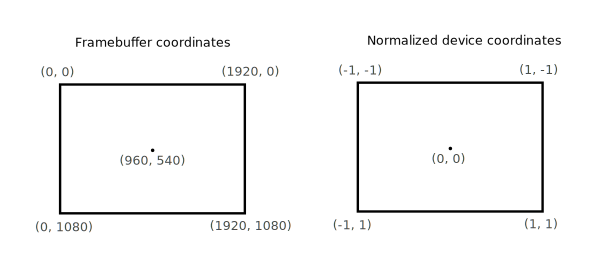
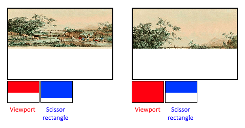

# Pipeline

## Introduction


- input assembler 从buffer收集原始顶点数据。
- tessellation shader subdivide geometry to increase mesh quality
- geometry shader.在图元上运行，丢弃该图元或者输出更多的图元。在除了intel集成GPU外的大多数显卡上，性能不理想。被**mesh shader**管线来替代。和光线追踪一样，是一种全新的管线方案。
- color blend是固定的。不同于opengl，不可随意更改管线设置。

vulkan的图形管线几乎是**completely immutable**。如果想要更改shader、绑定不同的framebuffer、设置blend func，都必须重新创建管线。

pros: **承诺语义** 减少驱动程序开销，更好的优化。

cons:操作繁琐。

## shader modules

vulkan必须指定字节码format：SPIR-V（专门为vulkan设计的）

有了统一的byte code，就有了标准，对于shader在不同gpu上的行为会更加一致。同时也降低了GPU厂商编写compiler的复杂度(shader code -> native code).

SPIR-V是一种强类型的IR，语义明确定义。而glsl是一种文本语言，可解释空间大。

### vertex shader



对于NDC，xy的范围和OpenGL一致但是y坐标翻转，z范围变成了[0,1].

入口：`vertMain` slang支持多个入口。返回值是输出

对于slang并没有采用内置变量，而是一种语义标注的方式：

`SV_VertexID` 当前顶点索引。

`SV_Position` 相当于gl_Position，输出clip space 的位置。

```c++
float4 sv_position : SV_Position;
float4 fragMain(VertexOutput inVert) : SV_Target
```

支持创建shader modules

### fragment shader

入口：`fragMain` 需要指定SV_target，返回值是颜色。参数接收顶点的输出。

输入输出是通过location指定的索引链接在一起的。

### loading

编译通过slangc编译为spv，loading的不是slang原文本，而是编译后的spv。

最终得到的是`std::vector<std::byte> buffer`。

具体文件操作可以参考【fstream】

### creating shader modules

在loading以后我们需要将其封装到`vk::raii::ShaderModule`对象中，才能传递到管线。

shadermodule同样需要createinfo。但是信息就很少了，只需要一个指针和大小。

```c++
vk::ShaderModuleCreateInfo createInfo{ 
    .codeSize = code.size() * sizeof(char), 
    .pCode = reinterpret_cast<const uint32_t*>(code.data()) 
};
```

spir-v的基本单元是32-bit word四个字节，以uint32_t组织。需要做类型转换。

> 但是这里有一个“匪夷所思”的点就是codesize 和 pcode的不一致，按理说codesize应该也以uint32_t为单位进行计算。

shader modules也是**device**级别的。

**notes**

编译链接spirv的行为知道图形管线创建才会发生，而且发生后就没用了。

所以可以作为创建图形管线函数中的局部变量。

### creating shader stage

使用`vk::PipelineShaderStageCreateInfo`传递给管线。

```c++
vk::PipelineShaderStageCreateInfo vertShaderStageInfo{ 
    .stage = vk::ShaderStageFlagBits::eVertex, 
    .module = shaderModule,  
    .pName = "vertMain" 
};
vk::PipelineShaderStageCreateInfo fragShaderStageInfo{ 
    .stage = vk::ShaderStageFlagBits::eFragment, 
    .module = shaderModule, 
    .pName = "fragMain" 
};
vk::PipelineShaderStageCreateInfo shaderStages[] = {vertShaderStageInfo, fragShaderStageInfo};
```


创建好结构体数组后就完成了，稍后会被管线引用。

## Fixed functions

在旧的API中为pipeline的大多数stage提供了默认状态，但是在vulkan中你必须显式提供。这些状态将会保存到pipeline state object.

### dynamic state

**`vk::PipelineDynamicStateCreateInfo`**

大部分的管线状态是固定的，但是有一些仍然是dynamic的，可以不用重新创建pipeline就可以修改，比如：

- viewport
- 线宽
- blend constants

想要使用dynamic state，需要你配置相关createinfo并且在绘制时指定数据（这两个步骤是必须的）。

```c++
std::vector<vk::DynamicState> dynamicStates = {vk::DynamicState::eViewport, vk::DynamicState::eScissor};

vk::PipelineDynamicStateCreateInfo dynamicState{
    .dynamicStateCount = static_cast<uint32_t>(dynamicStates.size()), 
    .pDynamicStates = dynamicStates.data()
};
```

### vertex input

**`vk::PipelineVertexInputStateCreateInfo`**

描述了传递给vs的顶点数据格式：

- binding: 数据之间的间距以及是否实例化 `pVertexBindingDescriptions`
- attribute: 属性、从哪个binding加载以及offset `pVertexAttributeDescriptions`

### input assembly

**`vk::PipelineInputAssemblyStateCreateInfo`**

描述了：

- 图元类型 `.topology`
- 是否启用图元重启 `.primitiveRestartEnable`

例如：`vk::PrimitiveTopology::eTriangleStrip`

按索引从vertex buffer/element buffer加载。

### viewports and scissors

```c++
vk::Viewport viewport{0.0f, 0.0f, static_cast<float>(swapChainExtent.width), static_cast<float>(swapChainExtent.height), 0.0f, 1.0f};
```

后面的0.0f和1.0f就是minDepth maxDepth，在几乎所有情况下，它们都应该是这个值。

viewport定义了transformation from the **image** to the **framebuffer**

```c++
vk::Rect2D scissor{vk::Offset2D{ 0, 0 }, swapChainExtent};
```

scissor是裁剪。



**固定设置**

```c++
vk::PipelineViewportStateCreateInfo viewportState{
    .viewportCount = 1, 
    .pViewports = &viewport, 
    .scissorCount = 1, 
    .pScissors = &scissor
};
```

之后如果想更改，需要在新管线中重新创建。

**动态设置**
参考dynamicstate设置完毕以后，只指定数量即可

```c++
vk::PipelineViewportStateCreateInfo viewportState{
    .viewportCount = 1, 
    .scissorCount = 1
};
```

### rasterizer

vulkan中的光栅化，做了很多opengl中vertex post-processing阶段以及per-sample testing的事情。

**`vk::PipelineRasterizationStateCreateInfo`**

depth test/face culling/scissor 全部提前在这个阶段执行

```c++
vk::PipelineRasterizationStateCreateInfo rasterizer{.depthClampEnable        = vk::False,
                                                    .rasterizerDiscardEnable = vk::False,
                                                    .polygonMode             = vk::PolygonMode::eFill,
                                                    .cullMode                = vk::CullModeFlagBits::eBack,
                                                    .frontFace               = vk::FrontFace::eClockwise,
                                                    .depthBiasEnable         = vk::False,
                                                    .lineWidth               = 1.0f};
```

- `depth_clamp` 和OpenGL中在post-processing中的一样
- `rasterizerDiscardEnable` 是否禁用对framebuffer的任何输出 和`GL_RASTERIZER_DISCARD`一样。可以用于测试前半段性能。
- `polygonMode` 线框绘制等等
- `cullmode` 剔除三角形正反面
- `frontface` 环绕方式
- `depthBiasEnable` 添加一个偏移来修改深度值。可能用于阴影映射。
- `lineWidth`

**`vk::PipelineMultisampleStateCreateInfo`**

```c++
vk::PipelineMultisampleStateCreateInfo multisampling{
    .rasterizationSamples = vk::SampleCountFlagBits::e1, 
    .sampleShadingEnable = vk::False
};
```

**`vk::PipelineDepthStencilStateCreateInfo`**

还需要stencil/depth buffer。

### color blending

片段输出颜色与framebuffer中的颜色进行组合。

- mix old and new

or

- bitwise old and new

有两个对应结构体`vk::PipelineColorBlendAttachmentState` & `vk::PipelineColorBlendStateCreateInfo`

前者是per-framebuffer（mix)后者是全局的可设置blend constant (bitwise)。

1) 执行过程：

```c++
if (blendEnable) {
    finalColor.rgb = (srcColorBlendFactor * newColor.rgb) <colorBlendOp> (dstColorBlendFactor * oldColor.rgb);
    finalColor.a = (srcAlphaBlendFactor * newColor.a) <alphaBlendOp> (dstAlphaBlendFactor * oldColor.a);
} else {
    finalColor = newColor;
}

finalColor = finalColor & colorWriteMask;
```

这里面

`srcColorBlendFactor` `dstColorBlendFactor` `colorBlendOp`  `srcAlphaBlendFactor`  `dstAlphaBlendFactor` `alphaBlendOp`  `colorWriteMask`都是结构体里面设置的。

2) (OpenGL中的logical op)

```c++
vk::PipelineColorBlendStateCreateInfo colorBlending{
    .logicOpEnable = vk::False, 
    .logicOp = vk::LogicOp::eCopy, 
    .attachmentCount = 1, 
    .pAttachments = &colorBlendAttachment
};
```

将自动禁用第一种方法。


### pipeline layout

uniform可以动态调整，无需重新创建。它们需要一个`vk::PipelineLayout`对象来指定。

```c++
vk::raii::PipelineLayout pipelineLayout = nullptr;
vk::PipelineLayoutCreateInfo pipelineLayoutInfo{
    .setLayoutCount = 0, 
    .pushConstantRangeCount = 0
};
pipelineLayout = vk::raii::PipelineLayout(device, pipelineLayoutInfo);
```

