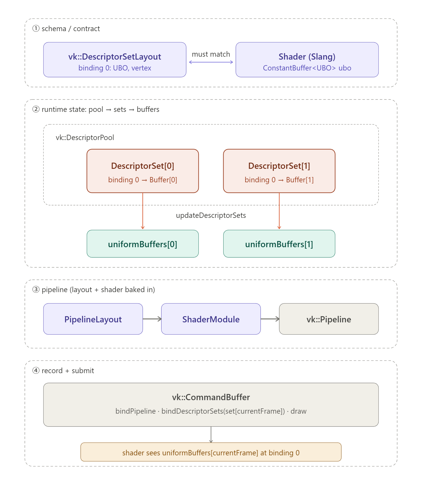

## intro

我们现在可以为每个顶点传递任意的attribute，但是我们如何传递一个全局的变量呢？比如matrix这种全局且可能每帧变换。

**resource descriptors**能帮助我们解决这个问题，一个descriptor可以让shader自由的访问像buffers和images这样的资源。descriptor的使用方法包括以下三个部分：

- 在pipeline创建的时候指定descriptor set layout
- 从descriptor pool中分配一个descriptor sets
- 在渲染的时候绑定descriptor sets

descriptor set layout指定了resources的类型，就像render pass明确attachments的类型一样。

descriptor set指定了将要绑定到descriptor的实际buffer，就像framebuffer指定了绑定到attachments的image view。

最后就是像vertex buffer那样，在draw call中被绑定。


descriptors有很多类型，这里使用的是uniform buffer objects descriptors. 

```c++
struct UniformBufferObject {
    glm::mat4 model;
    glm::mat4 view;
    glm::mat4 proj;
};
```

有这样一个结构体，我们把数据copy到一个buffer中。然后通过UBO descriptor在shader进行访问。

```glsl
struct UniformBuffer {
    float4x4 model;
    float4x4 view;
    float4x4 proj;
};
// [[vk::binding(0, 0)]] 显式控制 对于attribute同理[[vk::location(0)]]
ConstantBuffer<UniformBuffer> ubo;
```

slang的语法：

```
ConstantBuffer<T> -> ubo
Texture2D → sampled image
SamplerState → sampler
RWStructuredBuffer<T> → storage buffer
RWTexture2D → storage image
```

slang会自动分配set和binding编号。

## descriptor set layout

glm可以精确匹配shader中的类型，我们可以直接把UniformBufferObject memcpy 到一个vkbuffer中。

我们需要为shader使用的每一个descriptor binding提供详细信息，就像为每个attribute提供location一样。

```C++
void createDescriptorSetLayout() {}
```

每个binding都需要通过`VkDescriptorSetLayoutBinding`来描述

```c++
vk::DescriptorSetLayoutBinding uboLayoutBinding(0, vk::DescriptorType::eUniformBuffer, 1, vk::ShaderStageFlagBits::eVertex, nullptr);
```

- `binding` 对应一整个uniform buffer的binding
- `descriptorType` ubo\ssbo\image\sampler等等
- `descriptorCount ` 数组的长度 比如`layout(binding = 0) uniform sampler2D textures[8]; // descriptorCount = 8`
- `shaderStage`
- `pImmutableSamplers` 只对 `eSampler` 和 `eCombinedImageSampler` 类型有意义

所有的binding最后组合成一个`vkDescriptorSetLayout`

```c++
vk::DescriptorSetLayoutCreateInfo layoutInfo{.bindingCount = 1, .pBindings = &uboLayoutBinding};
vk::raii::DescriptorSetLayout descriptorSetLayout = vk::raii::DescriptorSetLayout(device, layoutInfo);
```


在pipeline创建的过程中，我们需要指定descriptor layout来告诉shader使用哪些descriptor.

```c++
vk::PipelineLayoutCreateInfo pipelineLayoutInfo{ .setLayoutCount = 1, .pSetLayouts = &*descriptorSetLayout, .pushConstantRangeCount = 0 };
```

```c++
PipelineLayoutCreateInfo -> DescriptorSetLayout -> DescriptorSetLayoutBinding
    											-> DescriptorSetLayoutBinding
    											-> ...
    					 -> DescriptorSetLayout
    					 -> ...
```


## uniform buffer

和创建其他buffer的流程一样，但是这里不需要staging buffer，因为我们每一帧都要更新数据。

和command buffer等资源一样,uniform buffer也需要为并行帧做好准备，而具有多个副本。

```c++
std::vector<vk::raii::Buffer> uniformBuffers;
std::vector<vk::raii::DeviceMemory> uniformBuffersMemory;
std::vector<void*> uniformBuffersMapped;
```

```c++
void createUniformBuffers() {
    uniformBuffers.clear();
    uniformBuffersMemory.clear();
    uniformBuffersMapped.clear();

    for (size_t i = 0; i < MAX_FRAMES_IN_FLIGHT; i++) {
        vk::DeviceSize bufferSize = sizeof(UniformBufferObject);
        vk::raii::Buffer buffer({});
        vk::raii::DeviceMemory bufferMem({});
        createBuffer(bufferSize, vk::BufferUsageFlagBits::eUniformBuffer, vk::MemoryPropertyFlagBits::eHostVisible | vk::MemoryPropertyFlagBits::eHostCoherent, buffer, bufferMem);
        uniformBuffers.emplace_back(std::move(buffer));
        uniformBuffersMemory.emplace_back(std::move(bufferMem));
        uniformBuffersMapped.emplace_back( uniformBuffersMemory[i].mapMemory(0, bufferSize));
    }
}
```


我们在创建缓冲区后立即使用 `vkMapMemory` 进行映射，以获得一个指针，以便后续写入数据。该缓冲区在整个应用程序生命周期内都将保持与此指针的映射状态。这种技术被称为**“持久映射”**，在所有 Vulkan 实现中均可使用。由于映射操作本身存在开销，避免每次更新缓冲区时都重新映射能够有效提升性能。

## updating uniform data

就是对每个变换矩阵进行更新变化。最后在copy数据到buffer中

```c++
memcpy(uniformBuffersMapped[currentImage], &ubo, sizeof(ubo));
```


## descriptor pool

我们需要将为每个vkbuffer创建descriptor set来绑定到layout中声明的ubo descriptor.

```c++
DescriptorSet[0]  ──指向──>  uniformBuffers[0]  (第 0 帧用)
DescriptorSet[1]  ──指向──>  uniformBuffers[1]  (第 1 帧用)
```

两个 descriptor set **共用同一个 layout**(形状一样),但里面填的 buffer 不同。

**Notes**

**1. `VkDescriptorSetLayout`—— 模板/蓝图**

它只描述"形状":在 binding=0 位置有一个 uniform buffer,给 vertex shader 用。它不包含任何实际的 buffer,只是一个类型声明。可以理解成 C++ 里的 `struct` 定义。

**2. `VkBuffer`—— 实际的 GPU 内存**

里面存着真正的数据,比如 MVP 矩阵。它本身不知道自己会被绑定到哪个 binding 点。

**3. `VkDescriptorSet`—— 填好的实例**

按照 layout 的"形状"创建出来的一个实例,并且**告诉 Vulkan "binding=0 这个位置具体用哪个 VkBuffer"**。类比 C++ 就是按 struct 定义出的一个具体对象,字段都填上了值。


descriptor set 和cmd buffer一样需要从pool中进行分配

首先使用pool size描述这个pool里**每种类型的descriptor**总共有多少个

```
vk::DescriptorPoolSize poolSize(vk::DescriptorType::eUniformBuffer, MAX_FRAMES_IN_FLIGHT);
```

同样需要create info

```
vk::DescriptorPoolCreateInfo poolInfo{ .flags = vk::DescriptorPoolCreateFlagBits::eFreeDescriptorSet, .maxSets = MAX_FRAMES_IN_FLIGHT, .poolSizeCount = 1, .pPoolSizes = &poolSize };
```

maxset指定的是有多少个descriptor sets

```
descriptorPool = vk::raii::DescriptorPool(device, poolInfo);
```

## descriptor set

```c++
std::vector<vk::DescriptorSetLayout> layouts(
    MAX_FRAMES_IN_FLIGHT, *descriptorSetLayout);

vk::DescriptorSetAllocateInfo allocInfo{
    .descriptorPool     = *descriptorPool,
    .descriptorSetCount = MAX_FRAMES_IN_FLIGHT,
    .pSetLayouts        = layouts.data()
};
```

`vkAllocateDescriptorSets` 的设计是:**一次调用可以分配多个 set,每个 set 可以有各自不同的 layout**。所以 API 要求你传一个 layout 数组,长度 = 要分配的 set 数量。

在本例里,我们要分配 2 个 set,而且它们**形状完全一样**(都是"一个 UBO"),所以这个数组就是同一个 layout 重复 2 次。`std::vector` 的构造函数 `(count, value)` 刚好做这件事——创建一个 2 元素的 vector,每个元素都是 `*descriptorSetLayout`。

```c++
vk::raii::DescriptorPool descriptorPool = nullptr;
std::vector<vk::raii::DescriptorSet> descriptorSets;

...

descriptorSets.clear();
descriptorSets = device.allocateDescriptorSets(allocInfo);
```

现在我们要为每个descriptor set指定buffer

```c++
for (size_t i = 0; i < MAX_FRAMES_IN_FLIGHT; i++) {
    vk::DescriptorBufferInfo bufferInfo{
        .buffer = *uniformBuffers[i],
        .offset = 0,
        .range  = sizeof(UniformBufferObject)
    };

    vk::WriteDescriptorSet descriptorWrite{
        .dstSet          = *descriptorSets[i],
        .dstBinding      = 0,                                 // 对应 shader 里 binding = 0
        .dstArrayElement = 0,
        .descriptorCount = 1,
        .descriptorType  = vk::DescriptorType::eUniformBuffer,
        .pBufferInfo     = &bufferInfo
    };

    device.updateDescriptorSets(descriptorWrite, nullptr);
}
```

**RAII 对象管理生命周期,需要传给 C API 风格字段时,用 `*` 拿出原始句柄**。

```
			  ┌──────────────────────────┐
              │  DescriptorSetLayout     │   ← 只是个"形状"声明
              │  binding 0: UBO, vertex  │
              └──────────────────────────┘
                         ▲  ▲
                         │  │ (两个 set 共享同一个 layout)
                         │  │
         ┌───────────────┘  └───────────────┐
         │                                  │
  ┌──────────────┐                  ┌──────────────┐
  │ DescSet[0]   │                  │ DescSet[1]   │ 
  │ binding 0 ──┐│                  │ binding 0 ──┐│
  └─────────────┼┘                  └─────────────┼┘
                │                                  │
                ▼                                  ▼
       ┌─────────────────┐               ┌─────────────────┐
       │ uniformBuffer[0]│               │ uniformBuffer[1]│
       │  (第 0 帧用)     │               │  (第 1 帧用)     │
       └─────────────────┘               └─────────────────┘

                  ┌────────────────────┐
                  │ DescriptorPool     │  ← DescSet[0] 和 [1] 都从这里分配
                  │ maxSets = 2        │
                  │ UBO 描述符 = 2     │
                  └────────────────────┘
```

**Notes**

一个 set 里有多个 binding,每个 binding 包含一个或多个 descriptor。一个 buffer 可以被多个 descriptor 共享,一个descriptor指向某个buffer的某个范围。

```
DescriptorSet
├── binding 0 (UBO)  ──> cameraBuffer      (相机矩阵)
├── binding 1 (UBO)  ──> lightBuffer       (灯光数据)
└── binding 2 (SSBO) ──> particleBuffer    (粒子数据)
```


## use

```c++
commandBuffers[frameIndex].bindDescriptorSets(vk::PipelineBindPoint::eGraphics, pipelineLayout, 0, *descriptorSets[frameIndex], nullptr);
commandBuffers[frameIndex].drawIndexed(indices.size(), 1, 0, 0, 0);
```

与顶点缓冲区和索引缓冲区不同，描述符集并非图形管线独有。因此，我们需要指定是将描述符集绑定到图形管线还是计算管线。


所以DescriptorSet描述的是某一帧，shader所用的资源的信息，它和其他概念是独立的：

- 资源本身(buffer / image / sampler 是各自独立创建和管理的)

- Layout(layout 只是形状声明,和具体资源无关)

- Pipeline(pipeline 只通过 layout 知道"形状",不知道具体填了什么)

**把"资源是什么"和"资源怎么被 shader 访问"分开**。


