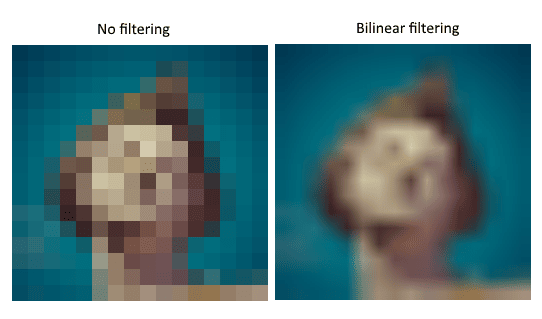
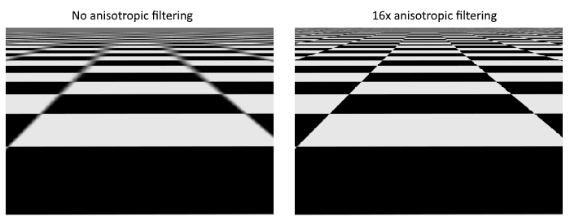
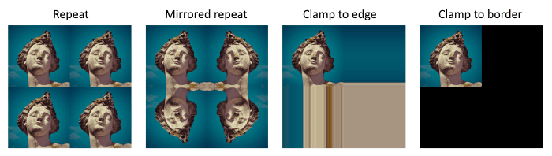

sample an image还需要两个额外的resource，一个是image view一个是sampler

## Texture image view

我们需要为texture image创建一个image view来进行访问。

## Samplers

shader可以直接从image中读取texel，但是在其作为texture的时候，我们一般不这样做，而是通过sampler进行访问，sampler会进行filter&transformation。


### filter

filter的种类和应对情况和opengl是一致的.

- 过采样 = mag_filter = 片段多于纹素。



- 欠采样= min_filter = 纹素多于片段

  

### transformation



### createinfo

我们现在需要创建一个sampler

同样需要createInfo

```c++
vk::SamplerCreateInfo samplerInfo{
    .magFilter = vk::Filter::eLinear, 
    .minFilter = vk::Filter::eLinear,  
    .mipmapMode = vk::SamplerMipmapMode::eLinear,
    .addressModeU = vk::SamplerAddressMode::eRepeat, 
    .addressModeV = vk::SamplerAddressMode::eRepeat,
    .anisotropyEnable = vk::True, 
    .maxAnisotropy = properties.limits.maxSamplerAnisotropy，
};
```

除非是性能考虑，否则一般都会开启各向异性过滤。

`maxAnisotropy`

最大采样数量上限 `1x` `4x` 等等

我们需要通过物理设备查询支持的最大值，同时在设备选择的时候，也需要添加上这个功能

```C++
vk::PhysicalDeviceProperties properties = physicalDevice.getProperties();
```

`unnormalizedCoordinates`

如果该字段为 `VK_TRUE` ，则可以直接使用 `[0, texWidth)` 到 `[0, texHeight)` 范围内的坐标。如果为 `VK_FALSE` ，则所有轴都使用 `[0, 1)` 范围来寻址纹素。实际应用几乎总是使用归一化坐标，因为这样可以使用不同分辨率的纹理而保持坐标完全一致。

`compareEnable` & `compareOp`

【详细见阴影贴图】

`borderColor `

`mipLodBias` & `minLod` & `maxLod`

【详细见mipmap】


