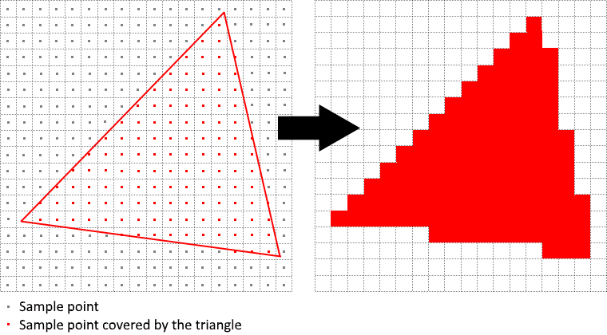
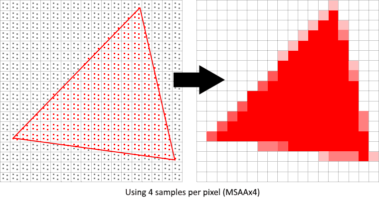

# MSAA

## 0. Notes

官方教程的 **正文描述** 仍沿用旧的 **Render Pass** 模型讲解（会出现 `colorAttachmentResolve`、`pResolveAttachments`、`VkSubpassDependency` 这些概念），但它在章节底部链接的 **参考代码 `30_multisampling.cpp` 实际上使用的是 Dynamic Rendering**（动态渲染），通过 `vk::RenderingAttachmentInfo` 的 `resolveImageView` / `resolveMode` 字段完成 resolve。

两种方式做的事在概念上完全一样，但 API 路径不同。本教程以 **官方代码** 为准（动态渲染），同时我会在对应位置告诉你 **旧 Render Pass 的对应写法是什么**，方便你日后读到旧代码时不懵。

------

## 1. why msaa?

### 1.1 Aliasing

屏幕的像素是离散的。传统光栅化时，GPU 只在 **每个像素的中心** 取一个样本，判断这个像素是否被三角形覆盖：

- 覆盖中心 → 像素上色
- 没覆盖中心 → 像素完全空白

结果就是沿着三角形边缘形成「阶梯状」的锯齿——这就是 **走样**。



### 1.2 how to fix

MSAA（Multisample Anti-Aliasing）在 **每个像素内部安排多个采样点**（如 4 个、8 个），分别判断每个采样点是否被覆盖，最后把这些点的结果**平均**，得到该像素的最终颜色。

- 覆盖了 4/4 个点 → 完整颜色
- 覆盖了 2/4 个点 → 颜色 × 0.5，剩下 0.5 是背景色
- 覆盖了 0/4 个点 → 纯背景色

**边缘像素因此获得了"渐变"效果**，视觉上就平滑了。

> 💡 **重要区别**：MSAA 只对 **几何边缘** 起效果，它不解决贴图内部的高频闪烁（那个叫 "shader aliasing"）。要解决贴图内部的问题，需要 **Sample Shading**（本章末尾会讲）。



### 1.3 cons

每个像素要存多份样本，所以：

- 颜色缓冲区变大 N 倍（N = 采样数）
- 深度缓冲区也要变大 N 倍
- 最终呈现到屏幕前，必须 **resolve** 成单采样图像（因为显示器只认一个像素一个颜色）

------

## 2. 整体流程

```
┌────────────────────────────────────────────────────────────────┐
│  新增/修改的资源与步骤                                         │
├────────────────────────────────────────────────────────────────┤
│                                                                │
│  1) 查询硬件支持的最大采样数 → msaaSamples                    │
│                                                                │
│  2) 创建 多重采样颜色图像 colorImage（N 个样本/像素）         │
│                                                                │
│  3) 深度图像 depthImage 也要改为 N 个样本/像素                │
│                                                                │
│  4) 图形管线设置 rasterizationSamples = N                     │
│                                                                │
│  5) 渲染时：                                                   │
│     ─ 渲染目标 = colorImage（多重采样）                       │
│     ─ resolve 目标 = swapChainImages[i]（单采样）             │
│     ─ GPU 自动做 resolve                                      │
│                                                                │
│  6) swapchain image 才是最终 present 的目标                   │
│                                                                │
└────────────────────────────────────────────────────────────────┘
```

------

## 3. 第一步：查询最大可用采样数

### 3.1 添加成员变量

cpp

```cpp
class HelloTriangleApplication {
    // ...
    vk::SampleCountFlagBits msaaSamples = vk::SampleCountFlagBits::e1;
    // ...
};
```

`vk::SampleCountFlagBits` 是一个 **枚举位掩码**，可选值：`e1`（默认无 MSAA）、`e2`、`e4`、`e8`、`e16`、`e32`、`e64`。

### 3.2 编写查询函数

cpp

```cpp
vk::SampleCountFlagBits getMaxUsableSampleCount() {
    vk::PhysicalDeviceProperties physicalDeviceProperties =
        physicalDevice.getProperties();

    // 关键：颜色缓冲和深度缓冲的支持能力取交集（按位与 &）
    vk::SampleCountFlags counts =
        physicalDeviceProperties.limits.framebufferColorSampleCounts &
        physicalDeviceProperties.limits.framebufferDepthSampleCounts;

    if (counts & vk::SampleCountFlagBits::e64) { return vk::SampleCountFlagBits::e64; }
    if (counts & vk::SampleCountFlagBits::e32) { return vk::SampleCountFlagBits::e32; }
    if (counts & vk::SampleCountFlagBits::e16) { return vk::SampleCountFlagBits::e16; }
    if (counts & vk::SampleCountFlagBits::e8)  { return vk::SampleCountFlagBits::e8;  }
    if (counts & vk::SampleCountFlagBits::e4)  { return vk::SampleCountFlagBits::e4;  }
    if (counts & vk::SampleCountFlagBits::e2)  { return vk::SampleCountFlagBits::e2;  }
    return vk::SampleCountFlagBits::e1;
}
```

**⚠️ 最容易踩的坑：**

1. `SampleCountFlags`（带 `s`，复数）和 `SampleCountFlagBits`（单数）**不是一回事**：
   - `SampleCountFlagBits` = 单个枚举值，如 `e4`
   - `SampleCountFlags` = 位掩码容器，可以同时保存「支持 e1、e2、e4」
   - 用 `&` 取交集时得到的是 `SampleCountFlags`，然后再用 `&` 检测某一位。
2. **必须取颜色和深度的交集**。因为一个管线里颜色附件和深度附件的采样数必须相等。假设硬件颜色支持 64x，但深度只支持 8x，你就不能用 64x，否则创建管线时会报错。
3. **为什么从 64 往下找而不是从 1 往上找**？—— 我们要 **最大** 支持的采样数，所以从高到低第一个命中的就是答案。

### 3.3 在选择物理设备后调用

cpp

```cpp
void initVulkan() {
    createInstance();
    setupDebugMessenger();
    createSurface();
    pickPhysicalDevice();
    msaaSamples = getMaxUsableSampleCount();   // ← 新增
    createLogicalDevice();
    createSwapChain();
    createImageViews();
    createDescriptorSetLayout();
    createGraphicsPipeline();
    createCommandPool();
    createColorResources();                     // ← 新增
    createDepthResources();
    // ... 其余保持不变
}
```

------

## 4. 第二步：创建多重采样颜色缓冲

### 4.1 添加类成员

cpp

```cpp
vk::raii::Image        colorImage       = nullptr;
vk::raii::DeviceMemory colorImageMemory = nullptr;
vk::raii::ImageView    colorImageView   = nullptr;
```

> **RAII 提醒**：使用 `vk::raii::Image` 而不是裸 `VkImage`。它在析构时会自动 `vkDestroyImage`，你不需要手动释放，也不需要写 `cleanupSwapChain()` 中的销毁代码——把 `colorImage = nullptr` 就够了（或者让其所在对象析构）。

### 4.2 修改 `createImage` 支持采样数参数

给 `createImage` 增加一个 `numSamples` 参数：

cpp

```cpp
void createImage(uint32_t width, uint32_t height, uint32_t mipLevels,
                 vk::SampleCountFlagBits numSamples,      // ← 新增
                 vk::Format format, vk::ImageTiling tiling,
                 vk::ImageUsageFlags usage,
                 vk::MemoryPropertyFlags properties,
                 vk::raii::Image& image,
                 vk::raii::DeviceMemory& imageMemory) {
    vk::ImageCreateInfo imageInfo{
        .imageType     = vk::ImageType::e2D,
        .format        = format,
        .extent        = {width, height, 1},
        .mipLevels     = mipLevels,
        .arrayLayers   = 1,
        .samples       = numSamples,              // ← 关键字段
        .tiling        = tiling,
        .usage         = usage,
        .sharingMode   = vk::SharingMode::eExclusive,
        .initialLayout = vk::ImageLayout::eUndefined
    };
    image = vk::raii::Image(device, imageInfo);
    // ... 内存分配与绑定不变
}
```

**其他调用处先用 `e1` 顶住**（后续会替换部分）：

cpp

```cpp
// 贴图图像：因为贴图本身不做 MSAA，保持 e1
createImage(texWidth, texHeight, mipLevels,
            vk::SampleCountFlagBits::e1,
            vk::Format::eR8G8B8A8Srgb, ...);
```

### 4.3 添加 `createColorResources`

cpp

```cpp
void createColorResources() {
    vk::Format colorFormat = swapChainSurfaceFormat.format;

    createImage(
        swapChainExtent.width, swapChainExtent.height,
        /*mipLevels=*/ 1,                                        // ← 只能 1
        /*numSamples=*/ msaaSamples,                             // ← 用最大采样
        colorFormat,
        vk::ImageTiling::eOptimal,
        vk::ImageUsageFlagBits::eTransientAttachment |           // ← 关键
        vk::ImageUsageFlagBits::eColorAttachment,
        vk::MemoryPropertyFlagBits::eDeviceLocal,
        colorImage, colorImageMemory);

    colorImageView = createImageView(colorImage, colorFormat,
                                     vk::ImageAspectFlagBits::eColor, 1);
}
```

**🔥 三个关键字段一定要理解：**

| 字段         | 值                                        | 为什么                                                       |
| ------------ | ----------------------------------------- | ------------------------------------------------------------ |
| `mipLevels`  | 只能是 **1**                              | Vulkan 规范强制：**多重采样图像禁止 mipmap**。因为 mipmap 是下采样链，和 MSAA 逻辑冲突。 |
| `numSamples` | `msaaSamples`                             | 告诉驱动每像素存多少个样本。                                 |
| `usage`      | `eTransientAttachment | eColorAttachment` | 见下方详解 ↓                                                 |

#### 为什么有 `eTransientAttachment`？

这个 flag 表示："这个图像 **只作为附件使用，内容不会跨 render pass/rendering 保留**"。

- GPU（尤其是移动端 tile-based GPU）看到这个标志，可以 **只在片上 tile 内存里保留** 多重采样数据，不写回到显存
- resolve 完成后立即丢弃多重采样内容
- **节省大量带宽**（多重采样图像很大，4x MSAA 就是普通图像的 4 倍）

这也是为什么颜色缓冲只需要 1 个 mipLevel —— 它是临时的中间产物，用完即弃。

------

## 5. 第三步：深度缓冲也要多重采样

深度测试是 **逐采样点** 进行的，所以深度缓冲必须和颜色附件采样数匹配：

cpp

```cpp
void createDepthResources() {
    vk::Format depthFormat = findDepthFormat();

    createImage(swapChainExtent.width, swapChainExtent.height, 1,
                msaaSamples,                           // ← 改：从 e1 改成 msaaSamples
                depthFormat,
                vk::ImageTiling::eOptimal,
                vk::ImageUsageFlagBits::eDepthStencilAttachment,
                vk::MemoryPropertyFlagBits::eDeviceLocal,
                depthImage, depthImageMemory);

    depthImageView = createImageView(depthImage, depthFormat,
                                     vk::ImageAspectFlagBits::eDepth, 1);
}
```

> **⚠️ 深度缓冲 vs 颜色缓冲的一个差异** 深度缓冲 **不需要 resolve**。因为它只在 render 阶段内部用于可见性测试，不会被 present，也不会被后续读取（通常）。所以我们只把它设为多重采样就行，不需要单采样的"resolve 目标"。

------

## 6. 第四步：窗口尺寸变化时重建

cpp

```cpp
void recreateSwapChain() {
    // ...等待空闲、处理最小化...
    device.waitIdle();

    cleanupSwapChain();
    createSwapChain();
    createImageViews();
    createColorResources();     // ← 新增
    createDepthResources();
}
```

------

## 7. 第五步：图形管线设置采样数

cpp

```cpp
void createGraphicsPipeline() {
    // ...
    vk::PipelineMultisampleStateCreateInfo multisampling{
        .rasterizationSamples = msaaSamples,    // ← 改：之前是 e1
        .sampleShadingEnable  = vk::False
    };
    // ...
}
```

**⚠️ 非常重要 —— 管线的采样数必须和附件的采样数 "精确匹配"**：

| 必须一致的三者                                               |
| ------------------------------------------------------------ |
| `VkPipelineMultisampleStateCreateInfo::rasterizationSamples` |
| 颜色附件图像创建时的 `samples`                               |
| 深度附件图像创建时的 `samples`                               |

**任何一个对不上，验证层都会报错、运行时可能崩溃。**

### `VkPipelineMultisampleStateCreateInfo` 各字段速查

cpp

```cpp
vk::PipelineMultisampleStateCreateInfo multisampling{
    .rasterizationSamples = msaaSamples,  // 每像素采样数
    .sampleShadingEnable  = vk::False,    // 是否对每个采样独立跑 FS（见 §9）
    .minSampleShading     = 1.0f,         // sampleShading 启用时的最小比例
    .pSampleMask          = nullptr,      // 位掩码，可禁用某些采样（一般 null）
    .alphaToCoverageEnable = vk::False,   // 用 fragment 的 alpha 作为覆盖率
    .alphaToOneEnable      = vk::False    // alpha 强制置 1
};
```

前三个最常用，后三个用于特殊效果（透明树叶、硬边 alpha 等），初学者可以先忽略。

------

## 8. 第六步：渲染时如何 Resolve（动态渲染版本）

**这是整个章节最容易混淆的部分，请仔细看。**

教程正文用旧 Render Pass 方式讲解，但示例代码用的是动态渲染。我们对齐示例代码。

### 8.1 旧 Render Pass 方式（仅作了解）

cpp

```cpp
// 传统写法——示例代码里没用这个，贴出来给你对照
VkAttachmentDescription colorAttachmentResolve{
    /* 采样数 */    = VK_SAMPLE_COUNT_1_BIT,   // 单采样，作为 resolve 目标
    /* finalLayout */ = VK_IMAGE_LAYOUT_PRESENT_SRC_KHR,
    // ...
};
VkAttachmentReference   colorAttachmentResolveRef{2, ...};
subpass.pResolveAttachments = &colorAttachmentResolveRef;
```

**核心思想**：render pass 里声明三个 attachment —— 多重采样颜色、深度、resolve 目标（swapchain 图像）。subpass 通过 `pResolveAttachments` 让 GPU 在 subpass 结束时自动做 resolve。

### 8.2 动态渲染方式（官方示例代码实际用的）

cpp

```cpp
void recordCommandBuffer(uint32_t imageIndex) {
    auto& commandBuffer = commandBuffers[frameIndex];
    commandBuffer.begin({});

    // ① 将 swapchain image 转换到 ColorAttachmentOptimal
    transition_image_layout(
        swapChainImages[imageIndex],
        vk::ImageLayout::eUndefined,
        vk::ImageLayout::eColorAttachmentOptimal,
        {},
        vk::AccessFlagBits2::eColorAttachmentWrite,
        vk::PipelineStageFlagBits2::eColorAttachmentOutput,
        vk::PipelineStageFlagBits2::eColorAttachmentOutput,
        vk::ImageAspectFlagBits::eColor);

    // ② 将 多重采样 colorImage 转换到 ColorAttachmentOptimal
    transition_image_layout(
        *colorImage,
        vk::ImageLayout::eUndefined,
        vk::ImageLayout::eColorAttachmentOptimal,
        vk::AccessFlagBits2::eColorAttachmentWrite,
        vk::AccessFlagBits2::eColorAttachmentWrite,
        vk::PipelineStageFlagBits2::eColorAttachmentOutput,
        vk::PipelineStageFlagBits2::eColorAttachmentOutput,
        vk::ImageAspectFlagBits::eColor);

    // ③ 将深度图像转换到 DepthAttachmentOptimal
    transition_image_layout(
        *depthImage,
        vk::ImageLayout::eUndefined,
        vk::ImageLayout::eDepthAttachmentOptimal,
        vk::AccessFlagBits2::eDepthStencilAttachmentWrite,
        vk::AccessFlagBits2::eDepthStencilAttachmentWrite,
        vk::PipelineStageFlagBits2::eEarlyFragmentTests | vk::PipelineStageFlagBits2::eLateFragmentTests,
        vk::PipelineStageFlagBits2::eEarlyFragmentTests | vk::PipelineStageFlagBits2::eLateFragmentTests,
        vk::ImageAspectFlagBits::eDepth);

    // ④ 构造颜色附件 —— 关键：同时指定渲染目标 + resolve 目标
    vk::ClearValue clearColor = vk::ClearColorValue(0.0f, 0.0f, 0.0f, 1.0f);
    vk::ClearValue clearDepth = vk::ClearDepthStencilValue(1.0f, 0);

    vk::RenderingAttachmentInfo colorAttachment = {
        .imageView          = colorImageView,                              // ★ 多重采样图像
        .imageLayout        = vk::ImageLayout::eColorAttachmentOptimal,
        .resolveMode        = vk::ResolveModeFlagBits::eAverage,           // ★ 平均法 resolve
        .resolveImageView   = swapChainImageViews[imageIndex],             // ★ resolve 到 swapchain
        .resolveImageLayout = vk::ImageLayout::eColorAttachmentOptimal,
        .loadOp             = vk::AttachmentLoadOp::eClear,
        .storeOp            = vk::AttachmentStoreOp::eStore,
        .clearValue         = clearColor
    };

    vk::RenderingAttachmentInfo depthAttachment = {
        .imageView   = depthImageView,
        .imageLayout = vk::ImageLayout::eDepthAttachmentOptimal,
        .loadOp      = vk::AttachmentLoadOp::eClear,
        .storeOp     = vk::AttachmentStoreOp::eDontCare,    // ← 深度不保留
        .clearValue  = clearDepth
    };

    vk::RenderingInfo renderingInfo = {
        .renderArea           = {.offset = {0, 0}, .extent = swapChainExtent},
        .layerCount           = 1,
        .colorAttachmentCount = 1,
        .pColorAttachments    = &colorAttachment,
        .pDepthAttachment     = &depthAttachment
    };

    commandBuffer.beginRendering(renderingInfo);
    // ...绑定管线、绘制...
    commandBuffer.endRendering();

    // ⑤ 将 swapchain image 转换到 PresentSrcKHR
    transition_image_layout(
        swapChainImages[imageIndex],
        vk::ImageLayout::eColorAttachmentOptimal,
        vk::ImageLayout::ePresentSrcKHR,
        vk::AccessFlagBits2::eColorAttachmentWrite,
        {},
        vk::PipelineStageFlagBits2::eColorAttachmentOutput,
        vk::PipelineStageFlagBits2::eBottomOfPipe,
        vk::ImageAspectFlagBits::eColor);

    commandBuffer.end();
}
```

### 8.3 动态渲染关键字段深度解读

`vk::RenderingAttachmentInfo` 在 MSAA 场景下有 **两组 imageView** —— 这是新手最容易被绕晕的地方：

```
┌─────────────────────────────────────────────────────────────┐
│  ┌──────────────────────┐           ┌─────────────────────┐ │
│  │  imageView           │  resolve  │  resolveImageView   │ │
│  │  (多重采样 4x/8x...) │  ──────→  │  (单采样)           │ │
│  │  = colorImageView    │           │  = swapChainView[i] │ │
│  │  GPU 在这里绘图      │           │  最终呈现的图像     │ │
│  └──────────────────────┘           └─────────────────────┘ │
│                                                             │
│  resolveMode 决定如何把 N 个样本合成 1 个：                 │
│    eAverage    — 平均（MSAA 的标准选择） ★                  │
│    eSampleZero — 只取第 0 个样本（便宜但质量差）            │
│    eMin / eMax — 最小/最大值（深度缓冲常用）                │
│    eNone       — 不做 resolve                               │
└─────────────────────────────────────────────────────────────┘
```

### 8.4 easy-to-miss 细节

1. **Layout 转换要做两遍**：多重采样 colorImage 和 swapchain image **都要** 转换到 `ColorAttachmentOptimal`，因为两者在渲染阶段 **都是** 写入目标（resolve 也算写入）。
2. **swapchain 图像的最终布局**：必须用 pipeline barrier 手动转到 `ePresentSrcKHR`，动态渲染不会像旧 render pass 那样帮你自动过渡 `finalLayout`。
3. **深度附件不需要 resolve**：所以 `depthAttachment` 里没填 `resolveImageView`。教程正文那句 "This requirement does not apply to the depth buffer, since it won't be presented at any point" 说的就是这个。
4. **`storeOp = eDontCare`（深度）的含义**：告诉驱动"我不需要把深度缓冲内容保留到下一帧"，驱动可以跳过写回显存，省带宽。

------

## 9. 进阶：Sample Shading（可选增强）

### 9.1 MSAA 解决不了什么

MSAA 只让 **几何边缘** 变平滑。对于纹理内部的高频颜色（例如棋盘格贴图、强烈光照高光），它依然会闪烁、闪金属片——因为片段着色器在每个像素 **只运行一次**，不管该像素有多少个采样点。

### 9.2 Sample Shading 的作用

启用后，片段着色器会对 **每个采样点分别执行**（或至少比例执行），让内部细节也平滑。代价：**片元着色器的运行次数接近 N 倍**。

### 9.3 如何开启

**Step 1 — 启用设备 Feature**：

cpp

```cpp
void createLogicalDevice() {
    // ...
    vk::StructureChain<
        vk::PhysicalDeviceFeatures2,
        vk::PhysicalDeviceVulkan13Features,
        vk::PhysicalDeviceExtendedDynamicStateFeaturesEXT
    > featureChain = {
        {.features = {
            .sampleRateShading = vk::True,   // ← 启用 sample shading
            .samplerAnisotropy = vk::True
        }},
        {.synchronization2 = vk::True, .dynamicRendering = vk::True},
        {.extendedDynamicState = vk::True}
    };
    // ...
}
```

**Step 2 — 管线中启用**：

cpp

```cpp
vk::PipelineMultisampleStateCreateInfo multisampling{
    .rasterizationSamples = msaaSamples,
    .sampleShadingEnable  = vk::True,   // ← 启用
    .minSampleShading     = 0.2f        // ← 至少 20% 的采样点各自运行 FS
};
```

`minSampleShading` ∈ [0, 1]：

- `0.0` ≈ 关闭（等于 `sampleShadingEnable=false`）
- `1.0` = 每个采样都单独跑 FS（最贵，最平滑）
- `0.2`（教程建议值）= 折中方案

本章的示例默认 **不启用** sample shading —— 因为性能成本较高，一般只在画质要求高的场景开。

------

## 10. 一张图总结所有资源关系

```
                                   ┌────────────────────────────┐
                                   │   SwapChain Images (N 张) │
                                   │   单采样                   │
                                   │   用于 present             │
                                   └─────────────▲──────────────┘
                                                 │
                                                 │ resolveImageView
                                                 │ resolveMode=Average
                                                 │
 ┌───────────────────────┐     每帧     ┌──────────────────────┐
 │  colorImage (1 张)    │ ─────────►  │ colorAttachment 绘图 │
 │  多重采样 Nx          │             │ 目标                 │
 │  eTransientAttachment │             └──────────────────────┘
 │  eColorAttachment     │
 └───────────────────────┘

 ┌───────────────────────┐
 │  depthImage (1 张)    │             (深度测试，不 resolve)
 │  多重采样 Nx          │
 │  eDepthStencilAttach  │
 └───────────────────────┘
```

**为什么只有 1 张 `colorImage` 和 1 张 `depthImage`，但 `swapchain` 有 N 张？**

- swapchain 图像要和显示器的呈现节奏解耦（三重缓冲），必须多张。
- MSAA 的 color/depth 是"临时中间产物"，任意时刻只有一帧在渲染，1 张够用。这和之前深度缓冲的道理一样。

------

## 11. 易错点清单（收藏版）

| #    | 坑                                                           | 解释                                                         |
| ---- | ------------------------------------------------------------ | ------------------------------------------------------------ |
| 1    | 颜色和深度采样数不一致                                       | 必须取 `framebufferColorSampleCounts & framebufferDepthSampleCounts` |
| 2    | 多重采样图像设了 `mipLevels > 1`                             | 规范禁止，会创建失败                                         |
| 3    | 管线 `rasterizationSamples` 和附件采样数对不上               | 100% 验证层报错                                              |
| 4    | 直接把多重采样图像 present                                   | 不能！必须 resolve 到单采样图像                              |
| 5    | 忘记把 swapchain image 也转到 `ColorAttachmentOptimal`       | resolve 会失败（动态渲染必须手动 barrier）                   |
| 6    | `recreateSwapChain` 忘了重建 colorImage                      | 尺寸变化后 resolve 会越界/变形                               |
| 7    | 深度缓冲也写了 resolve 目标                                  | 没必要；如果非要写，注意 resolveMode 应为 eMin/eMax          |
| 8    | 用 `sampleShadingEnable=true` 但没启用 `sampleRateShading` feature | 创建管线时会失败                                             |
| 9    | 把 `SampleCountFlags` 当成 `SampleCountFlagBits` 赋值        | 类型不匹配；后者是单值，前者是位集合                         |
| 10   | 认为 MSAA 能修贴图锯齿                                       | 不能，得用 Sample Shading 或 mipmap/各向异性                 |

------

## 12. 和旧 Render Pass 写法的对照表（供阅读旧代码时参考）

| 概念                 | 旧 Render Pass 写法                                    | 动态渲染写法（本教程）                                      |
| -------------------- | ------------------------------------------------------ | ----------------------------------------------------------- |
| 声明多重采样颜色附件 | `VkAttachmentDescription` + `samples=Nx`               | 直接用 `RenderingAttachmentInfo.imageView` 指向多重采样图像 |
| 声明 resolve 目标    | 第三个 `VkAttachmentDescription`（samples=1）          | `RenderingAttachmentInfo.resolveImageView`                  |
| 声明 resolve 动作    | `subpass.pResolveAttachments = &resolveRef`            | `RenderingAttachmentInfo.resolveMode = eAverage`            |
| 最终 layout 转换     | `VkAttachmentDescription.finalLayout = ePresentSrcKHR` | 自己在 `endRendering` 后加 `pipelineBarrier2`               |
| 同步                 | `VkSubpassDependency.srcAccessMask` 更新               | `ImageMemoryBarrier2` 的 `srcAccessMask`                    |

------

## 13. 运行效果

编译运行后，你应该能看到边缘明显变平滑（相比没开 MSAA 前）。最明显的地方：

- 模型轮廓线
- 远处高对比度的锯齿边
- 贴图 UV 边界

**如果看起来一样**，99% 是下面某个问题：

- 验证层没开，静默失败中
- `msaaSamples` 其实是 `e1`（没成功查到最大值）
- 管线的 `rasterizationSamples` 忘记改了

打开验证层跑一次，几乎所有配置错误都会被告知。

------

## 14. 结语

到这一章为止，你已经实现了一个功能完整的 Vulkan 程序：实例、设备、交换链、管线、顶点/索引/Uniform 缓冲、贴图、mipmap、深度、MSAA。所有 Vulkan 的基础概念都齐了。

下一步可以探索：

- **Push Constants** —— 比 uniform buffer 更轻量的少量常量传递
- **Instanced Rendering** —— 一次绘制大量相同物体
- **Compute Shader** —— 计算着色器（教程下一章）
- **Multiple Subpasses / Multiple Render Targets (MRT)**
- **Pipeline Cache** —— 加速启动

加油！