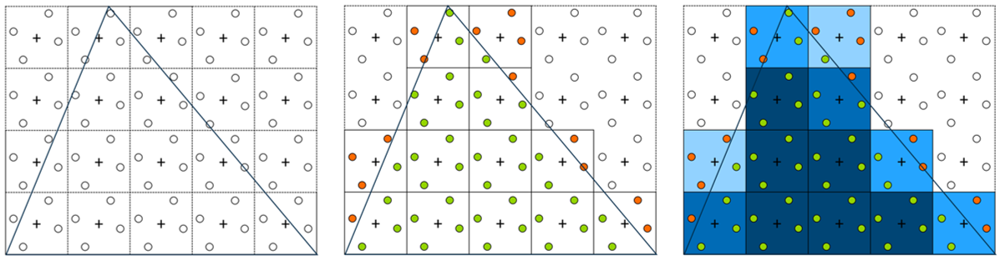
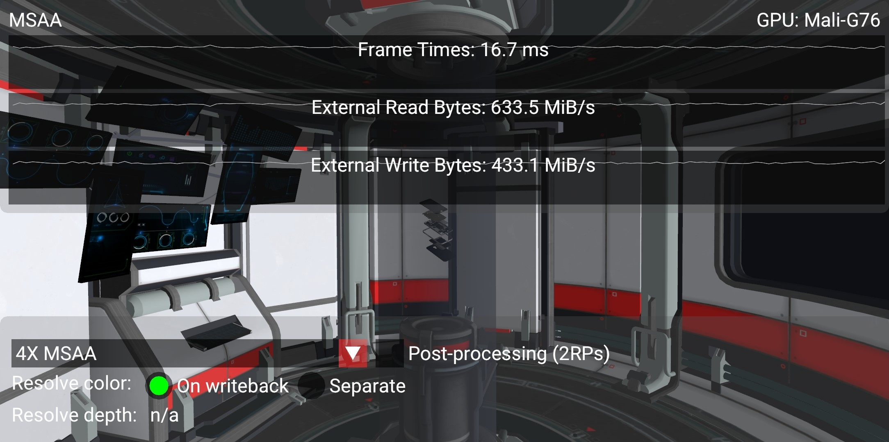
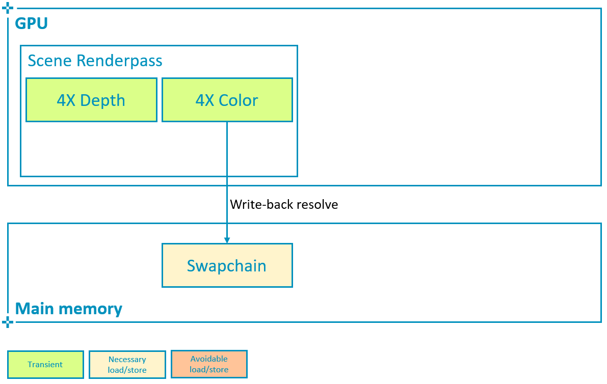
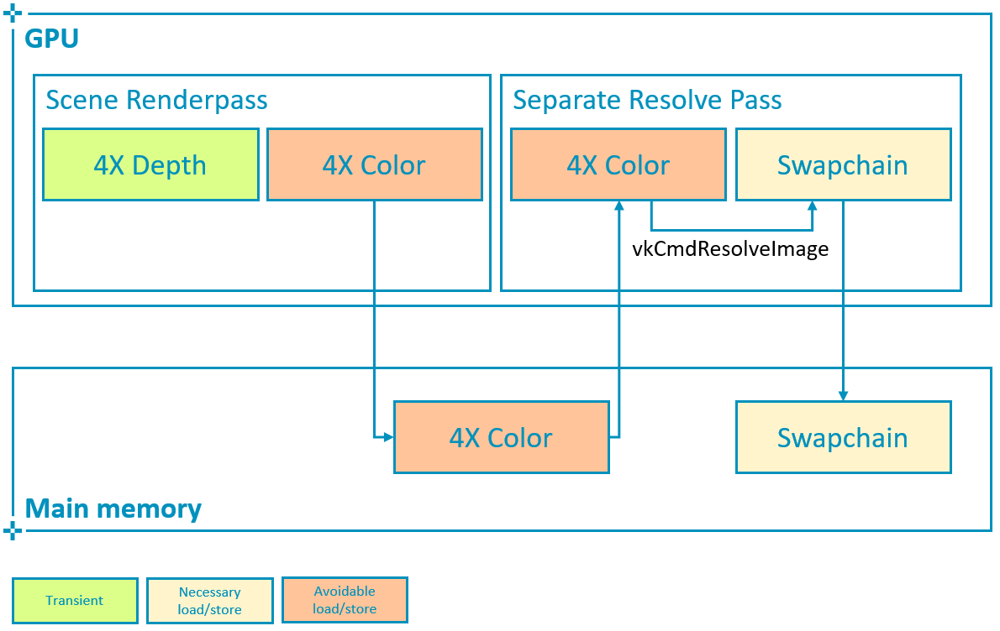
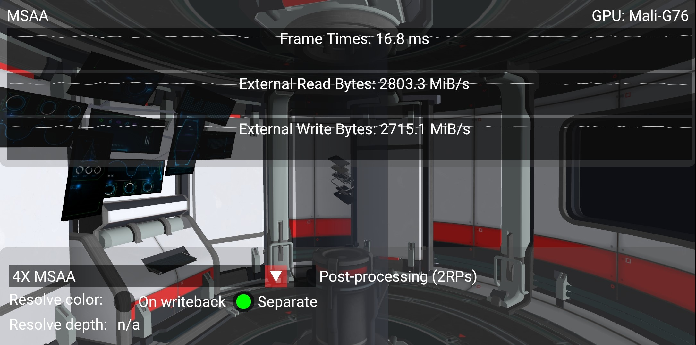

# MSAA Samples



采样点的分布是由spec定义的，位于一个旋转的网格当中。

MSAA通常用于解决几何边缘的锯齿问题。SSAA通常解决图元内部纹理等锯齿现象，但是Mipmap等texture filter已经可以缓解这个问题。

## color resolve







在渲染场景后，如果不需要多重采样附件，应避免将其写回主内存。这意味着多重采样附件必须使用 `storeOp = VK_ATTACHMENT_STORE_OP_DONT_CARE` 和 `usage |= VK_IMAGE_USAGE_TRANSIENT_ATTACHMENT_BIT`。

如图二，subpass，使用`pResolveAttachments`指定最后的单采样attachment，在写回内存的同时进行resolve。性能影响不到3%.

如图三，如果使用一个独立的pass进行解析过程`vkCmdResolveImage`，则需要额外的带宽开销.

## depth resolve

无论是否开启msaa，depth buffer应该是transient的，之后不会用到。【待补充】

## best practice summary

在大多数应用场景，将多sample的数据保存在tile memory上，并在写回的时候做resolve。

- 尽可能使用4xMSAA,不会增加太多的开销，却能显著提升图像质量。
- 对于loadop使用clear或者dont care，对于storeop使用dont care。
- 在subpass中指定`pResolveAttachments`，避免额外的带宽开销。
- 使用lazily_allocated内存分配msaa的图像。

### 实际情况

**LazilyAllocated 的含义**：你调用 `vkAllocateMemory` 时，驱动只给你一个虚拟地址/句柄，不真正分配物理页。只有当 GPU 真的试图读写这块内存时，驱动才会按需分配物理页。

如果这个 image 全程只在 tile memory 里流转，从不真正触达主存，那么物理页一页都不会分配，内存占用 = 0。

**移动 GPU 的实际情况**

MS color buffer 的数据生命周期：

```
光栅化 → tile memory → ROP resolve → VRAM (resolve 目标)
          ↑                              ↑
     数据活在这里                   MS 数据从不经过这里
     (片上 SRAM)                    (分配的虚拟页从未被 touch)
```

所以物理内存是 0。你问"不分配内存怎么写/读" —— 答案是**数据确实存在，但是存在 tile memory 里**，而 tile memory 不是通过 VkDeviceMemory 分配的，它是硬件固有的片上 SRAM，驱动在 renderpass 执行时临时"借"给你用。


**桌面 GPU 的实际情况**

桌面 GPU 没有真正的 tile memory 能装下整张 MS image。所以即便你声明了 Transient + LazilyAllocated：驱动发现"你这图像 8MB，我的 L2 cache 只有几 MB，装不下"，于是**物理页还是要分配**，LazilyAllocated 退化成普通分配。**所以transient在桌面上基本没用**。

subpass和独立pass在桌面端几乎没有区别，只是在subpass的时候，一些数据可能被ROP/L2 cache优化一部分，但是整体还是做的9x的带宽消耗。

> 近几年的桌面 GPU（NVIDIA Maxwell+、AMD RDNA+）引入了 **tiled caching / binning rasterizer**，会把屏幕分成小块，试图让一块的数据尽量留在 L2 里。但这个"块"比移动端小很多，而且 cache 是通用的（不是专用 attachment memory），所以优化程度介于"纯 IMR"和"真 TBR"之间。