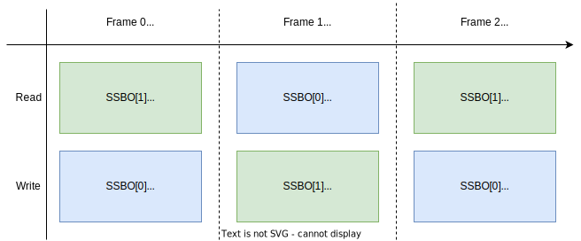
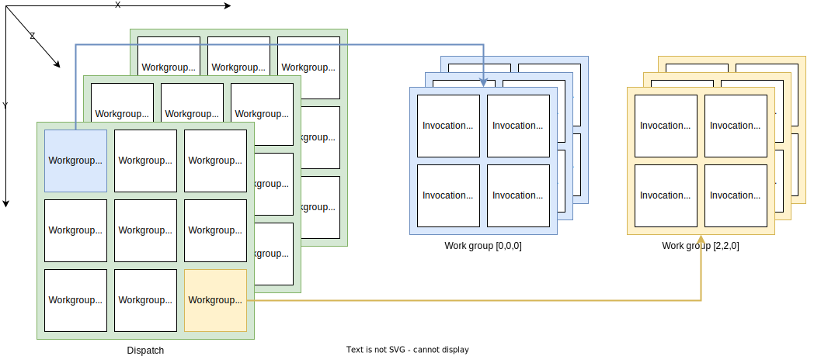

# compute shader

在vulkan是强制要求支持的。general purpose on GPU (GPGPU).

## pros

- 减轻cpu负担
- 所有数据可以驻留在gpu中，避免在cpu主存和gpu显存之间的频繁的传输数据。
- 适合高度并行化的工作流程。

## vulkan pipeline


## An example

本章实现一个基于GPU的粒子系统。

传统的基于CPU的粒子系统会将数据存储在cpu主存上，然后利用cpu进行重建buffer更新，然后频繁传递到gpu的内存中。或者通过在gpu上创建可以map的cpu的内存，每帧通过cpu写入更新。这样会占用较大带宽。

## data manipulation

之前介绍过提供图元/顶点数据的vertex/index buffer，以及传递数据的uniform buffer.以及用于纹理采样的sampled image。

cs引入的一个重要的能力就是任意地从buffer读写数据。为此vulkan提供了两种专用的存储类型：SSBO以及storage images。

### SSBO

允许shader从buffer读写数据，使用的方式和UBO类似。最大区别在于，可以将别的buffer 类型别名化为SSBO，且大小是任意的。

对于背后的buffer，我们可以声明多种usage，比如这里使用的，我们可以将其声明为vertex buffer的同时，又将其声明为storage

```C++
vk::BufferCreateInfo bufferInfo{};
...
bufferInfo.usage = vk::BufferUsageFlagBits::eVertexBuffer | vk::BufferUsageFlagBits::eStorageBuffer | vk::BufferUsageFlagBits::eTransferDst;
...

shaderStorageBuffers[i] = vk::raii::Buffer(*device, bufferInfo);
```

对于**shader**侧是这样声明的：

```c++
struct Particle {
	float2 position;
	float2 velocity;
    float4 color;
};

struct ParticleSSBO {
    Particle particles;
};
StructuredBuffer<ParticleSSBO> particlesIn;
RWStructuredBuffer<ParticleSSBO> particlesOut;
```

`StructuredBuffer`是unlimited的，只读的。

`RWStructuredBuffer`同样是unlimited的。

这种无须指定元素数量，也是SSBO相较于UBO的一种优势。

### storage images

```c++
imageInfo.usage = vk::ImageUsageFlagBits::eSampled | vk::ImageUsageFlagBits::eStorage;
```

在片段着色器中作为采样图像，以及在计算着色器中作为存储图像；

**shader**:

```c++
[vk::image_format("r32f")] Texture2D<float> inputImage; // 只读
[vk::image_format("r32f")] RWTexture2D<float> outputImage; // 存储图像
```

声明的是texture而不是sampler。

```c++
float3 pixel = inputImage[int2(gl_GlobalInvocationID.xy)].rgb;
outputImage[int2(gl_GlobalInvocationID.xy)] = pixel;
```

## compute queue families

类似于正常管线需要graphics queue family。计算操作也需要对应的queue family `vk::QueueFlagBits::eCompute`.

vulkan规范要求，必须存在一个既支持graphcis又支持compute的queue family。当然也会有专门的compute queue family支持更多的高级同步机制。

## shader stage

加载cs和之前加载vs的过程相同。如果你想让descriptor在顶点和计算阶段都可访问，也可以设置多个shaderstage

``````C++
vk::ShaderStageFlagBits::eCompute
``````

还引入了一种新的binding point type for descriptors and pipelines

```C++
vk::PipelineBindPoint::eCompute
```

## prepare SSBO

这里的buffer由于并行帧的存在，同样需要多个副本。

和之前vertex buffer一样的流程，先创建staging buffer 再进行copy。

只不过这次的数据是通过程序生成的。

## descriptors



```c++
std::array layoutBindings{
    vk::DescriptorSetLayoutBinding(0, vk::DescriptorType::eUniformBuffer, 1, vk::ShaderStageFlagBits::eCompute, nullptr),
    vk::DescriptorSetLayoutBinding(1, vk::DescriptorType::eStorageBuffer, 1, vk::ShaderStageFlagBits::eCompute, nullptr),
    vk::DescriptorSetLayoutBinding(2, vk::DescriptorType::eStorageBuffer, 1, vk::ShaderStageFlagBits::eCompute, nullptr)
};
```

我们为SSBO设置了两个binding点（一个binding可能对应多个buffer,一个buffer也可能由多个descriptor共享）。

因为cs需要能够访问上一帧和当前帧的SSBO，根据时间差进行更新。

## pipelines

由于计算不属于图形管线的一部分，我们无法使用 `device→createGraphicsPipeline` 。相反，我们需要创建一个专用的计算管线，使用 `device→createComputePipeline` 来运行计算命令。由于计算管线不涉及任何光栅化状态，其状态量远少于图形管线：

```c++
vk::PipelineLayoutCreateInfo pipelineLayoutInfo({}, 1, &**computeDescriptorSetLayout);

computePipelineLayout = std::make_unique<vk::raii::PipelineLayout>( *device, pipelineLayoutInfo );
```

```c++
vk::ComputePipelineCreateInfo pipelineInfo({}, computeShaderStageInfo, *computePipelineLayout);
computePipeline = std::make_unique<vk::raii::Pipeline>(device->createComputePipeline( nullptr, pipelineInfo));
```

## space

**work group**

定义了计算任务如何被GPU的计算单元组织和处理。可以认为是需要处理的work items。work group的维度由dispatch command来设定。

每个工作组都是相同cs 的**invocations**的集合。invocations是可以并行运行的，其维度在cs中设定。单个work group内的invocations可以共享shared memory。



> 举个例子：如果我们调度一个工作组计数为[64, 1, 1]，计算着色器的局部大小为[32, 32, 1]，那么我们的计算着色器将被调用 64 x 32 x 32 = 65,536 次。


## shader

```c++
[shader("compute")]
[numthreads(256,1,1)]
void compMain(uint3 threadId : SV_DispatchThreadID)
{
    uint index = threadId.x;

    particlesOut[index].particles.position = particlesIn[index].particles.position + particlesIn[index].particles.velocity.xy * ubo.deltaTime;
    particlesOut[index].particles.velocity = particlesIn[index].particles.velocity;

    // Flip movement at window border
    if ((particlesOut[index].particles.position.x <= -1.0) || (particlesOut[index].particles.position.x >= 1.0)) {
        particlesOut[index].particles.velocity.x = -particlesOut[index].particles.velocity.x;
    }
    if ((particlesOut[index].particles.position.y <= -1.0) || (particlesOut[index].particles.position.y >= 1.0)) {
        particlesOut[index].particles.velocity.y = -particlesOut[index].particles.velocity.y;
    }

}
```

`[numthreads(256,1,1)]`就定义了当前工作组的调用次数。

`SV_DispatchThreadID`唯一标识当前的invocation

## commands

```c++
computeCommandBuffers[frameIndex]->begin({});
...

computeCommandBuffers[frameIndex]->bindPipeline(vk::PipelineBindPoint::eCompute, *computePipeline);
computeCommandBuffers[frameIndex]->bindDescriptorSets(vk::PipelineBindPoint::eCompute, *computePipelineLayout, 0, {computeDescriptorSets[frameIndex]}, {});

computeCommandBuffers[frameIndex]->dispatch( PARTICLE_COUNT / 256, 1, 1 );

...

computeCommandBuffers[frameIndex]->end();
```

对于command buffer，compute的相关状态相比于graphics也是少很多的。

### submit

compute的submit也需要一个fences，表明计算完成，用于同步（帧之间）。

### graphics和compute的同步

使用semaphores和fences来保证在compute更新完数据前，vs不会进行读取操作。

在之前写的`createSyncObjects`中引入新的同步变量。

也就是说graphics的submit还要额外等一个，computeFinished的semaphore。

### timeline semaphore

普通的semaphore只具有简单的二进制状态signaled/unsignaled。timeline具有一个64 uint的counter，可以等待信号到特定值。

其实就是操作系统中的signal(N)和wait(N)，一直复用。语义如下：

- `signal(N)`：我这个任务做完时，把 sem 的计数器**设成 N**（N 必须比当前值大）

- `wait(N)`：阻塞直到 sem 的计数器 **≥ N**

**启用timeline semaphore**

```c++
vk::PhysicalDeviceTimelineSemaphoreFeaturesKHR timelineSemaphoreFeatures;
timelineSemaphoreFeatures.timelineSemaphore = vk::True;
```

**创建**

```C++
vk::SemaphoreTypeCreateInfo semaphoreType{ .semaphoreType = vk::SemaphoreType::eTimeline, .initialValue = 0 };
semaphore = vk::raii::Semaphore(device, {.pNext = &semaphoreType});
timelineValue = 0;
```

**`timelineValue`** 是在 CPU 代码里自己维护的一个 `uint64_t` 变量

**Semaphore 内部的计数器**：由 GPU / driver 推进。当一个 `signal(N)` 操作在 GPU 上完成时，计数器被设成 N。它只能往上走，不能回退。

**update**

```c++
// Update timeline value for this frame
uint64_t computeWaitValue = timelineValue;
uint64_t computeSignalValue = ++timelineValue;
uint64_t graphicsWaitValue = computeSignalValue;
uint64_t graphicsSignalValue = ++timelineValue;
```

每需要用一次就进行自增，可以多次使用

对于这种情况：

```
// T1 提交任务 A：signal 1
// T2 提交任务 B：signal 2       // A 可能还没执行完，B 就提交了
// T3 提交任务 X：wait 1         
// T4 提交任务 Y：wait 2
```

如果是一个队列的，那么FIFO的语义保证了，A的signal1必然先执行，B是不可能先于A提交的。

如果是不同队列，那么在A提交的时候signal的值小于当前值，validation layer会报错。那么尽量使用不同semaphore来避免这个问题。
