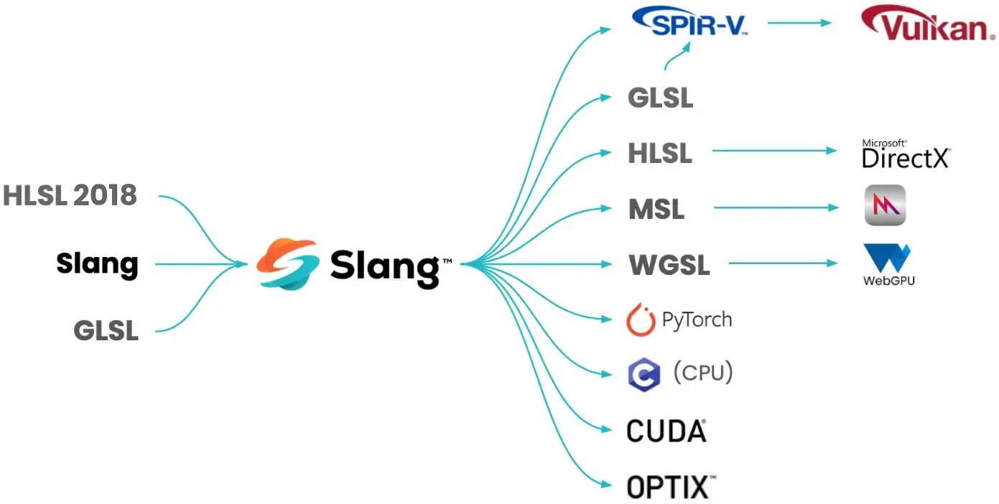

优点：

- 满足实时渲染应用，利用神经图形技术等不断变化的需求。
- 简化维护和开发
- 支持多种后端，跨平台，可迁移性高。
- 高性能：模块化编译，降低了整体编译时间。提供可复用的模块和动态着色器链接功能。



slang的包里面包含了vulkan的sdk.


slang-rhi可以帮助简化api的书写。实现自动化的参数绑定。

unreal自己写rhi是为了跨平台。slang写rhi是为了兼容自己高级语言特性。一些特性使用传统api无法直接实现，或者及其繁琐。slang-rhi就是为了解决这些问题。

例如这段代码：

```c++
// Slang 代码
interface IMaterial { float3 calcColor(); };

struct Wood : IMaterial { ... };
struct Metal : IMaterial { ... };

// 这里的 material 是多态的！
void main(IMaterial material) { 
    output = material.calcColor(); 
}
```

vulkan+slang编译器会生成 descriptor set布局。

而有了slang-rhi直接调用```shaderObject->setBinding("material", myWoodData)```就行了。

| **中间语言** | **背后主推** | **对应高级语言** | **主要 API**    | **格式基础** |
| ------------ | ------------ | ---------------- | --------------- | ------------ |
| **SPIR-V**   | Khronos      | GLSL / HLSL      | Vulkan / OpenGL | 自定义二进制 |
| **DXIL**     | Microsoft    | HLSL             | DirectX 12      | LLVM Bitcode |
| **DXBC**     | Microsoft    | HLSL             | DirectX 9-11    | Token-based  |
| **AIR**      | Apple        | MSL (Metal)      | Metal           | LLVM Bitcode |

slang可以生成SPIR-V DXIL DXBC身可以编译为glsl/hlsl

支持了泛型。