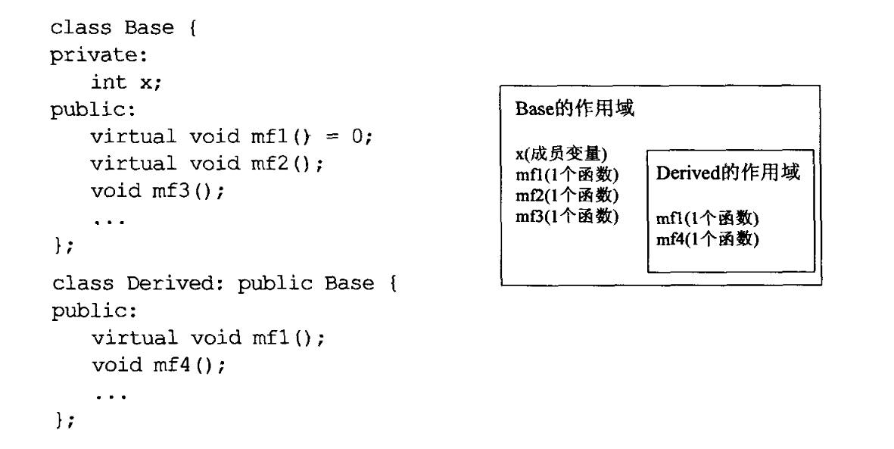

## 继承与面向对象设计

### 32 确定public是is-a关系

基类可以派上用场的任何地方，派生类对象一样可以，因为每一个派生类对象都是一个基类对象。

这个isa并不是一定的，严谨的。比如企鹅是鸟，但是企鹅不会飞，**世界上并不存在一个适用于所有软件的完美设计**。

条款18说：好的接口可以防止无效的代码通过编译。那么我们应该采取在编译期拒绝企鹅飞行的设计。

```c++
class Bird {
    
};
class Penguin: public Bird {
    // 不要声明fly函数
}
```

 

### 33 避免hide继承而来的name

```c++
int x;
void someFunc()
{
	double x;
    std::cin >> x;
}
```

内层的作用域名称会遮掩外围作用域的名称。

对于继承 derived class作用域被嵌套在base class作用域内



名称查找规则 derived -> base -> base所在namespace -> global

```C++
class Base {
public:
    virtual void mf1() = 0;
    virtual void mf1(int);       // 重载版本
    void mf3();
    void mf3(double);            // 重载版本
};

class Derived : public Base {
public:
    virtual void mf1();          // 只定义了无参版本
    void mf3();                  // 只定义了无参版本
};
```

派生类的函数会遮掩所有base的同名函数

```C++
Derived d;
d.mf1();      // ✅ 调用 Derived::mf1()
d.mf1(42);    // ❌ 编译错误！Base::mf1(int) 被隐藏了
d.mf3();      // ✅ 调用 Derived::mf3()
d.mf3(3.14);  // ❌ 编译错误！Base::mf3(double) 被隐藏了
```

解决办法：

- 通过使用using(public，想继承所有重载)

```c++
class Derived : public Base {
public:
    using Base::mf1;   // 把 Base 所有 mf1 版本引入作用域
    using Base::mf3;

    virtual void mf1();
    void mf3();
};
```

可以使得派生类的mf只覆盖你想override的，而不是全部遮掩。

- forwarding function（private/public，只想暴露部分接口）

当你**不想继承基类的所有重载**，只想暴露某一个特定版本时使用。典型场景是 **private 继承**

```c++
class Derived : private Base {
public:
    // 转发函数：手动把调用"转发"给基类
    virtual void mf1() {
        Base::mf1();   // 直接调用并转发给基类版本
    }
    // mf1(int) 不暴露，因为这里不写它
};
```

### 34 区分接口继承和实现继承

public继承包含两部分：

- 函数接口继承
- 函数实现继承

有时希望派生类只继承接口，有时希望同时继承接口和实现，有时希望继承接口和实现的同时override覆写锁继承的实现。

**成员函数的接口总是会被继承**

```C++
class Shape {
public:
    virtual void draw() const  = 0;
    virtual void error(const std::string& msg);
    int objectID() const;
}
class Rectangle: public Shape {};
class Ellipse: public Shape {};
```

- draw是纯虚函数，目的是为了让派生类只继承函数接口。

可以为纯虚函数提供定义，唯一途径是使用`Shape::draw()`

- error是虚函数，目的是为了让派生类继承该函数的接口以及默认实现

但是这样会为所有派生类都提供默认行为，即使派生类没有明确说明我需要这个默认行为。我们可以切断”virtual函数接口“与”默认实现“之间的连接：

接口部分被声明为纯虚函数，之后在定一个额外的默认行为函数。**以不同的函数分别提供接口和默认实现**

```c++
class Shape {
public:
    virtual void error(const std::string& msg) = 0;
protected:
    void defaultError(const std::string& msg);
}
void Shape::defaultError(const std::string& msg)
{
    // ...
}
```

但是这样可能导致过多雷同的函数名称。可以利用**纯虚函数可以有自己的实现**这一点：

```C++
class Shape {
public:
    virtual void error(const std::string& msg) = 0; // 接口
}
void Shape::error(const std::string& msg) // 默认行为
{
    
}
```

- objectID是一个非虚函数，意味着它并不打算在派生类中有不同的行为，即继承函数接口以及一份强制性实现