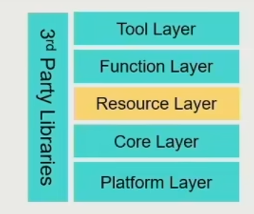
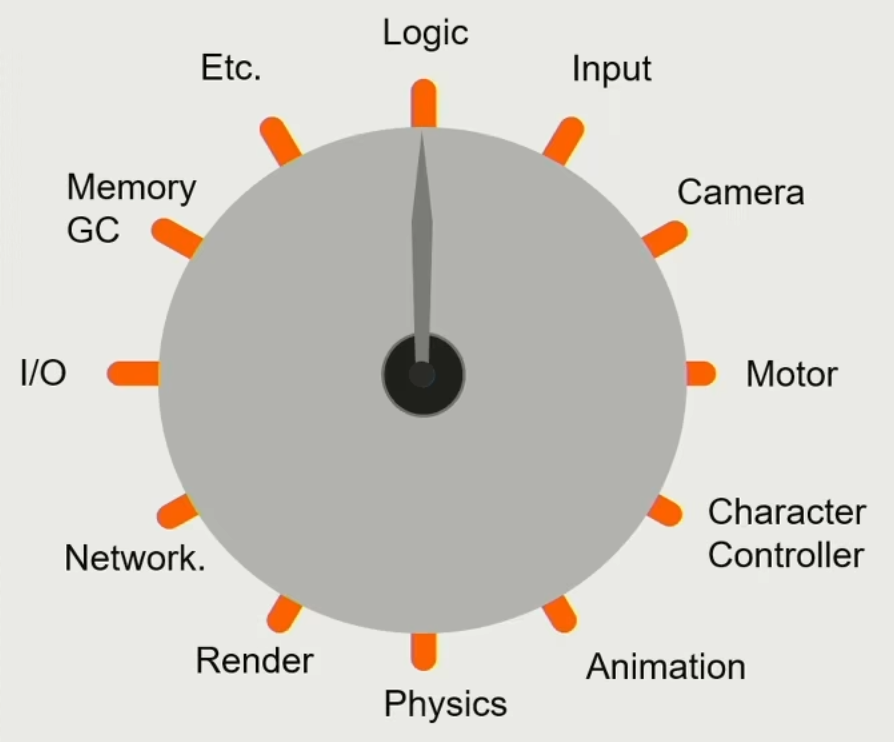
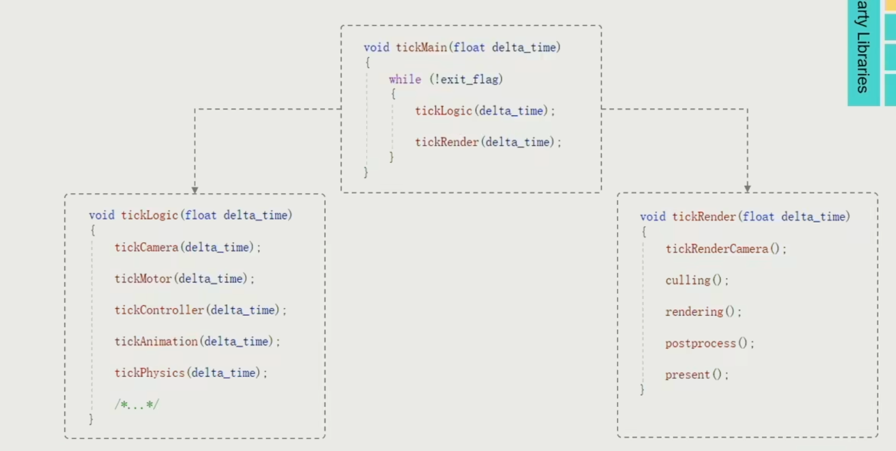

# 02.引擎架构分层

- 工具层
- 功能层
- 资源层
- 核心(core)层 频繁调用一些功能 线程创建 内存管理等
- 平台层 适配发布 处理各种平台、设备差异
- 第三方中间库

5+1 层次

---

## 1. Resource

- 将不同格式的文件转换成引擎的高效数据文件：**asset**（资产）
- 数据之间的关联 composite asset file 关联文件 如xml格式指出
- GUID标识

当变成资产后进入引擎，需要一个**资产管理器**(runtime resource management)

- 根据路径加载或载出文件的虚拟文件系统
- 通过handle sys 管理资产的引用和整个生命周期
  - GC 垃圾回收
  - 延迟加载

## 2.Function

How to make the world alive

一个tick一个tick变化

logic是对世界的模拟，render是针对不同视角的渲染。

logic: 血量计算、运动计算、碰撞检测等等物理世界的运动

render：根据算法渲染呈现

## 3.Core

- Math Library
  - 效率
  - simd 单指令流多数据流
- 数据结构和容器
  - 定制化STL
- 内存管理
  - 局部性原理 顺序访问 分批处理

## 4.Platform

- 文件路径
- 图形学API 
  - RHI render hardware interface 层 实现虚函数，调用不同API实现的效果

## 5.Tool

allow anyone to create game|unleash the creativity

DCC digital content creation

---

## 为什么分层？

和计算机网络分层一样。

底层和顶层独立，顶层不必知道底层的细节。

d

