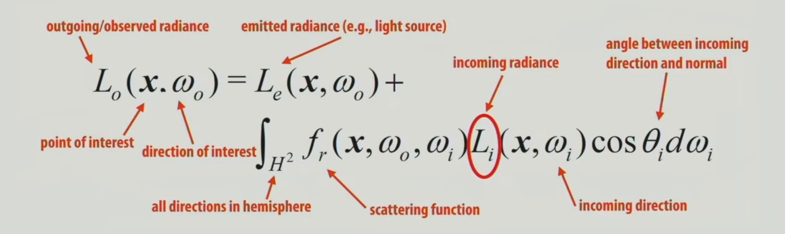
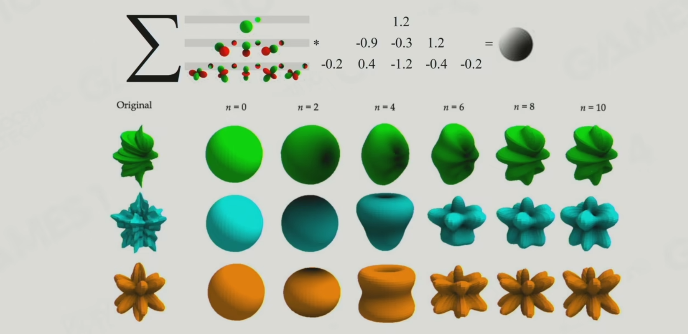
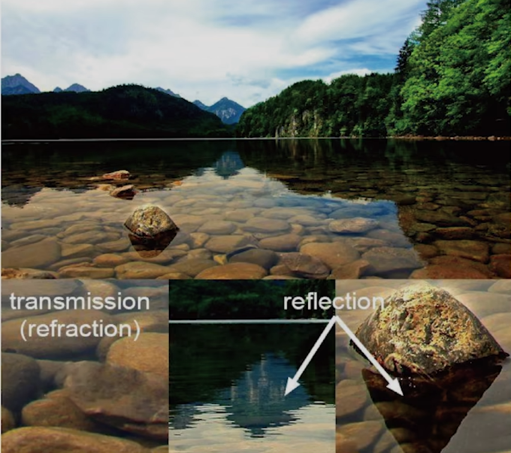
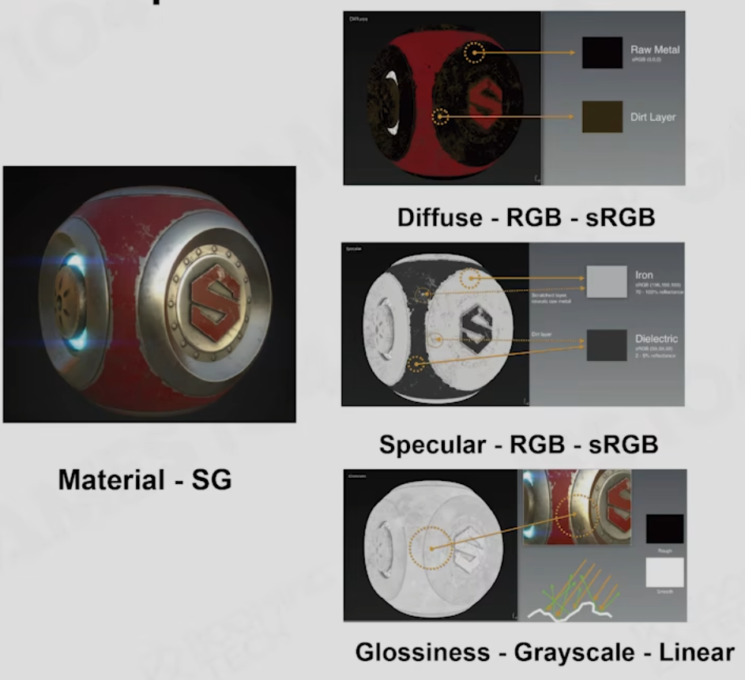
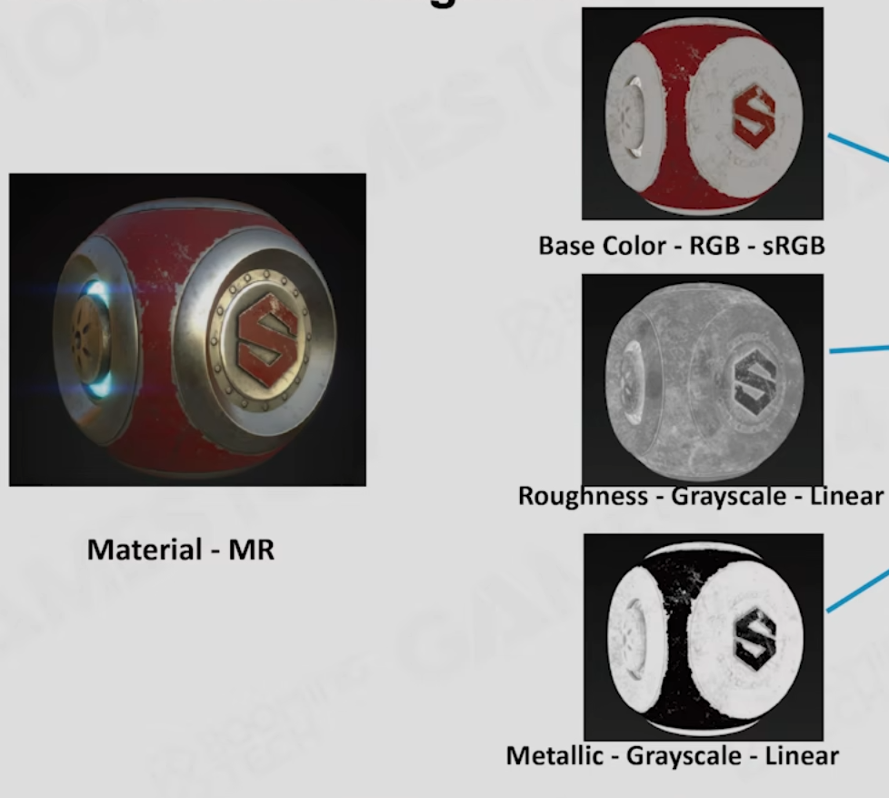
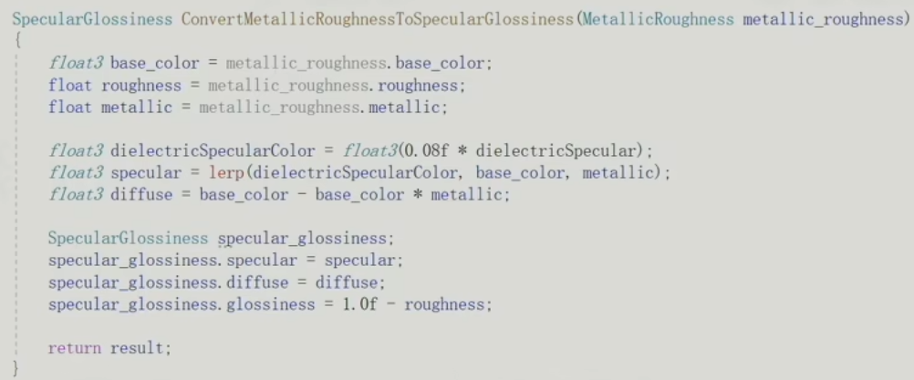

# 05.渲染中的光和材质的数学魔法

- lighting 光子的弹射，吸收，反射等
- material 怎么和光子反应
- shader 组织渲染

### 1.渲染方程

三个挑战：

- 1st 

  1a visibility to lights

  1b light source complexity

- 2nd 积分

- 3rd 间接光，全局光

### 2.基础光源解决方案

light: mainlight ambient environmentMap

material: blinn-phong material **问题**:能量不守恒 不真实

shadow: shadowmap **问题**: 阴影偏移

## summary of popular aaa rendering

lightmap + lightprobe 光

pbr+ibl 材质

cascade+vsmm 阴影

---

### 3.基于预计算的全局光照

空间换时间 

#### 3.1 light map

球谐函数 Spherical Harmonics

球面上积分->球谐函数上两个参数卷积

SH lightmap ：uv atlas

#### 3.2 light probe

光照采样点，然后插值

生成probe

1.通过地形

2.通过体素

专门做一个 reflection probe

### 4.Physical-Based Material

#### 1.Microfacet

diffuse: 光子被捕获，再弹出去。金属材质会直接捕获不弹出去

spectual: 反射 cook-torrance

#### 2.disney brdf

迪士尼brdf经验：

- 符合艺术家直觉
- 参数越少越好
- 范围最好是0~1
- 参数组合不会产生诡异的结果

#### 3.PBR pipeline

- **SG模型 **在pbr上封装的模型

roughness 就是1-Specular 

F0就是specular

problem : specular的设置会导致一些小问题

- **MR**:又包了一层

metallic较低，非金属，他的F0变化范围是有限的。

SG和MR可以相互转变

**cons**

1.非金属和金属过渡的时候会出现白边

2.没有直接控制F0的参数项目

**pros**

1.占用空间小，两张灰度图和一张srgb

2.解决SG的问题

### 5.基于图像的光照IBL

image-based lighting

### 6.经典shadow

cascade shadow

不同远近的shadowmap精度不同

**cons**存储问题

软阴影 PCF PCSS vssm

### 7.前沿技术

光照：实时光线追踪，实时全局光照

材质：更加复杂的模型：毛发，布料等

阴影：virtual shadow maps

### 7.shader 管理

uber shader

**在Shader中使用宏定义来区分执行分支**提高shader复用率

跨平台编译

