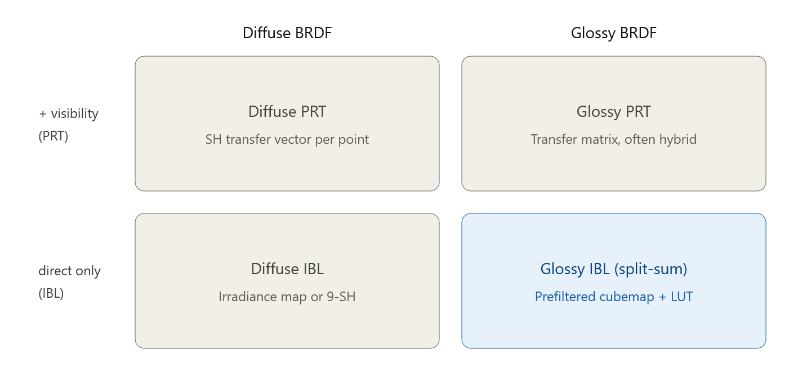
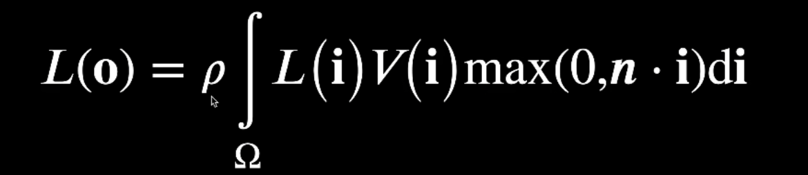
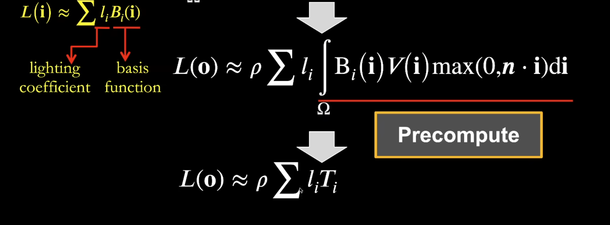
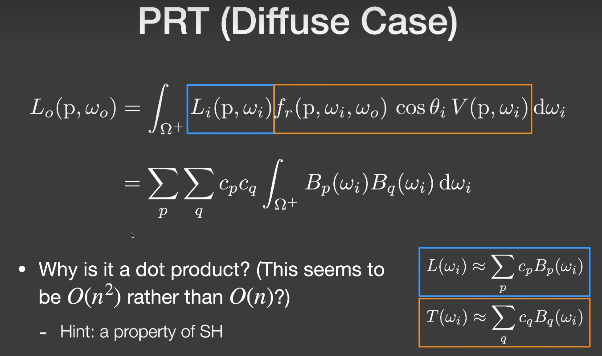
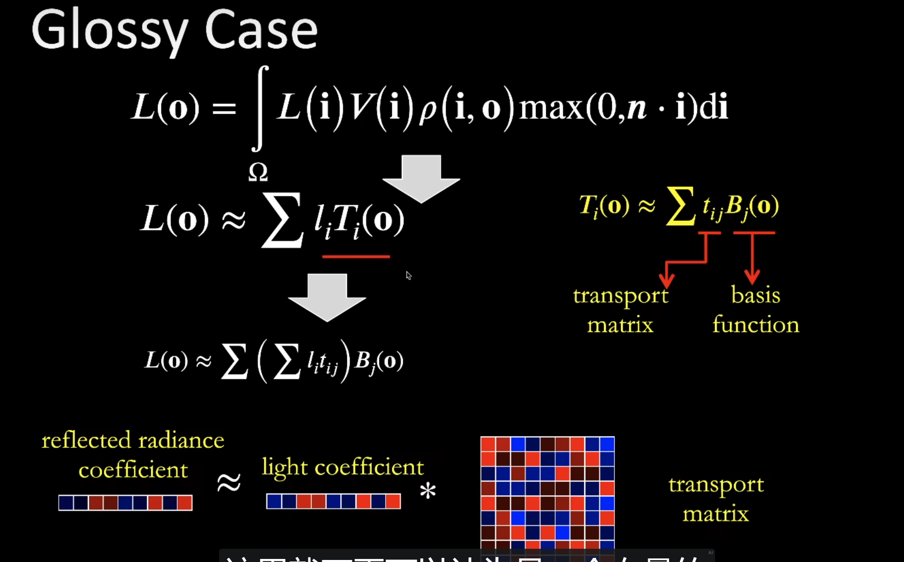
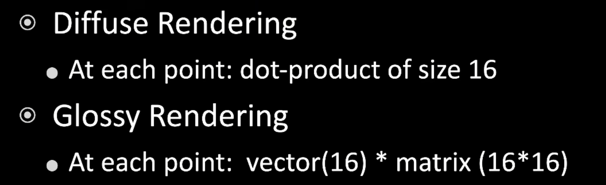

environment mapping是直接光照，和GI没什么关系，GI是间接光照

## PRT

计算环境mapping的某个point带shadow的shading。

= lighting + light transport

如果是静态场景，那么每个shading point的 light transport是不变的，可以预计算的。(场景不能动也就是PRT的缺点)

### Diffuse Case

diffuse情况下的rendering equation:

在PRT的情况下，积分和求和是可以交换的。

light transport和一个基函数乘积，相当于“投影”

由于SH的性质，只有当p=q的时候，右侧积分结果才会是1,都则是0

### glossy case

- SH for glossy transport
- wavelet

glossy case的复杂点在于，BRDF是一个四维的函数。（i两维，o两维）

 

不同o不同向量。所以lighttransport仍然是一个o的函数。

先投影到i的SH，再投影到o的SH

从i方向如何向o方向transport。

每个shading point都需要transport matrix。

diffuse一般用9（3阶段）

glossy一般用16

**当特别高频的情况下，需要高阶的SH（SH描述不是很好）的情况下，这就是PRT解决不了的问题了。**

接近镜面反射的时候，换用基函数，或者直接采样，使用ray tracing(path tracing都不用)。

还可以加interreflections。光线多次bounce。

材质区分：

- diffuse
- specular(镜面光滑程度)
- glossy（介于两者中间）

