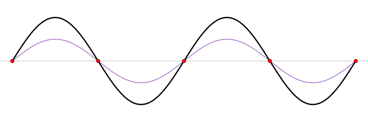
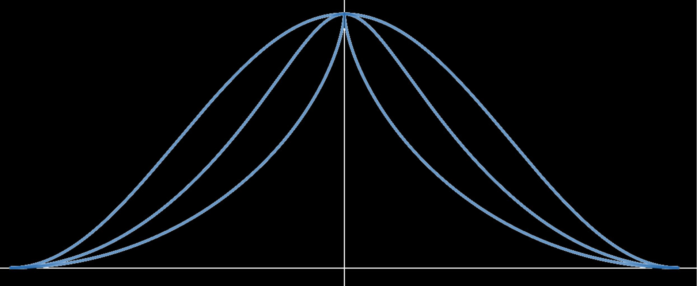
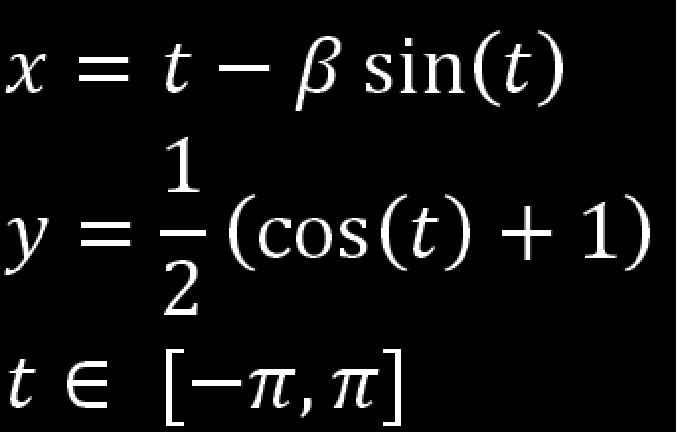
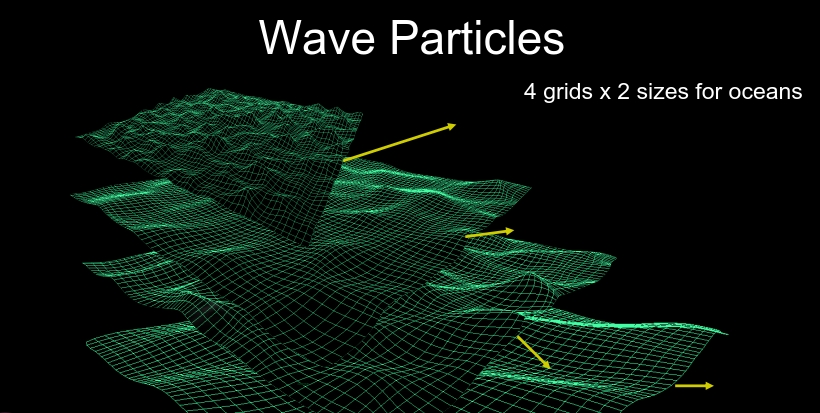
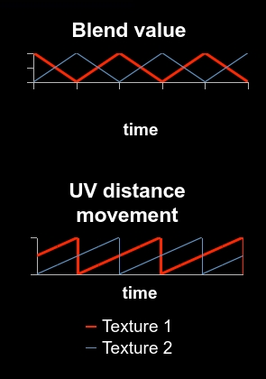
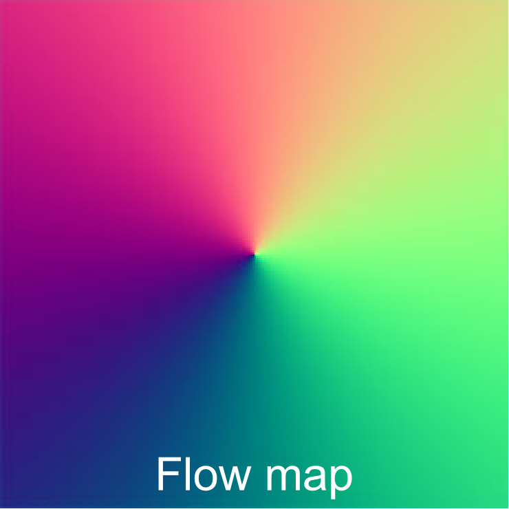
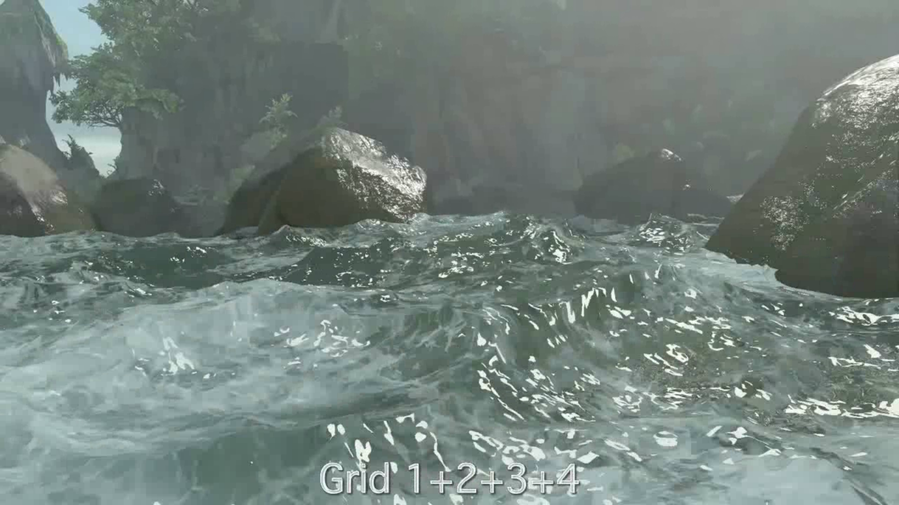
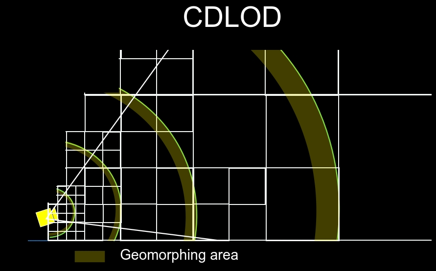
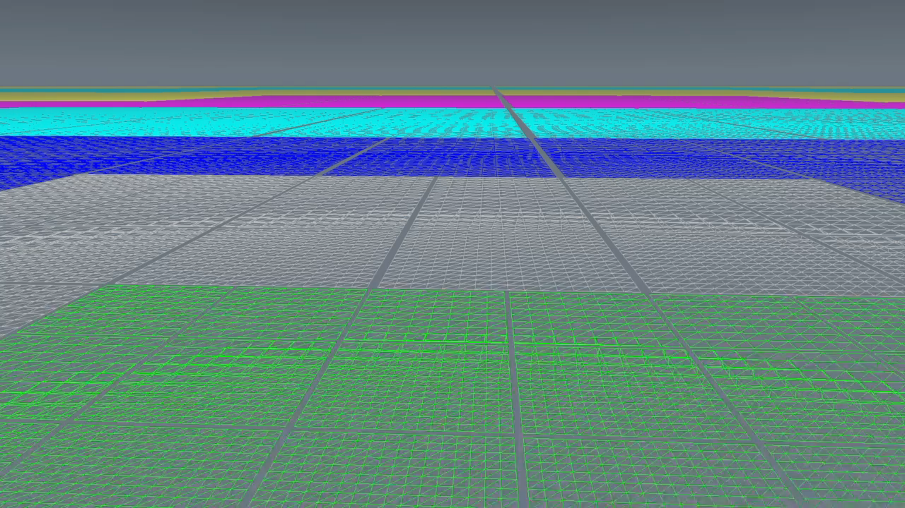
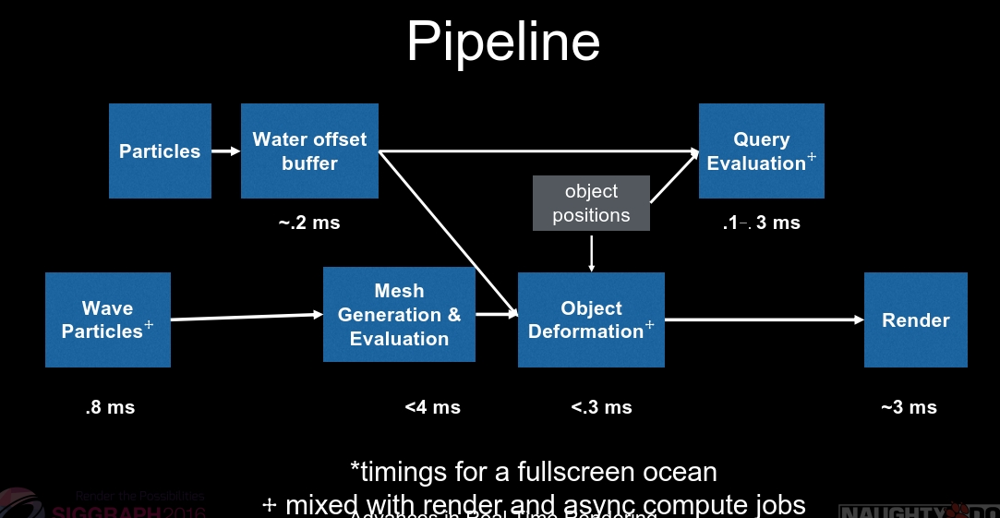

## Rendering rapids in uncharted 4

### previous work

- oceans

  Tessendorf FFT, wave particle

- rivers

  most use flow shader.缺点是看起来很flat,displacement较少

- simulation

  positional based fluids, siggraph 2013开销比较大

渲染river分为四个部分：

- wave animation
- geometry
- shading
- performance


- 流动是具有重复性的
- 驻波、反向波、小波叠加在大波之上
- 高频波在低频波的上面

驻波：



对于海洋：是全局的，通过gerstner或者fft生成波形，只要给出世界坐标(x,z)以及t就可以生成这个点的波浪高度，无需关心周围环境。

但是对于河流：其波浪是由局部环境决定的。比如河道变窄水流会变急。

### local motion: **wave particle**






从左到右依次是$\beta = 1$ $\beta = 0.5$ $\beta = 0$

在uncharted 3中就使用了wave particle来模拟海洋：
每一个wave particle会产生一个小的隆起，通过足够数量的粒子叠加，得到一种伪周期性的运动效果。除了位移也会同样的计算法线。

网格的尺寸为32*32,每个网格大约有300个particle。

而且每个网格是相互独立的，可以单独控制，同时不会产生明显的重复图案。

首先，他们计算了网格中每一个小方格（Quad）在变形后的**实际表面积**。

由于一个方格由两个三角形组成，他们分别计算了两个三角形的面积（实际上是对应平行四边形的面积）：
$$
d1=length(cross(v_{i+1,j}-v_{i,j},v_{i,j+1}−v_{i,j}))
$$

- **v**: 代表顶点的 3D 位置。
- **vi+1,j−vi,j**: 这是网格横向的边向量。
- **vi,j+1−vi,j**: 这是网格纵向的边向量。
- 两个向量的叉积会得到一个垂直于表面的法向量。
- 法向量的长度，在几何上等于这两个向量构成的**平行四边形的面积**。

$$
strain=1.0−(r×\frac{scaleX×scaleZ}{d1+d2})
$$

当strain的值很高的时候代表发生了挤压有尖锐的波峰，所以这里应该产生白色的泡沫粒子或飞溅特效。r是一个外部调控参数。

**和fft对比**

wave particle具有更多的可控性，虽然频率少，细节不如fft丰富,但是可以通过组合多个grids进行弥补。



最终表面包含四个wave particle grids，每个grids有不同的频率，scale和滚动速度。

### convert ocean tech for rivers

#### global motion

使低频的grids慢下来来模拟驻波，加快高频的grids来模拟水的流动。

高频在低频的上面流动

#### local motion

flow technique

flow map + wave particle

每一个grid有不同的速度



```c++
timeInt = time / (2.0 * interval)
float2 fTime = frac(float2(timeInt, timeInt * .5)
posA = pos.xz - (flowDir/2) * fTime.x * flowDir
posB = pos.xz - (flowDir/2) * fTime.y * flowDir
gridA0 = waveParticles(posA.xz, freq0,scale0) 
gridA1 = waveParticles(posA.xz, freq1,scale1)
…
gridB0 = waveParticles(posB.xz, freq2,scale0)
gridB1 = waveParticles(posB.xz, freq3,scale1)
…
float3 pos0 = gridA0 + gridA1 + gridA2 + gridA3
float3 pos1 = gridB0 + gridB1 + gridB2 + gridB3
pos = blend(pos0, pos1, abs((2*frac(timeInt)-1)))
pos.y += heightMap.eval(uv)
```

通过flowmap和waveparticle，可以精准的控制波的流向，



例如上图就可以制造一个旋涡。



- 不同规模的girds叠加。例如：

1: 一些小的涟漪 ripples

2:小波浪

3:中等波浪

4:低频大振幅的涌浪swells

- rgba遮罩贴图。控制各个等级的强度。

这里所有四层的方向都是共用同一个流动方向，节省资源。如果每一层使用不同的方向，效果没有显著的改变，但是会增加消耗。

### Mesh Construction

屏幕空间网格需要高细分（也就是顶点数量多）来避免走样（尤其是在相机移动的时候）。且无法处理落差：比如瀑布，急流的落差剧烈变化的场景。
在uncharted3中使用的是geometry clipmap。

geometry clipmap缺点

1.是不规则的数据块，对现代gpu不是友好的，不规则的**批处理**效率较低。

2.在LOD切换时会有跳变。


对于屏幕空间的不稳定性，必须采用世界空间确定的网格。

对于不规则的数据结构，我们需要采用gpu友好的规则结构网格。

河流属于有界水体，我们需要满足无界和有界的两种需求。

所以采取，基于四叉树的cdlod网格。

#### CDLOD

cdlod的数据结构是一片四边形，每个quad会根据到相机的距离被细分。

距离判定是两倍的增长。

距离是通过同心圆进行判断的。




网格的尺寸采用的是17 x 17。尺寸是指base quad，也就是gpu的渲染单位，将其细分为17 x 17个顶点。

对于远近不同的格子，顶点的稀疏程度是不一样的。



#### CDLOD for rivers

height map + wave 偏移

### particle deformation

与物体如何交互？

两阶段处理。

**第一阶段：胶囊体检测**

利用胶囊体近似表示车辆。

遍历base quads，加入待处理列表。

**第二阶段：deformation**

对于object要有一张特殊的纹理mask,对周围quad进行顶点变形。


**对于粒子**：
把一些粒子特效，渲染到offset buffer（off screen)里面，

3 vector stored in 32 bit buffer(11-11-10)

从上到下投影，以相机为中心，displace水的表面。


整个系统的pipeline：



- 计算生成wave particle,获得位置以及法线
- 特效粒子渲染到water offset buffer中
- 生成mesh
  - 读取base quad
  - 细分网格
  - displacement=waves + height map + offset buffer
- object deformation 压平交互效果
- render


对于破浪浪花等：

- 物理：通过offset buffer以及object deformation网格形成偏移，例如隆起或者挤压。
- 视觉：可以通过粒子系统或者billboard渲染一些水花面片或者浪花
- shading: 通过Strain引入白沫等等效果。

三个层面综合来渲染破浪浪花。