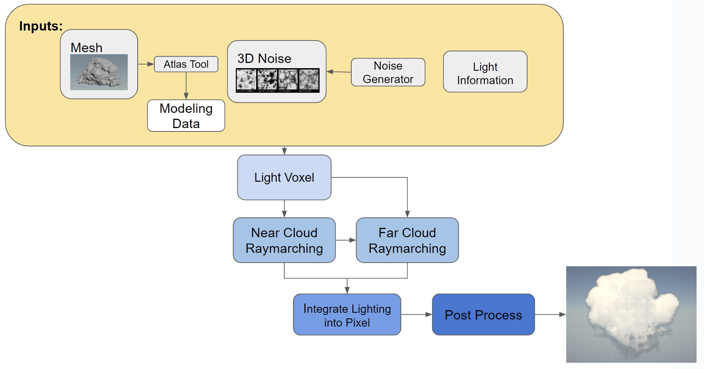
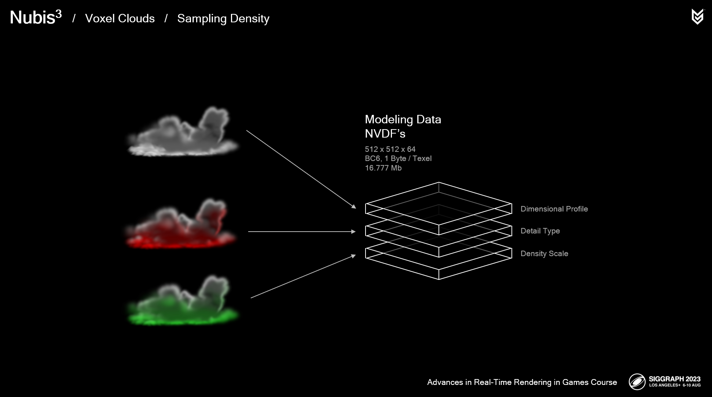
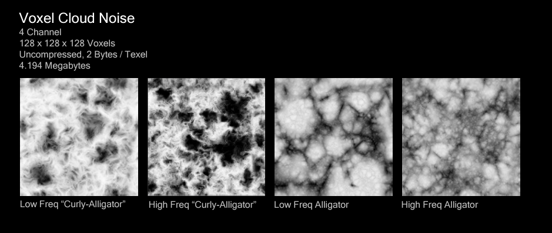
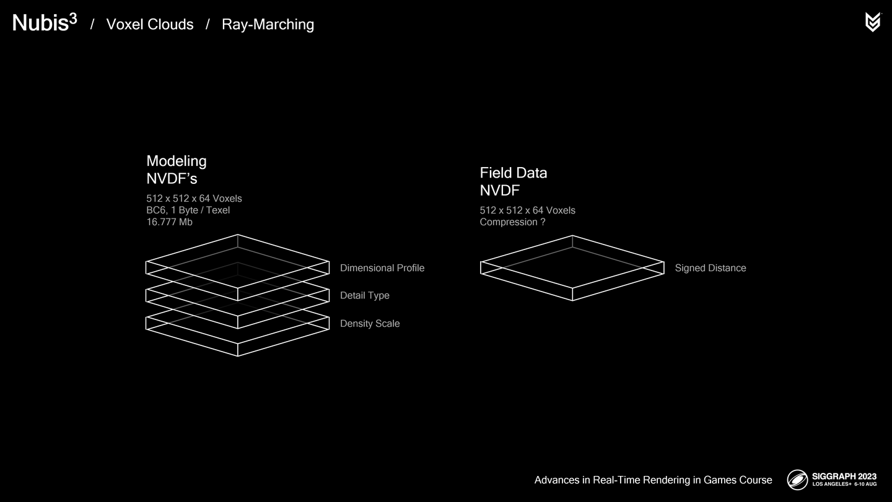
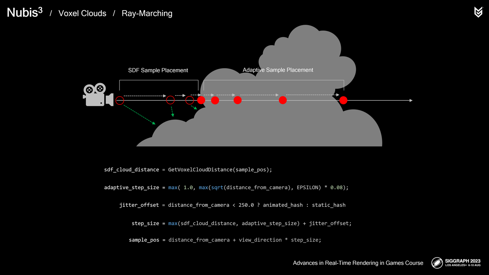

## 1.modeling

这个过程为整个算法提供了两个主要输入：

- modeling data，云整体形状的信息，从vdb以及tga文件加载
- cloud 3d noise, 存储了用于计算云细节的噪声，从.tga文件加载

通过离线流体模拟的方法建模云，将生成的数据保存到体素网格中，并输出的到.vdb/.tga文件。

云的生成是通过一个Aero的求解器生成的。atals tool是一个编辑工具，提供多个单体云的合成，可以在云上打洞之类的。

**VDB**

是hierarchical voxel grids的数据结构，一般用于存储云、烟雾和火焰模型。VDB可以直接生成SDF。

整个modeling data使用BC6压缩在一个data texture中，分辨率为512/512/64。

数据的主要三个通道：

- dimensional profile 整体形状以及梯度信息。
- detail type 描述两种细节形态 billow和wispy 在云结构上的分布
- Density scale 密度调制。

**TGA**

细节包括了上述描述的两种

- billow 波浪状结构，冷空气反向挤压而形成。
- wispy 絮状结构，云体向低密度空间弥散而形成。

上述两种细节保存在4-channel的3D纹理中

RG两通道用于求解billow,BA两通道用于求解Wispy。这些3D纹理存储在tga文件中。

## 2.distribution

体素内部存储的不是density而是profile,在marching过程中如果接触云，再使用3D的噪声侵蚀并计算照明。

## 3. 

**细节侵蚀**：

云体边缘需要较为低频的信号，密度高的地方需要高频的信号。可以根据mesh SDF来判断区域，使用不同频率的噪声。同时这里也建议使用mipmap，开启lod选择，这样可以节省15%的性能开销。

## 4.Compressed SDF

尽可能减少0密度点的采样。

frankencloudscape -> SDF -> field data NVDF(将-256 ~ 4096的距离范围remap到0 ~ 1) 是一张3DTexture 512/512/64。使用的是自定义的BC1压缩，因为相对于modeling data有精度要求。

将多个mesh SDF合成 global SDF

## 5.adpative raymarching

使用球面步进来判断与表面的交点，对于云内使用步长逐渐增大的自适应步幅，并且对于250m以内使用Jitter扰动方向来减少“**切片式伪影**”。
