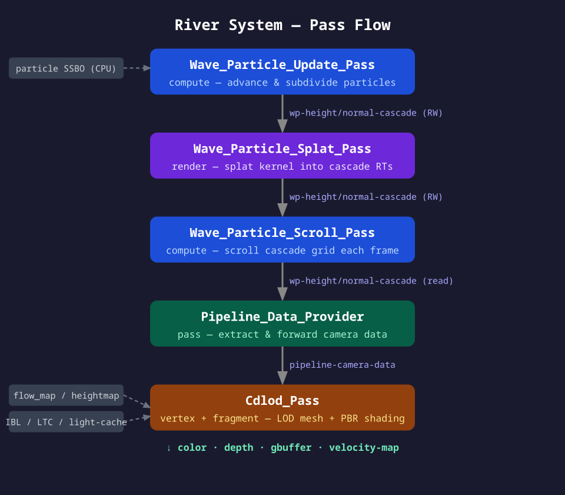

- # River Wave Particle System — Implementation Plan

  Uncharted 4 ("Rendering Rapids in Uncharted 4", SIGGRAPH 2016) river rendering implementation
  within the `ext-fx-river-system` extension, following the rays-engine pass/service/trait pattern.

  ---

  ## 1. Overview

  The wave particle technique (Yuksel et al., SIGGRAPH 2007) represents propagating wave-fronts
  as Lagrangian particles GPU-splatted into cascade heightmap render targets each frame.
  The accumulated maps drive vertex displacement, normal perturbation, and foam in the CDLOD pass.

  

  ### Pipeline Summary

  ```
  [CPU] Emitter events (gameplay, river sources)
          ↓
  [GPU Compute] Wave_Particle_Update_Pass  — deterministic position advance + subdivision
          ↓
  [GPU Render]  Wave_Particle_Splat_Pass   — additive kernel splat → cascade RTs (RG16F ×3)
          ↓
  [GPU Compute] Wave_Particle_Scroll_Pass  — scroll grids along flow, exponential decay
          ↓
  [GPU Vertex]  Cdlod_Pass (modified)      — wave height displacement + CDLOD morph
          ↓
  [GPU Fragment] Cdlod_Pass (modified)     — PBR shading, normals, foam, IBL, SSS
  ```

  See `pipeline-flow.svg` (same directory) for the full resource-flow diagram.

  ---

  ## 2. New Directory Structure

  ```
  source/ext-fx-river-system/
  ├── wave-particle/
  │   ├── wave-particle-buffer.hpp        — GPU particle SSBO layout & dead-list management
  │   ├── wave-particle-buffer.cpp
  │   ├── wave-particle-emitter.hpp       — Emitter data (pos, dir, rate, config)
  │   ├── wave-particle-cascade.hpp       — Cascade grid config & scroll-offset tracking
  │   ├── wave-particle-cascade.cpp
  │   ├── wave-particle-update-pass.hpp   — Compute: advance + subdivide
  │   ├── wave-particle-update-pass.cpp
  │   ├── wave-particle-splat-pass.hpp    — Render: additive splat into 3 cascade pairs
  │   ├── wave-particle-splat-pass.cpp
  │   └── wave-particle-scroll-pass.hpp   — Compute: scroll + decay
  │       wave-particle-scroll-pass.cpp
  ├── trait/
  │   ├── cdlod-config.hpp                — (existing, promote wave-particle fields)
  │   └── wave-particle-config.hpp        — NEW: full wave-particle configuration trait
  ├── service/
  │   ├── cdlod-service.cpp/hpp           — (existing)
  │   └── wave-particle-service.hpp       — NEW: emitter lifecycle, per-frame dispatch
  │       wave-particle-service.cpp
  └── init.cpp                            — register new passes, service, trait
  
  asset/ext-fx-river-system/
  ├── shader/
  │   ├── wave-particle/
  │   │   ├── wave-particle-update-comp.glsl   — Compute: position + flow deflect + subdivide
  │   │   ├── wave-particle-splat-vert.glsl    — Instanced quad per particle
  │   │   ├── wave-particle-splat-frag.glsl    — cos(π·r/R)·cos(2π·d/λ) kernel
  │   │   └── wave-particle-scroll-comp.glsl   — Scroll offset + exponential decay
  │   ├── river-shading.glsl              — NEW: shared lighting functions (Fresnel, SSS, foam)
  │   ├── cdlod-vert.glsl                 — (modified: wave height sampling)
  │   └── cdlod-frag.glsl                 — (modified: full PBR shading)
  └── effect/
      ├── wave-particle.fxg               — NEW: update → splat → scroll sub-graph
      ├── cdlod.fxg                       — MODIFIED: add wave-particle passes, new inputs
      └── river-system.fxg                — MODIFIED: expand interface (add light, ibl-data)
  ```

  ---

  ## 3. Data Structures

  ### 3.1 Wave_Particle (GPU buffer element, std430)

  ```cpp
  // wave-particle/wave-particle-buffer.hpp
  struct alignas(16) Wave_Particle {
      math::Vector2 position;         // initial world XZ at spawn_time
      math::Vector2 direction;        // unit propagation vector
      float         speed;            // m/s; dispersion: sqrt(g·2π/wavelength)
      float         amplitude;        // crest height (m); decays over lifetime
      float         radius;           // half-arc width (m); grows via dispersion
      float         dispersion_angle; // radians; subdivide when > threshold
      float         wavelength;       // metres; controls longitudinal frequency
      float         spawn_time;       // engine time at spawn
      float         lifetime;         // seconds remaining
      int           cascade_mask;     // bitmask: which cascades receive this particle
  };
  static_assert(sizeof(Wave_Particle) == 48);
  ```

  Particle positions are **never stored as current-frame state** — always reconstructed:

  ```glsl
  vec2 current_pos = p.position + p.direction * p.speed * (u_time - p.spawn_time);
  ```

  ### 3.2 Wave_Particle_Buffer

  ```cpp
  // wave-particle/wave-particle-buffer.hpp
  struct Wave_Particle_Buffer : core::Pinned {
      core::Gpu_Buffer particle_ssbo;      // Wave_Particle[capacity]
      core::Gpu_Buffer counter_buffer;     // uint[2]: alive_count, dead_head
      core::Gpu_Buffer dead_list_buffer;   // uint[capacity]: free-slot ring buffer
      int capacity{65536};
  
      auto upload_spawns(std::span<Wave_Particle const>) -> void;
      auto bind_for_update() -> void;
      auto bind_for_splat() -> void;
  };
  ```

  ### 3.3 Wave_Particle_Cascade

  ```cpp
  // wave-particle/wave-particle-cascade.hpp
  struct Cascade_Grid {
      core::Render_Target height_rt;   // RG16F: R=height, G=foam_amount
      core::Render_Target normal_rt;   // RG16F: R=nx, G=nz (ny reconstructed as sqrt)
      float world_size;                // world units covered (e.g. 32, 128, 512)
      float texel_world_size;          // world_size / texture_resolution
      math::Vector2 scroll_offset;     // accumulated UV scroll [0,1] (wraps)
      float decay_rate{0.92f};         // per-frame exponential decay multiplier
  };
  
  struct Wave_Particle_Cascade : core::Pinned {
      static constexpr int COUNT = 3;
      std::array<Cascade_Grid, COUNT> grids;  // fine → coarse
      int texture_resolution{512};
  
      auto advance_scroll(math::Vector2 flow_velocity_ms, float dt) -> void;
  };
  ```

  ### 3.4 Wave_Particle_Config (trait)

  ```cpp
  // trait/wave-particle-config.hpp
  struct Wave_Particle_Config {
      // Cascade world coverage
      CCTT_INTROSPECT(.gui_editor "drag" .gui_widget_min{8.0f} .gui_widget_max{256.0f})
      float cascade0_world_size{32.0f};
  
      CCTT_INTROSPECT(.gui_editor "drag" .gui_widget_min{64.0f} .gui_widget_max{1024.0f})
      float cascade1_world_size{128.0f};
  
      CCTT_INTROSPECT(.gui_editor "drag" .gui_widget_min{256.0f} .gui_widget_max{4096.0f})
      float cascade2_world_size{512.0f};
  
      CCTT_INTROSPECT(.gui_editor "drag" .gui_widget_min{64} .gui_widget_max{1024})
      int texture_resolution{512};
  
      // Particle lifecycle
      CCTT_INTROSPECT(.gui_editor "drag" .gui_widget_min{0.0f} .gui_widget_max{3.0f})
      float max_amplitude{0.3f};
  
      CCTT_INTROSPECT(.gui_editor "drag" .gui_widget_min{1.0f} .gui_widget_max{30.0f})
      float max_lifetime{8.0f};
  
      CCTT_INTROSPECT(.gui_editor "drag" .gui_widget_min{5.0f} .gui_widget_max{90.0f})
      float subdivide_angle_deg{30.0f};
  
      CCTT_INTROSPECT(.gui_editor "drag" .gui_widget_min{0.2f} .gui_widget_max{8.0f})
      float wavelength{1.5f};
  
      // Rendering
      CCTT_INTROSPECT(.gui_editor "drag" .gui_widget_min{0.0f} .gui_widget_max{2.0f})
      float displace_scale{0.5f};
  
      CCTT_INTROSPECT(.gui_editor "drag" .gui_widget_min{0.0f} .gui_widget_max{4.0f})
      float normal_strength{1.2f};
  
      CCTT_INTROSPECT(.gui_editor "drag" .gui_widget_min{0.0f} .gui_widget_max{1.0f})
      float foam_threshold{0.12f};
  
      // Flow
      CCTT_INTROSPECT(.gui_editor "asset_path")
      std::string flow_map_path{};     // RG=direction, B=amplitude_weight, A=foam_mask
  
      CCTT_INTROSPECT(.gui_editor "drag" .gui_widget_min{0.0f} .gui_widget_max{1.0f})
      float flow_influence{0.6f};
  
      CCTT_INTROSPECT(.gui_editor "drag" .gui_widget_min{0.0f} .gui_widget_max{10.0f})
      float flow_scroll_speed{1.0f};
  
      // Debug
      CCTT_INTROSPECT(.serde_optional true)
      bool debug_show_particles{false};
  
      CCTT_INTROSPECT(.serde_optional true)
      int debug_cascade_view{-1};      // -1=off, 0/1/2=show that cascade
  };
  ```

  ---

  ## 4. GPU Passes

  ### 4.1 Wave_Particle_Update_Pass (Compute)

  Dispatch size: `ceil(capacity / 64)` groups.

  **Per-thread:**
  1. Reconstruct current position: `pos = p.position + p.direction * p.speed * (t − p.spawn_time)`
  2. Sample flow map at `pos` → deflect direction, scale amplitude by B channel
  3. Decrement lifetime; if `<= 0` → write index to dead-list, zero particle
  4. Expand radius: `p.radius += p.speed * tan(p.dispersion_angle * 0.5) * dt`
  5. Subdivide if `p.dispersion_angle > threshold`:
     - Allocate 3 child slots via `atomicAdd(dead_head, -3)`
     - Each child: `amplitude /= 3`, `dispersion_angle /= 3`, `spawn_time = t`, `position = pos`
     - Spread directions evenly: `dir_i = rotate(parent.dir, (i−1) * angle/3)`
     - Zero parent particle

  ```glsl
  // wave-particle-update-comp.glsl (excerpt)
  layout(local_size_x = 64) in;
  layout(std430, binding = 0) buffer Particles  { WaveParticle particles[]; };
  layout(std430, binding = 1) buffer Counters   { uint alive_count; uint dead_head; };
  layout(std430, binding = 2) buffer DeadList   { uint dead_indices[]; };
  layout(binding = 3) uniform sampler2D u_flow_map;
  
  uniform float u_time;
  uniform float u_dt;
  uniform float u_subdivide_angle;
  uniform float u_flow_influence;
  uniform vec2  u_flow_map_world_origin;
  uniform float u_flow_map_world_size;
  
  void main() {
      uint idx = gl_GlobalInvocationID.x;
      if (idx >= alive_count) return;
  
      WaveParticle p = particles[idx];
      if (p.lifetime <= 0.0) { kill(idx); return; }
  
      vec2 pos = p.position + p.direction * p.speed * (u_time - p.spawn_time);
  
      // Flow map deflection
      vec2 uv = (pos - u_flow_map_world_origin) / u_flow_map_world_size + 0.5;
      vec4 flow = texture(u_flow_map, uv);
      vec2 flowDir = normalize(flow.rg * 2.0 - 1.0);
      p.direction  = normalize(mix(p.direction, flowDir, u_flow_influence));
      p.amplitude *= flow.b;
      p.amplitude -= p.amplitude * 0.15 * u_dt;  // slow dissipation
      p.lifetime  -= u_dt;
      p.radius    += p.speed * tan(p.dispersion_angle * 0.5) * u_dt;
  
      if (p.dispersion_angle > u_subdivide_angle) { subdivide(idx, p, pos); return; }
  
      particles[idx] = p;
  }
  ```

  ### 4.2 Wave_Particle_Splat_Pass (Render)

  Called once per cascade. Renders all live particles as instanced quads into that cascade's
  `height_rt` and `normal_rt` with `ONE + ONE` (additive) blending.

  **Vertex shader (`wave-particle-splat-vert.glsl`):**

  ```glsl
  layout(location = 0) in vec2 a_quad_local;  // [-1,1]² template quad
  
  // Per-instance: read from SSBO using gl_InstanceID
  out vec2  v_local;
  out float v_amplitude;
  out float v_radius_world;
  out float v_wavelength;
  out float v_long_phase_offset;  // dot(current_pos, direction) for longitudinal phase
  
  uniform float u_time;
  uniform float u_cascade_world_size;
  uniform vec2  u_cascade_scroll_offset;
  
  void main() {
      WaveParticle p = particles[gl_InstanceID];
      if (p.lifetime <= 0.0) { gl_Position = vec4(2.0); return; }  // discard
  
      vec2 pos = p.position + p.direction * p.speed * (u_time - p.spawn_time);
  
      // Particle UV center in cascade (0..1 with scroll)
      vec2 center_uv = (pos / u_cascade_world_size) + 0.5 + u_cascade_scroll_offset;
      center_uv = fract(center_uv);  // wrap within cascade
  
      float r_uv = p.radius / u_cascade_world_size;
      vec2 vertex_uv = center_uv + a_quad_local * r_uv;
  
      v_local           = a_quad_local;
      v_amplitude       = p.amplitude;
      v_radius_world    = p.radius;
      v_wavelength      = p.wavelength;
      v_long_phase_offset = dot(pos, p.direction);
  
      gl_Position = vec4(vertex_uv * 2.0 - 1.0, 0.0, 1.0);
  }
  ```

  **Fragment shader (`wave-particle-splat-frag.glsl`):**

  ```glsl
  in vec2  v_local;
  in float v_amplitude;
  in float v_radius_world;
  in float v_wavelength;
  in float v_long_phase_offset;
  
  uniform float u_cascade_world_size;
  uniform float u_foam_threshold;
  
  layout(location = 0) out vec2 out_height_foam;  // R=height, G=foam
  layout(location = 1) out vec2 out_normal_xz;    // R=nx, G=nz (additive)
  
  void main() {
      float r = length(v_local);
      if (r > 1.0) discard;
  
      // Lateral envelope: raised cosine (zero at r=1)
      float k_lat = cos(PI * r);
  
      // Longitudinal oscillation along propagation
      // v_local.y ≈ normalised longitudinal coordinate [-1,1]
      float d_world = v_local.y * v_radius_world;
      float phase   = 2.0 * PI * d_world / v_wavelength + v_long_phase_offset * 2.0 * PI / v_wavelength;
      float k_long  = cos(phase);
  
      float height = v_amplitude * k_lat * k_long;
  
      // Normal as gradient of kernel (analytically derived)
      float dk_lat_dr  = -sin(PI * r) * PI / (r + 1e-5);
      float dh_dx = v_amplitude * dk_lat_dr * v_local.x * k_long;
      float dh_dz = v_amplitude * (dk_lat_dr * v_local.y * k_long
                    - k_lat * sin(phase) * 2.0 * PI * v_radius_world / v_wavelength);
  
      float foam = max(0.0, (height - u_foam_threshold) * (1.0 / (v_amplitude + 1e-4)));
  
      out_height_foam = vec2(height, foam);
      out_normal_xz   = vec2(dh_dx, dh_dz);
  }
  ```

  ### 4.3 Wave_Particle_Scroll_Pass (Compute)

  Runs after splat. Applies exponential decay to both cascade RTs. The scroll offset is
  managed CPU-side in `Cascade_Grid::scroll_offset` and passed as a uniform to the splat pass,
  so no texel shifting is needed — only amplitude decay.

  ```glsl
  // wave-particle-scroll-comp.glsl
  layout(local_size_x = 16, local_size_y = 16) in;
  layout(rg16f, binding = 0) uniform image2D u_height_foam;
  layout(rg16f, binding = 1) uniform image2D u_normal;
  uniform float u_decay;   // e.g. 0.93 per frame (~60 fps → ~60 frames half-life)
  
  void main() {
      ivec2 c = ivec2(gl_GlobalInvocationID.xy);
      imageStore(u_height_foam, c, imageLoad(u_height_foam, c) * u_decay);
      imageStore(u_normal,      c, imageLoad(u_normal,      c) * u_decay);
  }
  ```

  ---

  ## 5. Shading — Cdlod_Pass Fragment Stage

  The modified `Cdlod_Pass` implements a physically-based water surface lighting model.
  New inputs required: `common-light-cache`, `ibl-data`, `ltc-data`, `gbuffer`.

  ### 5.1 Normal Computation

  Three normal sources are blended:

  ```glsl
  // 1. Wave-particle normal (from 3 cascade grids)
  vec3 wp_normal = vec3(0.0, 1.0, 0.0);
  for (int i = 0; i < 3; ++i) {
      vec2 uv = wp_cascade_uv(v_world_xz, i);
      vec2 n_xz = texture(u_wp_normal[i], uv).rg * cascade_inbounds(uv);
      wp_normal.xz += n_xz * u_wp_normal_strength;
  }
  wp_normal = normalize(wp_normal);
  
  // 2. Flow-scrolling detail normal map (two-UV cross-fade)
  //    Two UV sets scroll along flow direction; cross-faded to hide UV stretching.
  float t_frac  = fract(u_time * u_flow_scroll_speed * 0.05);
  float blend   = abs(t_frac * 2.0 - 1.0);          // triangle wave
  vec2 flow_dir = texture(u_flow_map, v_flow_uv).rg * 2.0 - 1.0;
  vec2 uv_a = v_flow_uv - flow_dir * t_frac;
  vec2 uv_b = v_flow_uv - flow_dir * (t_frac - 0.5);
  vec3 detail_n = mix(sample_normal(uv_a), sample_normal(uv_b), blend);
  
  // 3. Combine: wave-particle (macro) + flow detail (micro)
  vec3 surface_normal = normalize(wp_normal + detail_n - vec3(0, 1, 0));
  ```

  ### 5.2 Fresnel Reflectance

  Water IOR ≈ 1.33. Schlick approximation:

  ```glsl
  // river-shading.glsl
  float fresnel_water(float n_dot_v) {
      const float F0 = 0.02;  // ((1.0 - 1.33) / (1.0 + 1.33))^2
      return F0 + (1.0 - F0) * pow(1.0 - clamp(n_dot_v, 0.0, 1.0), 5.0);
  }
  ```

  ### 5.3 IBL Specular

  Use the `ibl-data` input (same as ocean-pass):

  ```glsl
  float n_dot_v    = max(dot(surface_normal, view_dir), 0.0);
  float fresnel    = fresnel_water(n_dot_v);
  float roughness  = 0.05;  // water is very smooth
  
  // Sample pre-filtered env map at appropriate mip
  vec3 reflect_dir = reflect(-view_dir, surface_normal);
  vec3 ibl_specular = sample_ibl_specular(ibl_data, reflect_dir, roughness) * fresnel;
  ```

  ### 5.4 Subsurface Scattering Approximation (River Color)

  River water has a characteristic turquoise/green color from suspended sediment
  and depth absorption. Beer-Lambert along the view direction:

  ```glsl
  // Depth below surface along view ray
  float water_depth = max(texture(u_scene_depth, v_screen_uv).r - gl_FragCoord.z, 0.0);
  water_depth      *= u_depth_scale;   // scene-depth to metres
  
  // Absorption coefficients (RGB) — tune per-scene
  const vec3 absorption = vec3(0.45, 0.12, 0.08);  // strongly absorbs red
  vec3 transmittance = exp(-absorption * water_depth);
  
  // Base water color: deep blue-green, attenuated by depth
  vec3 water_color = mix(u_deep_color, u_shallow_color, exp(-water_depth * 2.0));
  
  // Fake forward scattering toward sun
  float sun_scatter = pow(max(dot(view_dir, -u_sun_direction), 0.0), 4.0) * 0.3;
  water_color += u_sun_color * sun_scatter * transmittance;
  ```

  ### 5.5 Direct Sun Lighting (GGX Specular)

  ```glsl
  // river-shading.glsl
  vec3 sun_specular_ggx(vec3 N, vec3 V, vec3 L, vec3 sun_color, float roughness) {
      vec3  H    = normalize(V + L);
      float NdH  = max(dot(N, H), 0.0);
      float NdV  = max(dot(N, V), 0.0);
      float NdL  = max(dot(N, L), 0.0);
      float a    = roughness * roughness;
      float a2   = a * a;
  
      // GGX NDF
      float denom = NdH * NdH * (a2 - 1.0) + 1.0;
      float D = a2 / (PI * denom * denom);
  
      // Schlick-GGX visibility
      float k  = (roughness + 1.0) * (roughness + 1.0) / 8.0;
      float G  = (NdV / (NdV * (1.0 - k) + k)) * (NdL / (NdL * (1.0 - k) + k));
  
      float F = fresnel_water(max(dot(H, V), 0.0));
      return sun_color * D * G * F * NdL;
  }
  ```

  ### 5.6 Foam Rendering

  Foam blended atop the water surface using the accumulated foam map from splat pass,
  plus a flow-divergence channel baked into the flow map alpha:

  ```glsl
  float wp_foam    = texture(u_wp_height[0], wp_uv_0).g;          // particle-generated foam
  float baked_foam = texture(u_flow_map, v_flow_uv).a;             // divergence-baked foam
  float foam_mask  = saturate(wp_foam + baked_foam * 0.5);
  
  // Foam texture at two scrolling UV sets (same cross-fade as normals)
  vec4 foam_tex = mix(texture(u_foam_tex, uv_a * 4.0),
                      texture(u_foam_tex, uv_b * 4.0), blend);
  
  vec3 surface_color = mix(water_color + ibl_specular, foam_tex.rgb, foam_mask);
  float alpha        = mix(0.88, 1.0, foam_mask);  // foam is fully opaque
  ```

  ### 5.7 Final Composite

  ```glsl
  // Blend sun specular (Fresnel weighted) + IBL + subsurface + foam
  vec3 final_color = surface_color
                   + sun_specular_ggx(surface_normal, view_dir, sun_dir, sun_color, 0.05)
                   + ibl_specular;
  
  // Shore fade: attenuate amplitude at shallow edges (from flow map B or heightmap)
  float shore_mask = saturate(water_depth * 4.0);
  final_color     *= shore_mask;
  
  out_color = vec4(final_color, alpha);
  ```

  ### 5.8 G-Buffer Output (Deferred Integration)

  River writes to the standard pipeline G-buffer so deferred SSAO, shadows,
  and screen-space reflections can reference it:

  ```glsl
  // Write surface normal to G-buffer normal slot
  out_gbuffer_normal  = vec4(surface_normal * 0.5 + 0.5, roughness);
  // Velocity for temporal AA
  vec2 velocity = (v_clip_pos_curr.xy / v_clip_pos_curr.w)
                - (v_clip_pos_prev.xy / v_clip_pos_prev.w);
  out_velocity_map = vec4(velocity * 0.5, 0.0, 1.0);
  ```

  ---

  ## 6. Effect Graph — FXG2 Format

  ### 6.1 `wave-particle.fxg` (new file)

  ```
  [FXG2]
  name wave-particle-pipeline
  
  [EFFECT]
  wave-particle-update-pass *
  wave-particle-splat-pass  *
  wave-particle-scroll-pass *
  
  [RESOURCE]
  wp-height-cascade  texture-span -
  wp-normal-cascade  texture-span -
  
  [GRAPH]
  wave-particle-update-pass wp-height-cascade <- *
  wave-particle-update-pass wp-normal-cascade <- *
  
  wave-particle-splat-pass wp-height-cascade <-> *
  wave-particle-splat-pass wp-normal-cascade <-> *
  
  wave-particle-scroll-pass wp-height-cascade <-> *
  wave-particle-scroll-pass wp-normal-cascade <-> *
  
  OUTPUT wp-height-cascade = *
  OUTPUT wp-normal-cascade = *
  
  
  
  
  [FXG2]
  name wave-particle-update-pass
  
  [PASS]
  cpp ::ss::ext_fx_river_system::Wave_Particle_Update_Pass
  
  [RESOURCE]
  wp-height-cascade  texture-span -
  wp-normal-cascade  texture-span -
  
  [GRAPH]
  PASS wp-height-cascade <- *
  PASS wp-normal-cascade <- *
  
  INPUT wp-height-cascade = *
  INPUT wp-normal-cascade = *
  
  
  
  
  [FXG2]
  name wave-particle-splat-pass
  
  [PASS]
  cpp ::ss::ext_fx_river_system::Wave_Particle_Splat_Pass
  
  [RESOURCE]
  wp-height-cascade  texture-span -
  wp-normal-cascade  texture-span -
  
  [GRAPH]
  PASS wp-height-cascade <-> *
  PASS wp-normal-cascade <-> *
  
  INPUT|OUTPUT wp-height-cascade = *
  INPUT|OUTPUT wp-normal-cascade = *
  
  
  
  
  [FXG2]
  name wave-particle-scroll-pass
  
  [PASS]
  cpp ::ss::ext_fx_river_system::Wave_Particle_Scroll_Pass
  
  [RESOURCE]
  wp-height-cascade  texture-span -
  wp-normal-cascade  texture-span -
  
  [GRAPH]
  PASS wp-height-cascade <-> *
  PASS wp-normal-cascade <-> *
  
  INPUT|OUTPUT wp-height-cascade = *
  INPUT|OUTPUT wp-normal-cascade = *
  ```

  ### 6.2 `cdlod.fxg` — modified `river-cdlod-pipeline.full`

  ```
  [FXG2]
  name river-cdlod-pipeline
  alias river-cdlod-pipeline.debug
  
  [FXG2]
  name river-cdlod-pipeline.debug
  
  [EFFECT]
  river-pipeline-data-provider *
  wave-particle-pipeline       *
  cdlod-pass                   *
  
  [RESOURCE]
  camera              camera   -
  color               texture  rgba16f
  depth               texture  depth24
  gbuffer             geometry-buffer - 1 1 color
  velocity-map        texture  rgba16f
  common-light-cache  common-light-cache -
  ibl-data            image-based-lighting-data -
  ltc-data            ltc-data -
  pipeline-camera-data  river-pipeline-camera-data -
  wp-height-cascade   texture-span -
  wp-normal-cascade   texture-span -
  
  [GRAPH]
  river-pipeline-data-provider camera               <- *
  river-pipeline-data-provider pipeline-camera-data -> *
  
  wave-particle-pipeline wp-height-cascade -> *
  wave-particle-pipeline wp-normal-cascade -> *
  
  cdlod-pass color               <-> color
  cdlod-pass depth               <-> depth
  cdlod-pass gbuffer             <-> *
  cdlod-pass velocity-map        ->  *
  cdlod-pass pipeline-camera-data <- *
  cdlod-pass common-light-cache   <- *
  cdlod-pass ibl-data             <- *
  cdlod-pass ltc-data             <- *
  cdlod-pass wp-height-cascade    <- *
  cdlod-pass wp-normal-cascade    <- *
  
  INPUT camera              = *
  INPUT common-light-cache  = *
  INPUT ibl-data            = *
  INPUT ltc-data            = *
  INPUT|OUTPUT color        = *
  INPUT|OUTPUT depth        = *
  INPUT|OUTPUT gbuffer      = *
  OUTPUT velocity-map       = *
  
  
  
  
  [FXG2]
  name river-cdlod-pipeline.bypass
  
  [RESOURCE]
  camera  camera  -
  color   texture rgba16f
  depth   texture depth24
  
  [GRAPH]
  INPUT camera       = *
  INPUT|OUTPUT color = *
  INPUT|OUTPUT depth = *
  
  
  
  
  [FXG2]
  name cdlod-pass
  
  [PASS]
  cpp ::ss::ext_fx_river_system::Cdlod_Pass
  
  [RESOURCE]
  color               texture  rgba16f
  depth               texture  depth24
  gbuffer             geometry-buffer - 1 1 color
  velocity-map        texture  rgba16f
  pipeline-camera-data  river-pipeline-camera-data -
  common-light-cache  common-light-cache -
  ibl-data            image-based-lighting-data -
  ltc-data            ltc-data -
  wp-height-cascade   texture-span -
  wp-normal-cascade   texture-span -
  
  [GRAPH]
  PASS color               <-> *
  PASS DEPTH               <-> depth
  PASS gbuffer             ->  *
  PASS velocity-map        ->  *
  PASS pipeline-camera-data <- *
  PASS common-light-cache   <- *
  PASS ibl-data             <- *
  PASS ltc-data             <- *
  PASS wp-height-cascade    <- *
  PASS wp-normal-cascade    <- *
  
  INPUT pipeline-camera-data = *
  INPUT common-light-cache   = *
  INPUT ibl-data             = *
  INPUT ltc-data             = *
  INPUT wp-height-cascade    = *
  INPUT wp-normal-cascade    = *
  INPUT|OUTPUT color         = *
  INPUT|OUTPUT depth         = *
  OUTPUT gbuffer             = *
  OUTPUT velocity-map        = *
  
  
  
  
  [FXG2]
  name river-pipeline-data-provider
  
  [PASS]
  cpp ::ss::ext_fx_river_system::Pipeline_Data_Provider
  
  [RESOURCE]
  camera               camera -
  pipeline-camera-data river-pipeline-camera-data -
  
  [GRAPH]
  PASS camera               <- *
  PASS pipeline-camera-data -> *
  
  INPUT  camera               = *
  OUTPUT pipeline-camera-data = *
  ```

  ### 6.3 `river-system.fxg` — expanded interface

  The outer pipeline now propagates `common-light-cache`, `ibl-data`, `ltc-data`, `gbuffer`,
  and `velocity-map` through to `river-cdlod-pipeline`:

  ```
  [FXG2]
  name river-system-pipeline
  alias river-system-pipeline.full
  
  [FXG2]
  name river-system-pipeline.full
  
  [EFFECT]
  cdlod river-cdlod-pipeline
  
  [RESOURCE]
  camera              camera -
  color               texture rgba16f
  depth               texture depth24
  gbuffer             geometry-buffer - 1 1 color
  velocity-map        texture rgba16f
  common-light-cache  common-light-cache -
  ibl-data            image-based-lighting-data -
  ltc-data            ltc-data -
  
  [GRAPH]
  cdlod camera              <- *
  cdlod color               <-> *
  cdlod depth               <-> *
  cdlod gbuffer             <-> *
  cdlod velocity-map        ->  *
  cdlod common-light-cache  <- *
  cdlod ibl-data            <- *
  cdlod ltc-data            <- *
  
  INPUT camera             = *
  INPUT common-light-cache = *
  INPUT ibl-data           = *
  INPUT ltc-data           = *
  INPUT|OUTPUT color       = *
  INPUT|OUTPUT depth       = *
  INPUT|OUTPUT gbuffer     = *
  OUTPUT velocity-map      = *
  
  
  
  
  [FXG2]
  name river-system-pipeline.bypass
  
  [RESOURCE]
  camera  camera  -
  color   texture rgba16f
  depth   texture depth24
  
  [GRAPH]
  INPUT camera       = *
  INPUT|OUTPUT color = *
  INPUT|OUTPUT depth = *
  ```

  ### 6.4 `milicon-pipeline.fxg` — `scattering-medium.flying` wiring update

  The `river` slot in `scattering-medium.flying` must forward the new inputs.
  This is in the engine runtime overlay (`build/engine-dev/bin/runtime-overlay/...`)
  and must be patched separately:

  ```
  # In scattering-medium.flying [RESOURCE] section, add:
  common-light-cache  common-light-cache -
  ibl-data            image-based-lighting-data -
  ltc-data            ltc-data -
  gbuffer             geometry-buffer - 1 1 color
  velocity-map        texture rgba16f
  
  # In [GRAPH] section, update river wiring:
  river camera             <- *
  river color              <-> *
  river depth              <-> *
  river common-light-cache <- light
  river ibl-data           <- *
  river ltc-data           <- *
  river gbuffer            <-> *
  river velocity-map       ->  *
  ```

  ---

  ## 7. Wave_Particle_Service

  ```cpp
  // service/wave-particle-service.hpp
  struct Wave_Particle_Service : public core::Scene_Service {
      auto enable_service(core::Scene&) -> void override;
      auto on_post_attach_trait(core::Scene_Node&, Wave_Particle_Config const&) -> void override;
      auto on_pre_detach_trait(core::Scene_Node&, Wave_Particle_Config const&) -> void override;
      auto on_pre_mutate_trait(core::Scene_Node&, Wave_Particle_Config const&) -> void override;
  
      // Called by gameplay / physics code for dynamic disturbances
      auto emit_disturbance(math::Vector2 world_xz,
                            math::Vector2 direction,
                            float amplitude,
                            float radius,
                            int   count = 8) -> void;
  
  private:
      core::Opaque<struct Wave_Particle_Service_Impl> m_impl;
  };
  // service/wave-particle-service.cpp
  struct Wave_Particle_Service_Impl : core::Pinned {
      Wave_Particle_Buffer            buffer;
      Wave_Particle_Cascade           cascade;
      Wave_Particle_Update_Pass       update_pass;
      Wave_Particle_Splat_Pass        splat_pass;
      Wave_Particle_Scroll_Pass       scroll_pass;
  
      Wave_Particle_Config const*     active_config{nullptr};
  
      std::vector<Wave_Particle>      spawn_queue;     // batched, uploaded at frame start
  
      struct River_Emitter {
          math::Vector2 position;
          math::Vector2 direction;
          float emit_rate;        // particles/sec
          float accumulator{0};   // fractional debt
          float amplitude;
          float radius;
      };
      std::vector<River_Emitter>      emitters;
  };
  
  // Per-frame update (called before render):
  // 1. Tick emitters → push to spawn_queue
  // 2. Upload spawn_queue to SSBO dead-list slots
  // 3. dispatch(update_pass)
  // 4. for each cascade: dispatch(splat_pass), dispatch(scroll_pass), advance scroll_offset
  ```

  ---

  ## 8. init.cpp Changes

  ```cpp
  // source/ext-fx-river-system/init.cpp (additions)
  auto init(core::Extension_Context& ctx) -> void {
      // ... existing registrations (Cdlod_Pass, Pipeline_Data_Provider, Cdlod_Service) ...
  
      ctx.register_trait<Wave_Particle_Config>();
      ctx.register_service<Wave_Particle_Service>();
  
      ctx.register_pass<Wave_Particle_Update_Pass>();
      ctx.register_pass<Wave_Particle_Splat_Pass>();
      ctx.register_pass<Wave_Particle_Scroll_Pass>();
  
      ctx.load_effect_graph("asset/ext-fx-river-system/effect/wave-particle.fxg");
      // cdlod.fxg and river-system.fxg are already loaded; they reference the new FXG by name.
  }
  ```

  ---

  ## 9. Compile Flags (manifest.txt additions)

  ```
  RIVER_WAVE_PARTICLE_ENABLE=0           # 0=disabled, 1=enabled
  RIVER_WAVE_PARTICLE_CASCADE_COUNT=3    # must match Cascade_Grid::COUNT
  RIVER_WAVE_PARTICLE_MAX_PARTICLES=65536
  ```

  Shader macros set dynamically in `Cdlod_Pass::Impl::update()`:
  ```cpp
  set_macro("RIVER_WAVE_PARTICLE_ENABLE",   config.enable_wave_particle ? 1 : 0);
  set_macro("RIVER_CDLOD_DEBUG_LOD_COLOR",  config.debug_lod_color       ? 1 : 0);
  // ...existing macros unchanged
  ```

  ---

  ## 10. Implementation Phases

  - [ ] **Phase 1** — Particle Buffer & Update Pass
    - `Wave_Particle_Buffer` SSBO + dead-list + counter
    - `Wave_Particle_Update_Pass`: deterministic advance, flow deflection
    - Validate with `debug_show_particles` overlay in debug fragment mode

  - [ ] **Phase 2** — Splat Pass & Cascade Textures
    - `Wave_Particle_Cascade`: RT allocation, scroll tracking
    - `Wave_Particle_Splat_Pass`: instanced quad, cosine×cosine kernel, MRT output
    - `Wave_Particle_Scroll_Pass`: decay compute
    - Validate with `debug_cascade_view`

  - [ ] **Phase 3** — Cdlod_Pass Integration
    - Add cascade texture-span inputs to pass and FXG
    - Vertex: 3-cascade height blend for displacement
    - Fragment: normal accumulation, foam

  - [ ] **Phase 4** — Full Shading Pipeline
    - Fresnel, GGX sun specular, IBL
    - Beer-Lambert depth absorption, SSS approximation
    - G-buffer + velocity-map output
    - Expand `river-system-pipeline` + `milicon-pipeline` interfaces

  - [ ] **Phase 5** — Flow Map & River Emitters
    - Flow map loading via `Wave_Particle_Config::flow_map_path`
    - River source emitter system in `Wave_Particle_Service`
    - Two-UV cross-fade normal scrolling

  - [ ] **Phase 6** — Subdivision & Object Interaction
    - Compute-based particle subdivision (atomic dead-list allocation)
    - `emit_disturbance()` API for gameplay events
    - Shore amplitude attenuation via depth/heightmap

  - [ ] **Phase 7** — Performance Polish
    - Per-cascade frustum culling (skip splat for invisible particles)
    - Coarse cascade update throttling (every N frames)
    - GPU timing queries for each pass

  ---

  ## 11. Performance Budget

  | Pass | Dispatch | Expected cost |
  |---|---|---|
  | Wave_Particle_Update | 65536 / 64 groups | ~0.3 ms |
  | Wave_Particle_Splat × 3 cascades | 65536 instances × 3 draws | ~0.6 ms |
  | Wave_Particle_Scroll × 3 cascades | 512×512 / 16×16 groups × 3 | ~0.1 ms |
  | Cdlod_Pass (modified) | existing + 6 texture fetches/frag | +0.1 ms |
  | **Total overhead** | | **~1.1 ms** |

  VRAM: 3 × 2 × 512² × RG16F = **6 MB** for cascade RTs.
  Particle SSBO: 65536 × 48 B = **3 MB**.

  ---

  ## 12. Key References

  - Yuksel, House, Keyser — "Wave Particles", SIGGRAPH 2007
  - Gonzalez-Ochoa — "Rendering Rapids in Uncharted 4", SIGGRAPH 2016 (Advances in Real-Time Rendering)
  - Iwanicki — "Water Technology of Uncharted", GDC 2012
  - Jeschke et al. — "Wave Profile Buffers", SIGGRAPH 2018 (superior UV advection, future upgrade)
  - greje656/Questions river.md — practical implementation notes