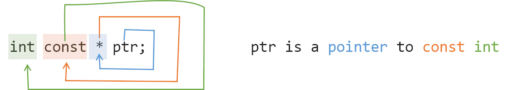
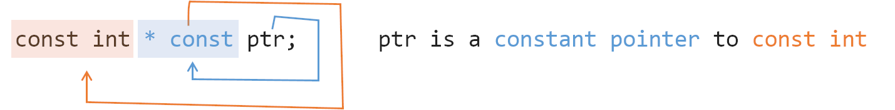
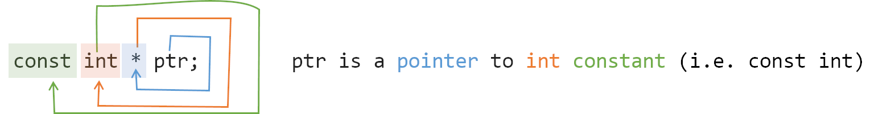
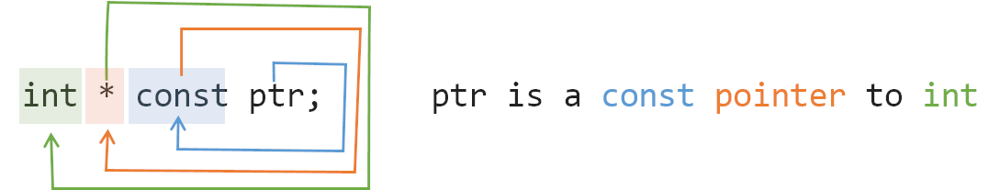

#### constexpr

常量表达式，可以作用在变量和函数上，一个 constexpr 变量是一个**编译时**完全确定的常数。一个 constexpr 函数至少对于某一组实参可以在编译期间产生一个**编译期**常数。

const只保证了运行的时候不直接被修改。

**template的非类型模板参数**以及**数组大小值**都是需要常量表达式的地方


对于函数：如果传入运行时参数，函数会在运行时执行，如果传入编译时常量，函数会在编译时执行。函数体内智能包含编译时可执行的语句。

#### consteval

只能参与函数的声明。

使用`constexpr`声明的函数，其返回值可以被用于常量表达式中。但是，`constexpr`没有限定函数*只能*被用于常量表达式中。 `constexpr`函数仍然可以用于一般表达式中。

对于某些编译器（例如 clang 以及不带优化选项的 gcc），调用以`constexpr`声明的函数只有在常量表达式中才会被展开（其他情况仍然会在运行时调用）。例如：

```
constexpr int sqr(int x) {
  return x * x;
}

int foo() {
  int x = doSomething();
  return sqr(x);  // OK, sqr will be called during runtime
}

int foo() {
  return sqr(5);  // runtime
}
```

`consteval`则可以看作是**更加严格**的`constexpr`，它只能用于函数的声明。当某个函数使用`consteval`声明后，则所有**带有求值动作**调用这个函数的表达式必须为常量表达式。

**不带有求值动作**的调用`consteval`函数的表达式不需要为常量表达式

如：```decltype(sqr(y))```


