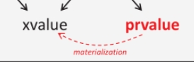

# move&forward&value

参考链接：https://zhuanlan.zhihu.com/p/335994370

## vaule语义

lvalue和xvalue 是描述对象或者函数位置的表达式。

**右值包含prvalue和xvalue**

**prvalue** （c++17以后语义发生了根本性变化）

是一个执行初始化动作，用于初始化**的表达式**，没有内存地址，没有身份。比如：

- `std::string("hello"); ` 临时对象
- `getValue(); `  函数返回值（非引用）
- `nullptr` ` true ` `42` 字面量（字符串字面量除外）
- `a + B` 运算表达式的结果（非引用）
- lambda表达式

**xvalue**

资源可以被复用，有内存地址，但是马上要die。

- `std::move(a)`
- `static_cast<char &&>(ch)`
- 亡值数组的访问。
- `a.x` a是右值且x非引用、非静态

## 临时量实质化

**notes：**

c++ 17引入**临时量实质化**。 **延迟对象的创建，直到最后一刻**



纯右值主要就是用来初始化的值。是一个**初始化指令**。纯右值不会产生实际存在的临时对象。

当我需要绑定引用，或者访问成员的时候，会进行实质化。如下：

纯右值转换到临时对象。`A().x`中 `A()`就被从纯右值转换成了亡值，去访问

> **任何完整类型 T 的纯右值，可转换成同类型 T 的亡值**

**for what?**

- 技术上：为了实现c++17的强制rvo/nrvo。
- 效果上：传递未实质化的对象。

```c++
struct Immovable {
    Immovable() = default;
    
    // 删除了拷贝构造和移动构造
    Immovable(const Immovable&) = delete;
    Immovable(Immovable&&) = delete; 
};

// 函数返回一个 prvalue
Immovable make_it() {
    return Immovable(); // C++14: 错误！需要移动构造函数来从函数移出
                        // C++17: 合法！这只是返回一张蓝图
}

int main() {
    // C++14: 错误！需要移动构造函数来初始化 x
    // C++17: 合法！
    Immovable x = make_it(); 
}
```

---

```c++
auto&& result = std::move(s);  
```

函数调用如果返回右值引用类型则该表达式本身是xvalue。上述```std::move(s)```是右值（xvalue)

> **右值引用本身既可以是左值也可以是右值，如果有名称则为左值，否则是右值**
>
> ```ref_a_right```就是左值```std::move(a)```的返回值就是右值。

上面这句话其实表达不准确，因为值类型判断的是表达式，而不是某个类型（右值引用）。


**左值&右值**（引用）

表达式结束之后是否依然存在。持久/临时。在内存中是否占有确定位置。

也可以通过是否能取地址进行判断。（c++标准中规定，`&`的操作数必须是一个左值，虽然xvalue有内存，但是你无法通过取址运算符简单获取，所以这句话是**正确的**）


左值引用不可以指向右值，但const左值引用可以。

```const int &ref_a = 5;```

例如```void push_back(const value_type& val);```

保证了可以```vec.push_back(5)```


右值引用不能指向左值。可以修改右值。

```
int &&ref_a_right = 5;
ref_a_right = 6;
```

右值引用如何指向左值？可以使用std::move.

```
int a = 5;
int &ref_a = a;
int &&ref_a_right = std::move(a);
```

关键！：

**作为函数形参时，右值引用更灵活。虽然const左值引用也可以做到左右值都接受，但它无法修改，有一定局限性。**

**std::move**

可以将一个左值转换成右值，从而可以调用右值引用的拷贝构造函数。

> 从语义来说，是移动，接管资源，变为空。

**移动构造函数**
当拷贝构造函数由于要使用深拷贝，所以即使使用了左值引用避免传参的时候进行了拷贝，但是函数内部还是要拷贝的。

移动构造函数，把被拷贝者的数据移动过来，被拷贝者就不要了，这样避免了深拷贝。

> **注意：**以上两行是来解释移动构造函数的出现的原因，并不是std::move的功能。上述功能在构造函数中实现

包含如：重置数据指针等操作：但由于（上面提到的关键）const左值引用无法修改，左值引用又无法引用右值，所以使用右值引用和std::move来解决这个问题。

例：在vector的push_back或者emplace_back中使用move就可以提高性能，因为其避免了深拷贝，但是要注意原数据就无了。（对于push_back和emplace_back的区别见C++17)

> 并没有移动什么，单纯使用也不会有性能提升，相当于一个类型转换。方便接收参数，真正的移动语义是函数内部自己实现的，所以有性能提升

在overload resolution中xvalue被视为rvalue优先匹配移动构造函数或移动赋值操作符，而lvalue会匹配拷贝。

**std::move并未实现任何移动语义**

**注意**

对于基本内置类型，如int等，没有构造函数，没有移动语义，所以使用与否，emplace还是push没有任何区别。


---


#### 待补充或完善待消化待吸收：

**std::forward**

和std::move一样本身也是类型转换。其更加强大，move只能转出右值，但是forward都可以。主要用于模板编程的参数转发中。

```std::forward<T>(u)```

- 当T为左值引用类型时，u将被转换为T类型的左值
- 否则u将会被转换为T类型的一个右值


xvalue **可以**出现在赋值号左边（LHS），前提是该对象的赋值运算符没有被“引用限定符（ref-qualifier）”禁止。

```c++
struct S {
    S& operator=(int) { return *this; } // 普通赋值
};

void func() {
    S s;
    std::move(s) = 10; // <--- 合法！
    // std::move(s) 是 xvalue。
    // 这里调用了 S::operator=(int)，这是完全合法的。
}
```

**只有**当类明确加了 `&` 限定符时，xvalue 才不能赋值：

```c++
struct SafeS {
    SafeS& operator=(int) & { return *this; } // 只能被 lvalue 调用
};
// std::move(SafeS()) = 10; // <--- 只有这时才编译错误
```

