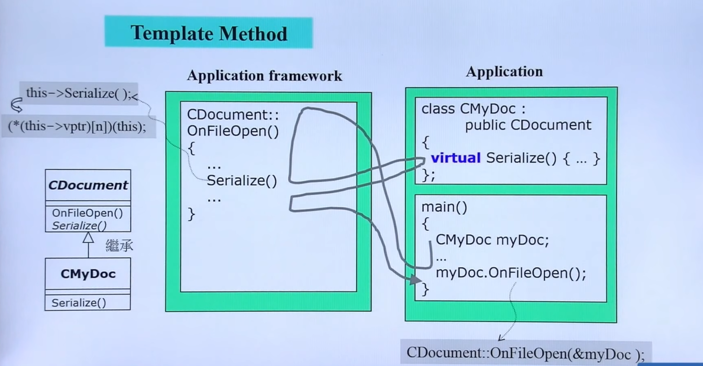
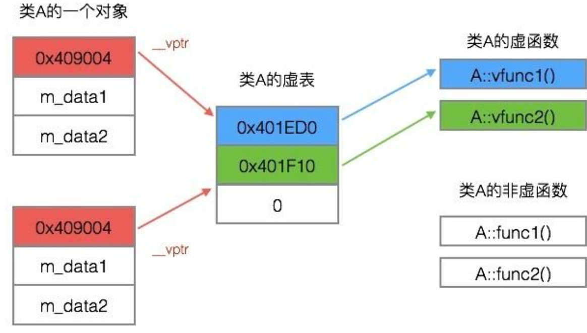
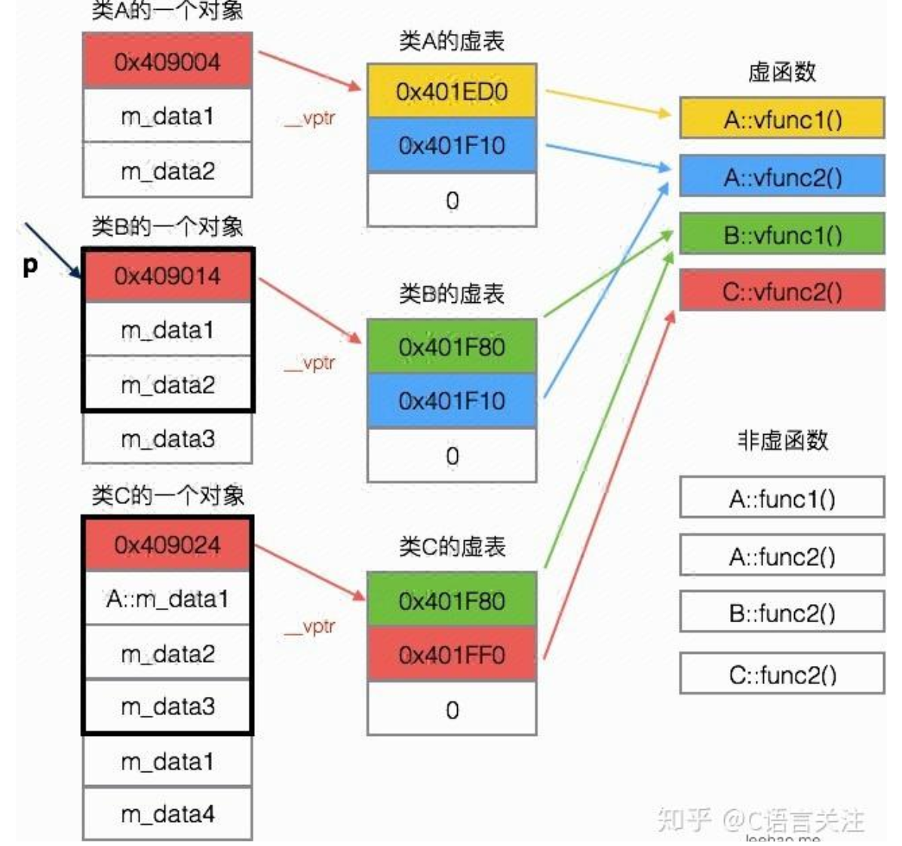
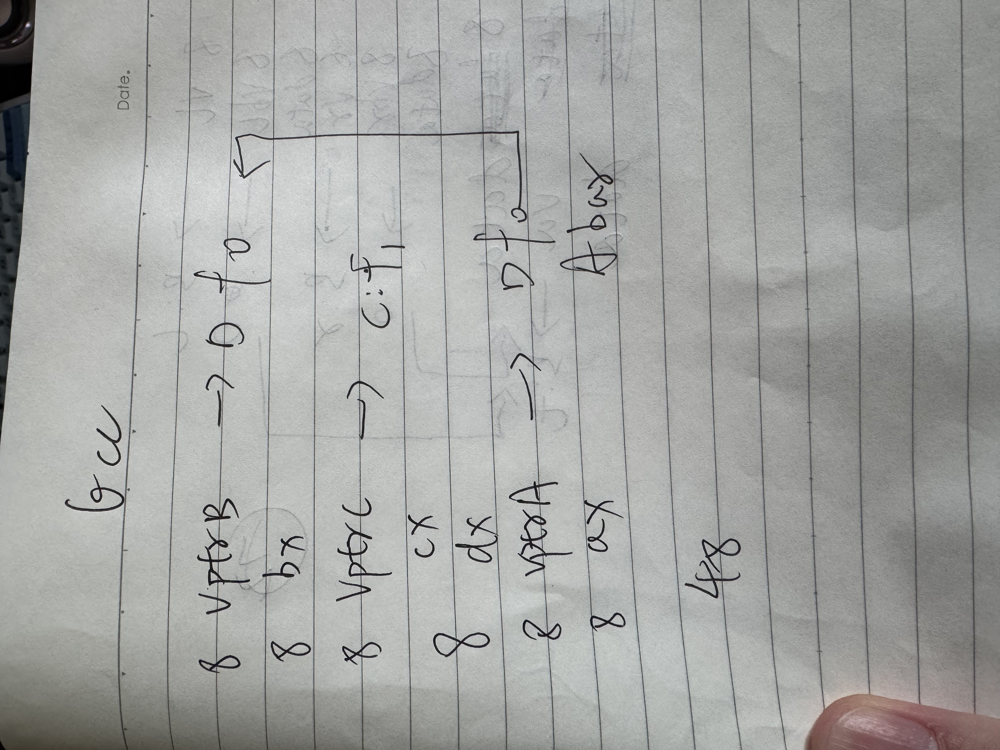
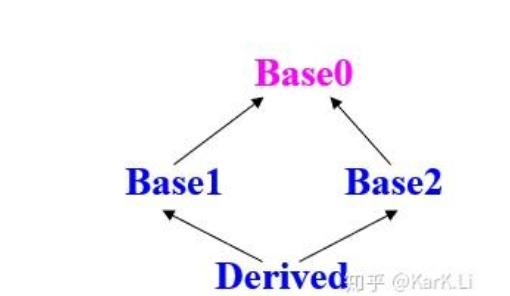

**虚函数**

关于继承，继承数据可以从内存的角度去理解，继承函数要从所有权继承来理解。

- non-virtual 不希望derived class override（这个名词只能在虚函数中用）
- virtual 希望derived class override 已经有默认定义。
- pure virtual derived class一定要override。

继承以后不写virtual也是可以的（多层也是）。

含有无定义的纯虚函数的类（抽象类），是无法实例化的，编译错误。

派生类指针指向基类是不合法的，编译错误

通过子类调用父类函数。父类进行一系列操作，将其中一个操作延缓（时空上）到子类执行（或实现）。是一种设计模式 **template method**

谁调用，传入的this就是谁。



**Q**:为什么构造函数不能为虚函数

存储空间：构造函数运行的时候，还没有分配内存，vtable自然也没有

构造函数不需要是虚函数，也不允许是虚函数，因为创建对象时我们总是要明确指定对象类型，尽管我们可能通过基类的指针或引用去访问它。

但析构却不一定，我们往往通过基类的指针来销毁对象。这时候如果析构函数不是虚函数，就不能正确识别对象类型从而不能正确调用析构函数：基类指针只调用基类析构函数。并为调用派生类析构函数。

**在构造函数和析构函数中执行虚函数？**

```
struct A
{
    virtual void f0() { std::cout << "A\n"; }

    A() { this->f0(); }

    virtual ~A() { this->f0(); }
};

struct B : public A
{
    virtual void f0() { std::cout << "B\n"; }

    B() { this->f0(); }

    ~B() override { this->f0(); }
};

int main()
{
    B b;
    return 0;
} // 输出：ABBA
```


**虚函数表**：

虚函数表只是一种编译器的实现，并不是c++标准规范中的内容。

对象头部8字节会存储一个指向虚函数表的指针。

虚表是一个存储“指向虚函数的指针”（**函数指针**）的数组。一个类只有一个虚表。

一种**不规范的访问虚函数表的方法**

```c++
using func = void(*)(void*); // 这里传入的this指针参数仍然是具体类型而不是void*
Triangle t = Triangle(100);
auto vptr = reinterpret_cast<void** >(&t);
auto vtable = reinterpret_cast<func*>(*vptr);
auto Test = *vtable;
Test(&t);
```

`void*`是不能解引用和指针运算的。因为不知道具体类型的大小，不知道要错过多少字节。但是`void**`是可以解引用的，因为`void*`是指针类型8个字节（也就是地址）。

```c++
void* obj_addr = &t; // 拿到了对象的首地址，对象的首地址存储的是虚表的指针，也就是地址。
// 我们想拿到这八个字节，但是不知道指向的对象是什么
// 我们告诉他是void*（一个指针），所以要把它转换成void**
// 比如存储的是type_a，那这里就要转换成type_a*
auto vptr = reinterpret_cast<void** >(obj_addr);
void* vtable_addr = *vptr; // 拿到了虚表的地址。
// 现在我们需要知道虚表存储的八个字节地址
// 我们告诉虚表指向的也是(一系列)void*
void** vtable = reinterpret_cast<void**>(vtable_addr);
void* func_addr = vtable[i]; // 访问 ，完全等价下面写法
// void* func_addr = *(vtable + i);
```

通过访问虚函数表并更改一定内存的权限，即可修改虚函数表。

**图解**：



```c++
class A {
public:
    virtual void vfunc1();
    virtual void vfunc2();
    void func1();
    void func2();
private:
    int m_data1, m_data2;
};

class B : public A {
public:
    virtual void vfunc1();
    void func2();
private:
    int m_data3;
};

class C: public B {
public:
    virtual void vfunc2();
    void func2();
private:
    int m_data1, m_data4;
};
```



> 动态绑定，其表现出来的现象称为运行时多态。动态绑定区别于传统的函数调用，传统的函数调用我们称之为静态绑定，即函数的调用在编译阶段就可以确定下来了。

只是在编译期生成了虚函数表，并不是确定了指针所指对象是什么，以及具体调用哪个函数的地址。

**静态绑定：** 汇编指令直接写死：`CALL 0x004015A0`。

**动态绑定：** 汇编指令写的是：

```asm
; 1. 拿到对象的地址
MOV EAX, [ptr] 
; 2. 拿到对象头部的虚表指针 (vptr)
MOV EDX, [EAX] 
; 3. 拿到虚表里第0项的内容 (真正的函数地址)
MOV EAX, [EDX] 
; 4. 调用那个取出来的地址
CALL EAX
```

**额外例子**：

```
struct A
{
    int ax;
    virtual void f0() {}
};

struct B : public A
{
    int bx;
    virtual void f1() {}
};

struct C : public B
{
    int cx;
    void f0() override {}
    virtual void f2() {}
};
```

```
                                                    C VTable（不完整)
struct C                                              +------------+
object                                                | RTTI for C |
    0 - struct B                            +-------> +------------+
    0 -   struct A                          |         |   C::f0()  |
    0 -     vptr_A -------------------------+         +------------+
    8 -     int ax                                    |   B::f1()  |
   12 -   int bx                                      +------------+
   16 - int cx                                        |   C::f2()  |
sizeof(C): 24    align: 8                             +------------+
```

> 单链继承的情况下，动态向下转换和向上转换时，不需要对`this`指针的地址做出任何修改，只需要对其重新“解释”

**虚继承/菱形继承**

在菱形继承之前，先看多继承的一个例子：

```
struct A
{
    int ax;
    virtual void f0() {}
};

struct B
{
    int bx;
    virtual void f1() {}
};

struct C : public A, public B
{
    int cx;
    void f0() override {}
    void f1() override {}
};
```

```
                                                C Vtable (7 entities)
                                                +--------------------+
struct C                                        | offset_to_top (0)  |
object                                          +--------------------+
    0 - struct A (primary base)                 |     RTTI for C     |
    0 -   vptr_A -----------------------------> +--------------------+       
    8 -   int ax                                |       C::f0()      |
   16 - struct B                                +--------------------+
   16 -   vptr_B ----------------------+        |       C::f1()      |
   24 -   int bx                       |        +--------------------+
   28 - int cx                         |        | offset_to_top (-16)|
sizeof(C): 32    align: 8              |        +--------------------+
                                       |        |     RTTI for C     |
                                       +------> +--------------------+
                                                |    Thunk C::f1()   |
                                                +--------------------+
```


**概念区分**

vptr通常是指vfptr，指向虚表的指针。

还有一种指针是vbptr用于实现虚继承。指向偏移量表，如果offset混合（合并两者）的话这个是没有的。

在MSVC中 vfptr和vbptr各占一个指针的内存。

**MSVC**

```
struct Alice {
	virtual void f() {}
	int a;
};

struct Bob : virtual Alice {
	int b;
};
```

```
struct Bob                                        
object                                          
    0 - struct Bob (primary base)                	+--------------------+
    0 -   vbptr_Bob ----------------------------->  |     offset 0    	 |    
    8 -   int b										|     offset 16      |
   12 -   padding									+--------------------+
   16 - struct Alice                                +--------------------+
   16 -   vptr_Alice --------------------------->   |   A::function f()  |
   24 -   int a     							    +--------------------+
   28 -   padding                
sizeof(C): 32    align: 8   
```

```
struct Alice {
	int a;
};

struct Bob : virtual Alice {
	virtual void f() {}
	int b;
};
```

```
struct Bob                                        
object                                          
    0 - struct Bob (primary base)                	+--------------------+
    0 -   vptr_Bob ----------------------------->   |    function f()    |
    												+--------------------+
    												+--------------------+
    8 -   vbptr_Bob ----------------------------->  |     offset -8    	 |    
   16 -   int b										|     offset 16      |
   20 -   padding									+--------------------+
   24 - struct Alice                                
   24 -   int a
   28 -   padding                
sizeof(C): 32    align: 8   
```

```
struct Alice {
	virtual void f() {}
	int a;
};

struct Bob : virtual Alice {
	virtual void f() {}
	int b;
};
```

```
struct Bob                                        
object                                          
    0 - struct Bob (primary base)                	+--------------------+
    0 -   vbptr_Bob ----------------------------->  |     offset 0    	 |    
    8 -   int b										|     offset 16      |
   12 -   padding									+--------------------+
   16 - struct Alice                                +--------------------+
   16 -   vptr_Alice --------------------------->   |   B::function f()  |
   24 -   int a     							    +--------------------+
   28 -   padding                
sizeof(C): 32    align: 8   
```

```
class Top {
public:
	virtual void t() {}
	long long data_top;
};

class Left : virtual public Top {
public:
	void t() override {}      // Override Top
	virtual void l() {}       // 新虚函数
	long long data_left;
};

class Right : virtual public Top {
public:
	void t() override {}      // Override Top
	virtual void r() {}       // 新虚函数
	long long data_right;
};

class Bottom : public Left, public Right {
public:
	void t() override {}      // Override Top again
	void l() override {}      // Override Left
	void r() override {}      // Override Right
	long long data_bottom;
};
```

```
sizeof(D): 72
```

```
struct A
{
	int ax;
	virtual void f0() {}
	virtual void bar() {}
};
struct B : virtual public A      
{                                     
	int bx;                           
	void f0() override {}
	// 是否有新虚函数
};                                    
struct C : virtual public A           
{                                     
	int cx;                           
	virtual void f1() {}              
};                                   

struct D : public B, public C
{
	int dx;
	void f0() override {}
};
```

**gcc等编译器**



**MSVC** **存疑**：

有一个看起来是多余的padding，且如果没有vptr会后置，让有vptr的C在前面。

```
class D size(72):
        +---
 0      | +--- (base class B)
 0      | | {vfptr}
 8      | | {vbptr}
16      | | bx
        | | <alignment member> (size=4)
        | +---
24      | +--- (base class C)
24      | | {vfptr}
32      | | {vbptr}
40      | | cx
        | | <alignment member> (size=4)
        | +---
48      | dx
        | <alignment member> (size=4)
        +---
        +--- (virtual base A)
56      | {vfptr}
64      | ax
        | <alignment member> (size=4)
        +---

D::$vftable@B@:
        | &D_meta
        |  0
 0      | &B::f2

D::$vftable@C@:
        | -24
 0      | &C::f1

D::$vbtable@B@:
 0      | -8
 1      | 48 (Dd(B+8)A)

D::$vbtable@C@:
 0      | -8
 1      | 24 (Dd(C+8)A)

D::$vftable@A@:
        | -56
 0      | &D::f0
 1      | &A::bar
```

```
class D size(64):
        +---
 0      | +--- (base class C)
 0      | | {vfptr}
 8      | | {vbptr}
16      | | cx
        | | <alignment member> (size=4)
        | +---
24      | +--- (base class B)
24      | | {vbptr}
32      | | bx
        | | <alignment member> (size=4)
        | +---
40      | dx
        | <alignment member> (size=4)
        +---
        +--- (virtual base A)
48      | {vfptr}
56      | ax
        | <alignment member> (size=4)
        +---

D::$vftable@C@:
        | &D_meta
        |  0
 0      | &C::f1

D::$vbtable@B@:
 0      | 0
 1      | 24 (Dd(B+0)A)

D::$vbtable@C@:
 0      | -8
 1      | 40 (Dd(C+8)A)

D::$vftable@:
        | -48
 0      | &D::f0
 1      | &A::bar
```

**解答**：

普通继承，因为基类是派生类一部分，所以内存会紧凑布局。

虚拟继承，默认不会#pragma pack。


https://zhuanlan.zhihu.com/p/136478734




base0有一变量a

```c++
Derived d;
d.a = 5 // error
d.B::a = 5 // okay
```

通过B::a和C::a访问的a**不是**一个a。

sizeof(D) = sizeof(B) + sizeof(C) + sizeof(data);


虚继承会解决副本问题。A的内存布局直接跑到最后。

在base1 和base2继承的时候，声明virtual这样就会只有一个a的副本。

```C++
struct A { virtual void func() { cout << "A"; } };
struct B : virtual A { void func() override { cout << "B"; } }; // B 重写了 A
struct C : virtual A { }; // C 没重写
struct D : B, C { };      // D 继承 B 和 C

int main() {
    D d;
    A* p = &d;  // 【完全合法】！虚继承保证了 A 只有一份
    p->func();  // 【多态生效】！输出 "B"
}
```

```c++
struct A { virtual void func() = 0; };
struct B : virtual A { void func() override { cout << "B"; } };
struct C : virtual A { void func() override { cout << "C"; } };

struct D : B, C {
    // 如果不写下面这行，编译直接报错！因为 B 和 C 打架了。
    void func() override { 
        B::func(); // 必须显式决定，或者写新逻辑
    }
};
```

```c++
struct A { virtual void func() = 0; };
struct B : virtual A { void func() override { cout << "B"; } };
struct C : virtual A { };

struct D : B, C {
};

int main()
{
	C c; // error C没有override 所以C是抽象类不能实例化。
    D d;
    d.func() // 会调用B的实现
}
```


