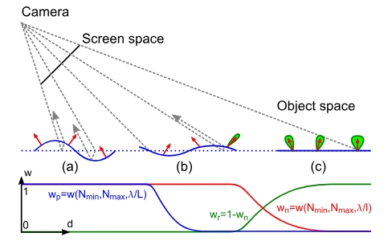

### Real-time Realistic Ocean Lighting using Seamless Transitions from Geometry to BRDF

---

主要是为了解决全尺度和全视距范围的aliasing问题，从近景到远景。

表面混合表示法。使用的仍然是fft pierson的频谱。

在屏幕空间使用规则网格渲染海洋，先投影到水平面，经波浪位移后再投射回屏幕空间。

每条蓝色波浪通过权重 wp（底部）进行衰减以避免走样和突变。红色像素法线由 w 独立计算并衰减，最终被绿色标注的法线分布（即 BRDF）替代。

- 当一个波浪相对于屏幕上的网格来说太小，此时会发生aliasing，会让波浪形状随着距离边缘而慢慢变成平坦的水面。

- 对于中间的视距仍然可以通过法线贴图来保留一些视觉细节。

- 在远景部分，波浪应该极小（甚至是比一个像素还小很多的微波），这时候将一些法线数据转化为**统计数据**，使用brdf保留一些细节。

以上全视距的**“接力棒（Seamless Transitions）”**就是该论文的核心阐述模型。

对于行星级别的渲染：

直接渲染一个球体，不需要网格位移，光照细节使用brdf的材质粗糙度来表现。

预计算一组2D环境贴图，查找对应的环境贴图，根据太阳天顶角，计算光照