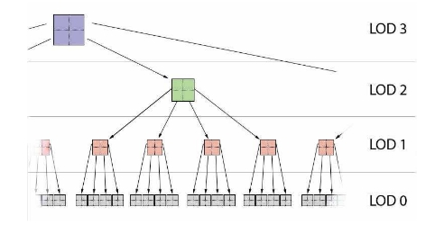
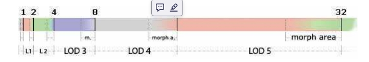
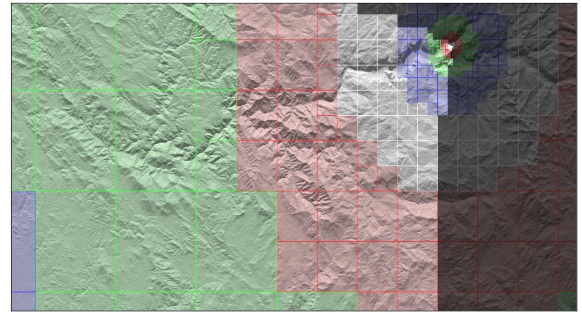
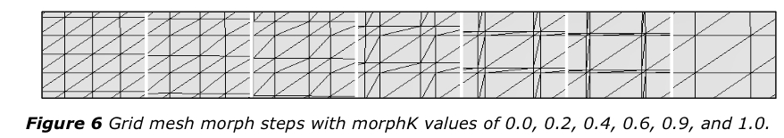

# CDLOD

## introduction

主要是解决了不同LOD之间的平滑过渡问题。并且由于其网格是规则的，对数据结构和并行运算比较友好。

之前的lod算法大部分都是cpu-based的.

固定网格渲染，和clipmap一样在vs中通过高度图数据对顶点进行偏移。

通过四叉树结构和一种新的lod系统来管理。

通过使用细分，可以充分利用shader model 5.0的最新特性。

### lod function

clipmap算法的一个显著缺点是其lod是基于二维的。

直接使用摄像机到顶点的3d距离。

计算简单且稳定。

### lod transition

t-junction问题：

在不同lod之间使用一些“缝合”。而这些“缝合”除了会增加渲染开销，还会增加artifacts

或者导致一些半透明问题。不同Lod层级的过渡也会导致popping。

而cdlod就解决了这些问题。no seams no artifacts

### data organization and streaming

## algorithm implementation

### overview

将一个高度图组织到quadtree中，在不同的lod等级选择正确的quadtree节点。

实际渲染的时候，通过一个唯一的网格(base grid)（通过缩放变形）来渲染选定节点覆盖的区域，在vs中读取高度图并偏移。通过实例化的方式绘制。

quadtree一旦创建就不会改变。

每个节点包含四个子节点，和最大最小高度值。

在streaming中所有的其他数据都是隐式生成的，内存使用更少，但略微复杂一些。

### quadtree and node selection

渲染的第一步就是进行节点选择。每一帧都需要进行。



树的深度就对应lod的某一层级

四叉树的每一个结点都必须使用相同数量的三角形来进行渲染。

### LOD distances and morph areas

为了确定在哪里选择哪些节点，会预计算每个LOD层覆盖的距离。

range array:



每一个距离是上一级的两倍。每一个Lod之间会有一个morph area,这个area覆盖了最后15%~30%的距离。


### quadtree traversal and node selection

从最顶层

```c++
// Beginning from the LODLevelCount and going down to 0;
// lodLevel 0 is the highest detailed level.
bool Node::LODSelect(int ranges[], int lodLevel, Frustum frustum)
{
    if (!nodeBoundingBox.IntersectsSphere(ranges[lodLevel]))
    {
        // No node or child nodes were selected; return false so that our
        // parent node handles our area.
        return false;
    }

    if (!FrustumIntersect(frustum))
    {
        // We are out of frustum, select nothing but return true to mark
        // this node as having been correctly handled so that our parent
        // node does not select itself over our area.
        return true;
    }

    if (lodLevel == 0)
    {
        // We are in our LOD range and we are the last LOD level.
        AddWholeNodeToSelectionList();
        return true; // We have handled the area of our node.
    }
    else
    {
        // We are in range of our LOD level and we are not the last level.
        // If we are also in range of a more detailed LOD level, then some
        // of our child nodes will need to be selected instead.
        if (!nodeBoundingBox.IntersectsSphere(ranges[lodLevel - 1]))
        {
            // We cover the required lodLevel range.
            AddWholeNodeToSelectionList();
        }
        else
        {
            // We cover the more detailed lodLevel range: some or all of our
            // four child nodes will have to be selected instead.
            foreach (childNode)
            {
                if (!childNode.LODSelect(ranges, lodLevel - 1, frustum))
                {
                    // If a child node is out of its LOD range, we need to
                    // make sure that the area is covered by its parent.
                    AddPartOfNodeToSelectionList(childNode.ParentSubArea);
                }
            }
        }

        return true; // We have handled the area of our node.
    }
}
```

在选择的过程中，我们要存储位置，size，lod level等等信息用于之后的渲染。

**部分渲染**：一个子节点是否渲染不取决于父节点及其其他子节点。

下图黑色部分就是cull掉的部分。



**frustum culling**

- 如果一个地形块在背后或者屏幕外，在cpu中遍历的时候就可以直接丢弃。

### rendering

迭代所有被选中的节点和他们的数据

### morph implementation



中间三角形，8个变为2个的过程。

逐渐放大两个三角形并缩小其余六个三角形。

此过程和之前的lod过渡不同。没有产生接缝或者tjunction。没有让顶点直接消失。

而是采取逐渐移动顶点的方案。

**如何移动？**

让所有奇数索引的点，平滑的移动到它的左边或者上边的偶数索引点上。

光栅化会自动略过面积为0的三角形。

```c++
// Morphs input vertex UV from high- to low-detailed mesh position
// - gridPos: normalized [0, 1] .xy grid position of the source vertex
// - vertex: vertex.xy components in world space
// - morphK: morph value

const float2 g_gridDim = float2(64, 64);

float2 morphVertex(float2 gridPos, float2 vertex, float morphK)
{
    float2 fracPart =
        frac(gridPos.xy * g_gridDim.xy * 0.5) * 2.0 / g_gridDim.xy;

    return vertex.xy - fracPart * g_quadScale.xy * morphK;
}

```

对于偶数索引 fracpart为0.0不动，对于奇数索引 fracpart为移动一个格子的距离

高度z的采样需要使用双线性过滤，平滑过渡，避免产生跳变。

**一致性**：

在morphK进行选择的时候，两个node之间公用的顶点，可能会因为微小误差而选取不同的morphK而导致裂缝。

因此需要确保node公用的顶点选取的morphK一致。

因此这里采取近似距离,忽略高度（因为采样可能导致细微误差），这里的近似值，只是在morphK计算的时候采取。

3d距离的计算选取lod仍然是在cpu中进行的，近似计算和变形是在gpu中的。

