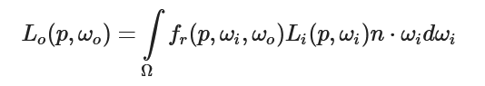

# PBR review

- 微表面模型：roughness参数，表示微表面朝向半程向量的比例。此项控制的是镜面反射
- 能量守恒：出射小于入射，假设折射光全部被吸收。考虑折射光弹出的技术为sss。

折射是漫反射的成因，但是这里进行了简化，用lamberian漫反射项代替了sss。

对于金属，折射光全部被吸入，没有漫反射项。

```c++
float kS = calculateSpecularComponent(...); // 反射/镜面 部分
float kD = 1.0 - ks;                        // 折射/漫反射 部分
```

## rendering equation

