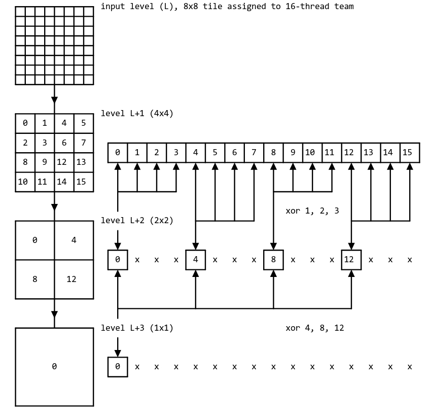

# nvpro_pyramid

传统的cs做法是多次dispatch，每一个层级dispatch，然后barrier，并且会使用L2 cache甚至主内存。

## intro

**nvidia**采取了一种新的方法：

> NVIDIA Vulkan Compute Mipmaps Sample [见https://github.com/nvpro-samples/vk_compute_mipmaps/blob/main/docs/strategy.md.html]

- 一级mipmap的输出可以立即用作下一级mipmap的输入，在单次dispatch中连续生成多个层级，最小化同步的开销，减小barrier的使用（每N个层级使用1个barrier）
- 并且可以保存到 shared memory/L1 cache甚至是register file。通过shuffle操作给另一个warp的core。减少访存的开销。

## 两种管线

`NVPRO_PYRAMID_IS_FAST_PIPELINE`

- Fast pipeline shader: 高效处理2的次幂情况，处理偶数且支持subgroup shuffle的情况，每个dispatch最多处理6个mip层级（记为M)。

  生成M个层级，要求输入层级能被均匀划分为$ {2^M} * {2^M} $的tile
- General Pipeline shder: 负责处理剩下的，尺寸为奇数或者缺少相应功能，最多只能处理2级。消耗更高。如果处理过程中又满足Fast Pipeline条件就又回去。

不要求在single pass中生成所有层级，如果single dispatch无法覆盖所有level则会发出更多的dispatch。

这样做的一个**好处**是，快速管线可以用于其原始 2 的幂次方用例之外的情况：如果基础 mip 层级具有偶数维度（但不一定是 2 的幂次方），快速管线可用于生成前几个 mip  层级（数据主体所在之处），而通用管线仅用于填充 mipmap 金字塔相对微小的“顶部”。例如：

- 图像尺寸 1920×1080：划分为 8×8 的tile，使用 `fastPipeline` 填充前 3 个层级，然后切换到 `generalPipeline` 。
- 图像尺寸 2560×1440：划分为 32×32 的tile，使用 `fastPipeline` 填充前 5 个层级，然后切换到 `generalPipeline` 。

## fast pipeline

处理偶数情况（不一定非要是2的次方）。

填充M个层级，我们就需要($2^M$,$2^M$)尺寸的tile。每个tile会被分给一个线程组，线程组的大小就取决于tile尺寸 。

一般为了让fast pipeline至少能执行两个level，要求尺寸为4的倍数。

### 1 level

这是个退化情况，2x2的tile是，四个采样点（或者直接使用硬件filter），每个线程reduce一个tile到L+1。

### 2 level

如果一个image可以被划分4x4的tiles，然后其中的每个4x4tile需要1个线程组，一个线程组也就是4个线程（每个线程处理周围的4个texel)。

```
input level
 +-------+       +---+---+       +-------+
 |       |       | 0 | 1 |       |       |
 |  4x4  | ====> +---+---+ ====> |   0   |
 |       |       | 2 | 3 |       |       |
 +-------+       +---+---+       +-------+
```

在level+1，这一个线程组中的0号使用`subgroupShuffleXor`来获取1,2,3线程的值，生成最终的1x1(其余线程则处于空闲状态)。

### 3level

类似的。这样每个线程组16个线程。

```
input level (L)            level L+1                level L+2
+---------------+       +---+---++---+---+       +-------++-------+
|               |       | 0 | 1 || 4 | 5 |       |       ||       |
|               |       +---+---++---+---+       |   0   ||   4   |
|               |       | 2 | 3 || 6 | 7 |       |       ||       |
|      8x8      | ====> +===+===++===+===+ ====> +=======++=======+
|               |       | 8 | 9 ||12 |13 |       |       ||       |
|               |       +---+---++---+---+       |   8   ||  12   |
|               |       |10 |11 ||14 |15 |       |       ||       |
+---------------+       +---+---++---+---+       +-------++-------+
```



>在 warp 大小为 32 个线程的情况下，每个 warp 实际上运行着两个这样的归约算法，分别由低 16 位和高 16 位线程执行。

### 4~5 level(shared memory)

比如level 4需要64线程，但是NVIDIA一个warp只有32线程，使用掩码 32 或 48 进行 xor-shuffle 将产生未定义的值。

64线程分成4个包含16线程的子组，每个子组跑一遍 8x8的3-level。每个子组到最后变成了1x1，每个子组的0号线程把自己的L+3写到shared memory中，然后barrier()一次。再由整个大组的0号线程去shared memory中读四个值，reduce成最终的1x1

level 5 也类似，256线程，分成16个16线程子组，跑3-level，变1x1。通过shared memory共享结果以后，再做一组2level

综上流程：

- level 4 = 4 x 3-level  -> shared memory -> 1-level -> 1x1
- level 5 = 16 x 3-level -> shared memory -> 2-level -> 1x1

不同warp之间使用shared memory以及同步，仍然要比不同dispatch,通过主存和L2 cache来得快。

### 6 level

1024线程 32x32。

如果采用类似4、5level的做法：分成16线程的子组跑3-level -> 8x8 再做 3-level到1x1。这种方法在实际应用中表现不佳。

可能的原因：

- 线程只有最开始的一级1024线程能完全利用，越到后面闲置的线程越多（宏观看)
- SM有block\warps\thread限制，一个blocks线程多，粒度就很大，一个SM有线程限制，无法容纳下两个block(部分不可以，因为要求block内部能共享内存)。此时一个block = 32warps,SM最大能容纳48warps。gpu occupancy = 32 / 48 = 0.667,跑不满。(单个SM看)
- 子组越多，那么读写sharedmemory的次数也越多，就更耗时。

采用方法：使用256线程，在第一级中，处理生成的纹素更多。也就是每个线程子组要运行四次。

level 6 = 1-downsampling + 5-level

**6-level的必要性**

挤出第 6 级 mipmap 对于 2048×2048(6+5/5+5+1) 和 4096×4096(6+6/5+5+2) 尺寸的图像是一项值得的优化（可以少dispatch).

当dispatch数量相同的时候尽量不选择6-level的方法。

## general pipeline

每次的dispatch最多生成2个mip levels。

### kernel

使用的卷积核从1x1~3x3的任意值（不包括1x1)

层级N的尺寸为$ (D_0,D_1) $,则生成N+1层的kernel size $(k_0,k_1)$由以下公式确定：
$$
k_i=
\begin{cases}
1\qquad D_i=1 \\
2\qquad D_i even\\
3\qquad D_i odd \, and\, D_i≠1\\
\end{cases}
$$
简单说，就是**维度为偶数采样2，维度为奇数采样3**（因此每个线程可能采样的纹素组合有：1*2、1*3、2*2、2*3、3*2、3*3）

### complication
二次幂尺寸的优点就在于，每个采样点在生成下一层级的时候仅会被采样一次。

非二次幂尺寸，有的采样点取药被采样多次，例如：5x5缩减到2x2

```
+---+---+---+---+---+        +---------+---------+
|   |   | 2 |   |   |        |         |         |
+---+---+---+---+---+        |         |         |
|   |   | 2 |   |   |        |         |         |
+---+---+---+---+---+        |         |         |
| 2 | 2 | 4 | 2 | 2 | =====> +---------+---------+ (each sample generated with 3x3 kernel)
+---+---+---+---+---+        |         |         |
|   |   | 2 |   |   |        |         |         |
+---+---+---+---+---+        |         |         |
|   |   | 2 |   |   |        |         |         |
+---+---+---+---+---+        +---------+---------+
```

### 1 level

和fast流水线一样，就是卷积核不同，每个生成sample对应一个线程。

### 2 level

128线程，每个子组最终生成8x8的L+2tile。

我们需要计算在L要划分多大的tile。因为stride是2（mipmap都是2,对于其他downsampling可能有别的stride)

**倒推**

所以对于DxD的tile往上一层某一维可能是2D或者2D+1,取决于kernel_size是2还是3。

那么除了这种情况以外，对于L+2层可能有一部分没有办法完整划分出D*D(边角料)，只剩下很小的部分，甚至可能是1x1或者2x2。

那么这种情况对应的L+1层可能也就2x2，对于kernel_size为1的情况甚至可能有1.

这也就对应了文档中1x1~(2D+1)x(2D+1)的来源。

L层就是4D+3

**选取**

如果从当前输入 level 往下，**还至少有两层需要生成**，那就优先用 **general 2-level**。

只有在**只剩最后一层**没生成的时候，才会落到 **general 1-level**。

**过程**

L层生成L+1的结果要存储在shared memory中。shared memory中图块最大的尺寸为17x17

barrier后第二次dispatch再取这个结果。

因为一个线程组的只有128个，所以可能一次处理不完一个tile，可能进行多次处理。

**Notes**

128和8是经过脚本测试选出的。

## 例子

看size是否有奇数，如果都是偶数，我们需要找到能整除的最大尺寸，填充M个层级，我们就需要($2^M$,$2^M$)尺寸的tile。

如果碰到奇数就切换到general pipeline

- L0 = 1920×1080
- L1 = 960×540
- L2 = 480×270
- L3 = 240×135
- L4 = 120×67
- L5 = 60×33
- L6 = 30×16
- L7 = 15×8
- L8 = 7×4
- L9 = 3×2
- L10 = 1×1

1920x1080能被8x8整除，做一遍fast pipeline的3-level

到L3之后135为奇数，一直做general 2-level.

最后做general 1-level

**Dispatch 1**：fast 3-level
 L0 → L1, L2, L3

**Dispatch 2**：general 2-level
 L3 → L4, L5

**Dispatch 3**：general 2-level （以此步骤为详细例子）
 L5 → L6, L7

L7为15x8则可以划分为一个8x8和一个7x8

对应到L6可以看到30x16都是偶数，则选取kernel_size为2，对应的tile大小为WG0 16x16以及WG1 14x16。

对应到L5 60x33，kernel_size为2x3，tile大小为WG0 32x33以及WG1 28x33.

**Dispatch 4**：general 2-level
 L7 → L8, L9

**Dispatch 5**：general 1-level
 L9 → L10

## benchmark

通过benchmark我们可以得到如下结论（推断/结果）：

- 对于2x2的核采用的是硬件双线性filter和blit一样，会比shader读取后再平均快一点。
- 减少dispatch次数是尤为重要的。
- nvpro_pramid优于fastpipeline + blit
- 高频次触发3x3内核会慢于blit 10%~20%

## tradeoff

- 尽量避免使用非2的次方图像（即使是偶数，在fastpipeline处理的过程中，可能会出现奇数）
- 若无法避免（例如用于屏幕空间效果），可考虑将图像降采样至下一个较低的 2 的幂次尺寸（例如从 2560×1440 降至 2048×1024），采用您选择的算法，然后基于降采样后的图像生成  mipmap。这样可将性能和/或质量损失仅限制在单次降采样过程，而非随每个 mip 层级累积。

