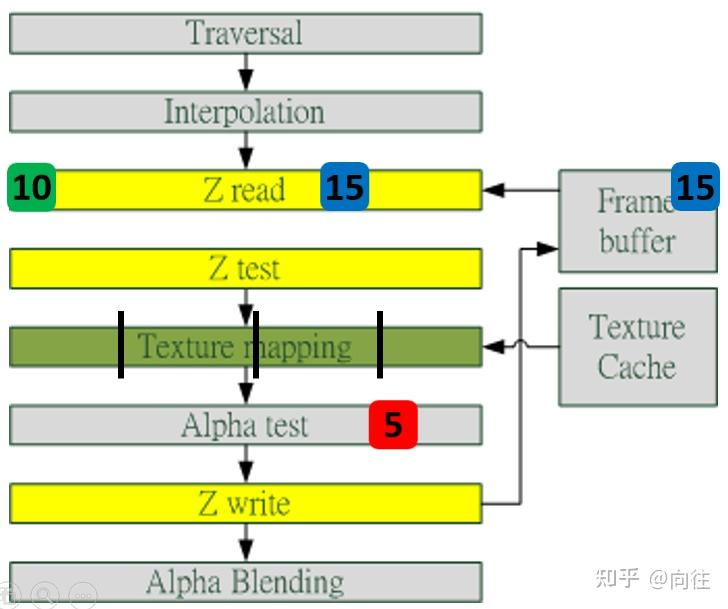

## 概念

early-z test是GPU硬件实现的。和depth prepass（软，自己手动做）的是两个概念

depth test发成在fs之后，但是我们在光栅化的时候就知道了每个fragment的深度，就可以提前做测试避免后面复杂的fs计算过程。

条件：

- 不能使用alpha test。有半透明物体，如果开启depth test需要置于alpha test后，所以不能提前剔除。
- 不能texkill/discard。
- 不能在fs中写depth。
- 开启multi-sampling。多采样会影响周边像素，earlyz无法知道周边像素是否被clip。

**深度冲突问题**：例子要结合上图，假设数值深度值5已经经过Early-Z即将写入Frame  Buffer，而深度值10刚好处于Early-Z阶段，读取并对比当前缓存的深度值15，结果就是10通过了Early-Z测试，会覆盖掉比自己小的深度值5，最终frame buffer的深度值是错误的结果。

避免深度数据冲突的方法之一是在写入深度值之前，再次与frame buffer的值进行对比

【遗留】https://community.khronos.org/t/early-z-and-discard/74748

https://zhuanlan.zhihu.com/p/545056819

multisampling的问题

【待看完opengl pipeline再进行补充】。