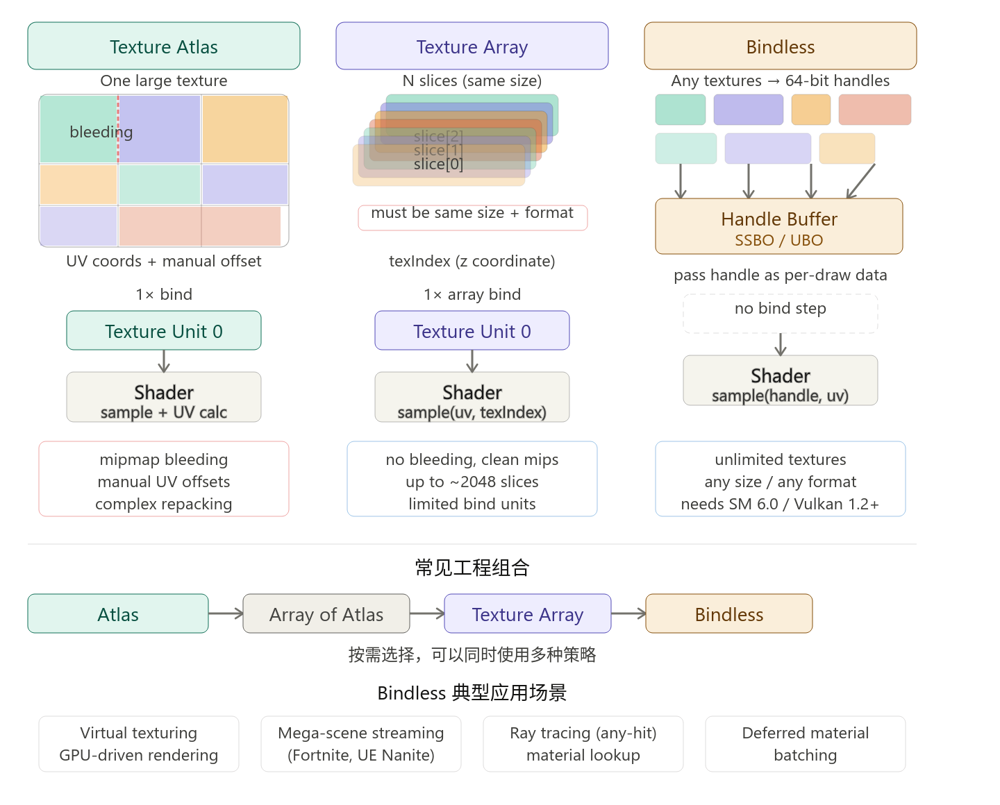

### texture atlas

将很多的小纹理，打包成一张大纹理，通过uv坐标偏移来采样不同的区域

**pros**

减少bind

**cons**

- 对mipmap不友好，需要加入padding。
- atlas大小受到限制

### texture array

相同尺寸、相同格式的纹理层。GPU原生支持。

每一layer都可以单独更新。

layer层数也是有限制的。

---

对于大量相同尺寸的纹理，或者需要动态更新的场景，需要使用texture array。

对于纹理尺寸差异较大，或向下兼容es2.0等场景，需要使用atlas。

对于动态访问大量的任意纹理，就需要使用bindless rendering。

---

### bindless

texture array仍然受到绑定点数量的限制。bindless用于解决这个问题

核心机制是：给每张纹理生成一个 64-bit `resident handle`，把这个 handle 当作普通数据（UBO/SSBO）传入 shader，shader 里直接通过 handle 采样，不再经过固定的 texture unit 绑定点。

例如vulkan的descriptor_indexing

对于一个shader如果需要动态（运行时临时决定）访问某个纹理，不可能预先绑定所有纹理，那么这个时候就需要使用bindless texture。

最常用于GPU driven。