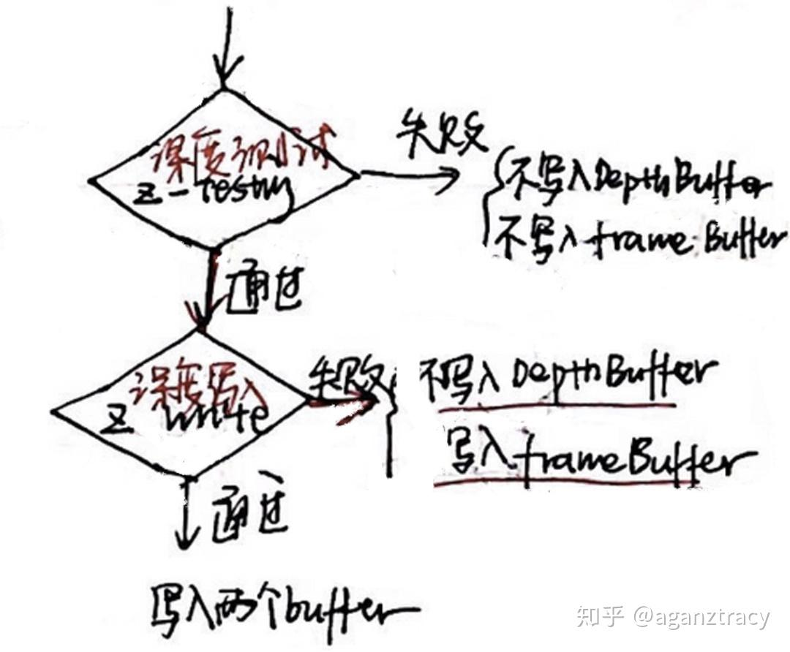
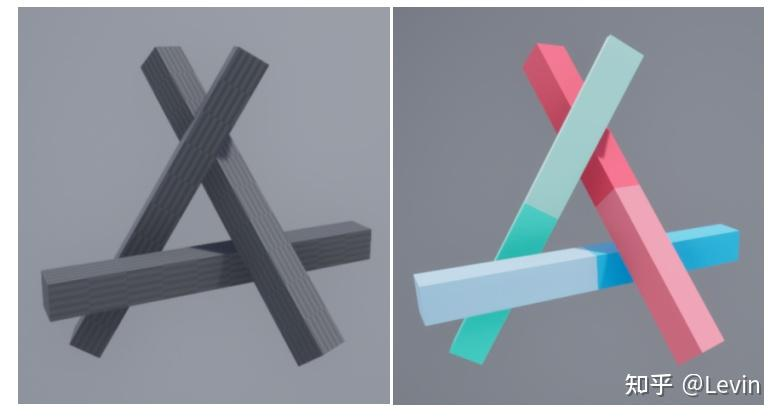
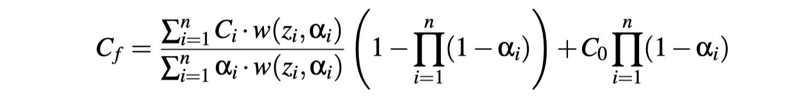

https://zhuanlan.zhihu.com/p/263566318

### 1.场景中只有不透明物体

深度缓冲区 zbuffer。渲染顺序不影响结果

### 2.场景存在半透明物体

先画不透明物体（无顺序要求），再渲染全透明物（alphatest),最后画半透明物体（开启深度测试，关闭深度写入，并严格按照画家算法alphablend,颜色混合）。

排队问题：unity中使用的是renderqueue

### 3.半透明物体交叠问题

- 分割物体
- 多pass渲染

等...

见后**顺序无关的半透明渲染**

## 补充内容

**alpha blending**
$$
color = srcColor * srcFractor + dstColor * dstFractor
$$
**alpha-test**

并未实现半透明效果，设定阈值，小于阈值，直接舍弃当全透明，剩下的当不透明处理，通常在管线中test之前。

**early-z**

将深度测试提前到片元着色器之前（节省 计算光照、颜色的时间）只适用于不透明物体。虽然提前，但是在最后阶段深度测定是还是要进行的。

alphatest和earlyz有冲突。

# 半透明顺序无关渲染 OIT

https://zhuanlan.zhihu.com/p/487577680

通过公式变换使得混合操作符合交换律，从而变得无关

Blended OIT算法

