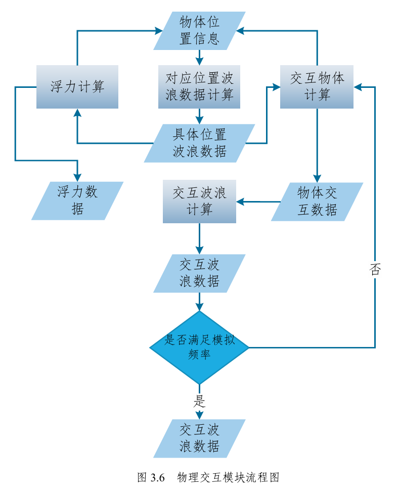
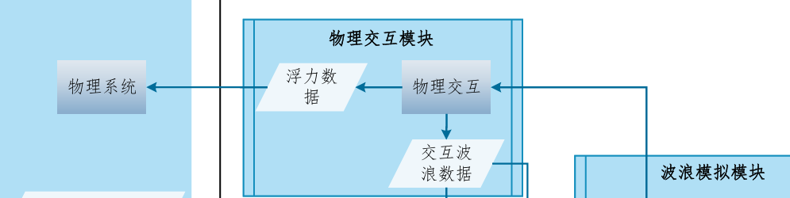

# Dynamic Wave

相关文件：

- source/ocean-pass.cpp
- source-physical-interaction/dynamic-wave-pass.hpp[.cpp]
- runtime/effect/dynamic-wave.fxg
- runtime/shader/collision/*
- runtime/pass/collision/sphere-water-interaction-pass.json
- runtime/pass/collision/update-dynamic-wave-pass.json
- 

| Dynamic Wave            | Dynamic Wave Config | Simulation Frequency | float | 15.0      | 200.0                    | fps  | 交互波浪的模拟频率 |
| ----------------------- | ------------------- | -------------------- | ----- | --------- | ------------------------ | ---- | ------------------ |
| Damping                 | float               | 0.0                  | 1.0   | no degree | 交互波浪的衰减系数       |      |                    |
| Courant Number          | float               | 0.1                  | 1.0   | no degree | 控制波浪的传播速度       |      |                    |
| Attenuation In Shallows | float               | 0.0                  | 1.0   | no degree | 浅水中的衰减（暂未实装） |      |                    |
| Horizontal Displace     | float               | 0.0                  | 20.0  | no degree | 水平偏移系数             |      |                    |
| Displace Clamp          | float               | 0.0                  | 1.0   | no degree | 最大偏移系数             |      |                    |

调用顺序：ocean_pass中collision_query_pass ==>> Simple_Floating_Object_Service::current().update_floating_object_data() 

==>> Simple_Collision_Query::instance().set_buffer_then_update_queries(collision_query_pass.queue[0])

该模块负责两个部分，一个部分是根据获得的波浪数据，去计算物体所在位置的水面高度等，并以此对物体施加浮力，另一个部分是收集场景中与海洋接触的物体，并为其生成相应的交互波浪

