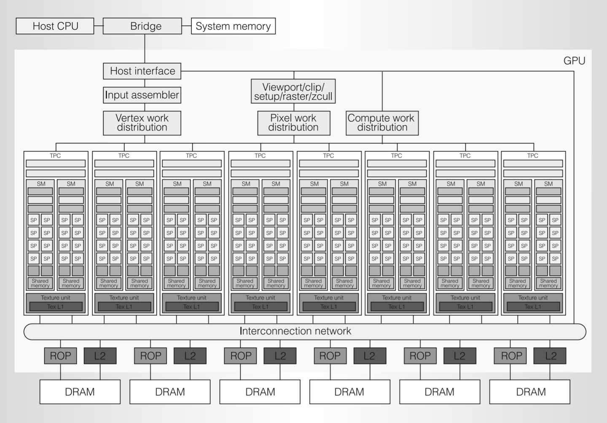
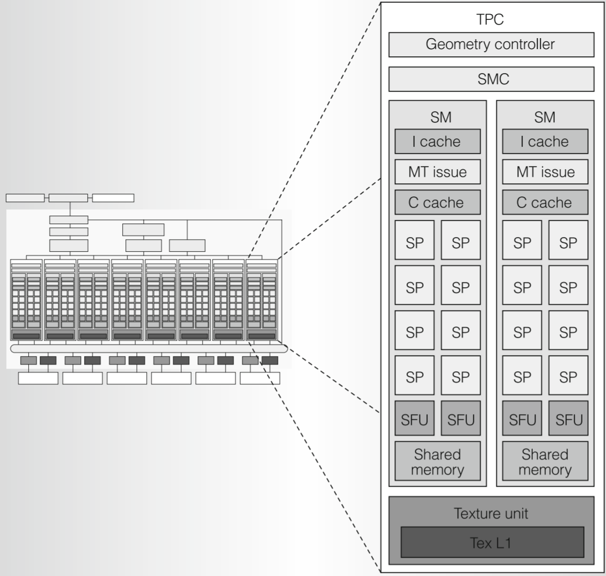
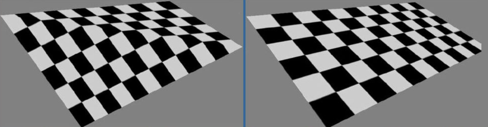
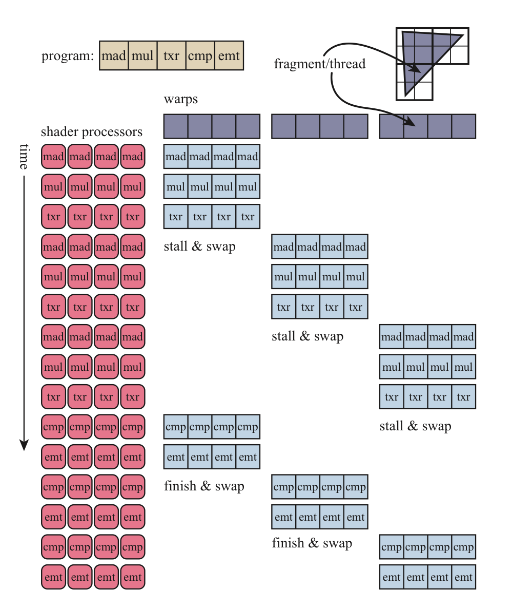
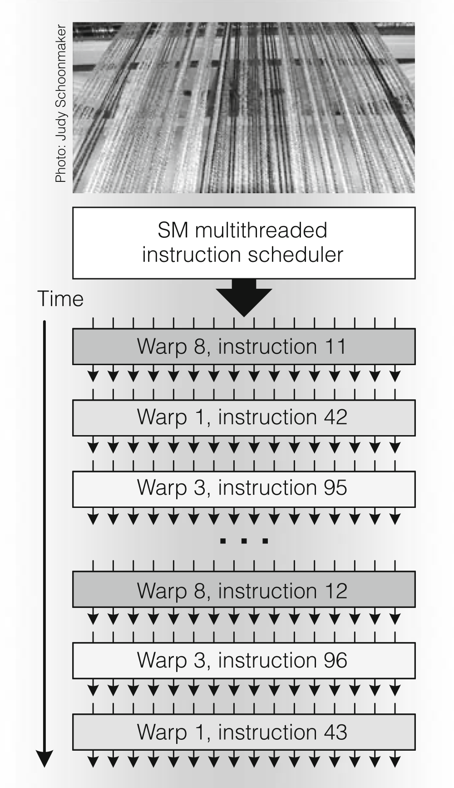
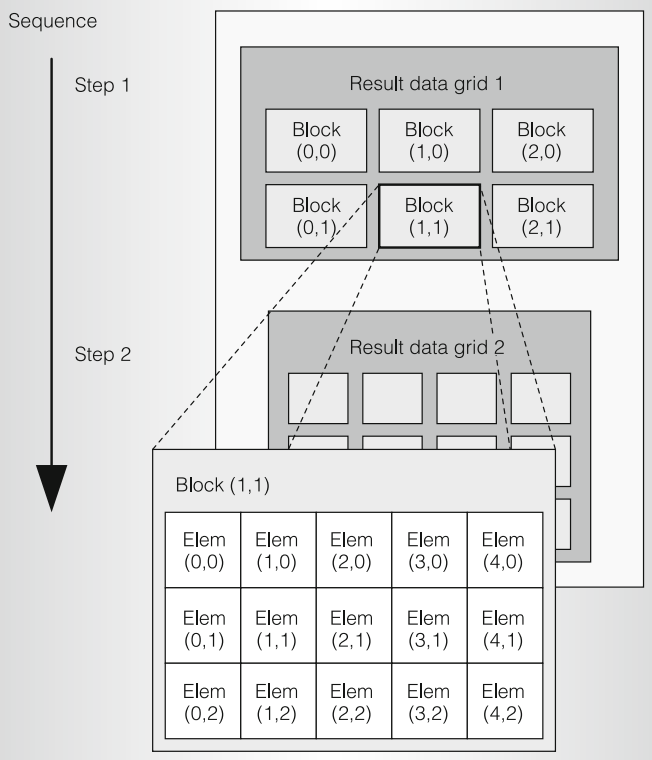
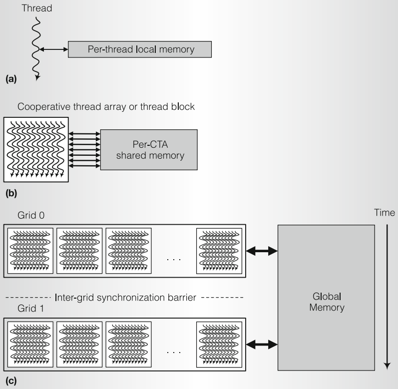

https://zhuanlan.zhihu.com/p/403354366

- host interface:主入口，负责接收命令和gpu的上下文切换，接收数据存储到VRAM中
- input assembler:组装顶点数据
- work distribution:分发任务给下面的TPC
- TPC：texture processing clusters = texture unit + SM * 2 （之后的架构叫GPC）
- viewport等等就是vertex post process的部分准备输出给fs
- ROP raster operations processor: ”码头工人" 进行逐片元操作。各种test等
- L2 cache Memory Controller DRAM:每个DRAM配一个MC一个L2和一个ROP。



- Geometry controller 负责顶点属性在芯片内的input/output。
- SMC：所有任务都是在统一的架构和硬件来运行的，
  - MC就负责将任务拆分打包成warp的粒度，交给其中一个SM处理。将工作拆分成32个一组。
  - 还协调SM和texture unit之间的工作（获取外部纹理资源）
  - 负载平衡
- Texture unit input:纹理坐标 output:经过filter的rgba
- SM streaming multiprocessor 底层负责运算的部门。“单发射、按 warp 广播一条指令”的 SIMT 机器。
  - l cache指令cache 从SMC获得的指令（程序的一条条指令）缓存下来，分批执行。
  - c cache 常量cache& shared memory
  - multi-threaded issue SM部门主管，拆分warp为一条条指令，**其对Warp的调度正是GPU并行能力的关键**
  - SP streaming processor，执行最基本的float标量运算，add/multiply/multiply-add以及整数运算
  - SFU special function unit 更为复杂的运算 指数、对数、三角函数、对片元属性做插值和透视校正(**!=透视除法在viewport/... TPC外部那个单元做的**)，



### 流程

**概念解释**

- 程序/shader: 会被编译器生成一份指令流，存到l-cache中。
- 线程：逻辑上的概念，一组线程执行同一段程序，但是每个线程都有自己的ID，状态，分支结果等等。
- warp: 32(tesla)个线程组成的调度单位即为warp。一个warp有一套共享的context，其中包括，当前执行的instruction的位置，哪些线程处于活跃状态(可能被stall)的掩码。由SM进行调度。warp的线程数量是固定的，如果执行次数小于32，那么剩下的就会空着。
- SP/SFU: 一个warp占用一组SP去跑，不同周期，不同warp可以轮流使用这些SP。
- SM调度：MTissue每个周期，从若干ready warps中选一个，去这个warp执行到的instruction，广播给这个warp的活跃线程去执行，这些线程就是占用SP来执行的。一个warp内部同一时刻只执行共同的命令。


1) shader里面会有向量表达式这类SIMD的指令，**编译器**会把他们拆成多条tesla SM标量指令。

2) SMC在拿到一个shader的所有指令后，打包成warp大小一组，让他们共享这条指令去执行这段程序(指令流）。

   warp是如何分组的呢？ 按线程分组，而不是SP，如果需要启动60个线程，那么就会分成2个warp，第二个warp会有4个无效线程。SP只有8个，那么每个warp就会执行四次。

3) 一个shader的所有指令就存储在l-cache中，只有一份。 mti每个周期选一个warp拿出一条指令，分发给自己的有效线程(线程占用SP)执行。

​	mti负责warp的管理和调度。


**不同分支**

这些SP/SFU都会执行发下来的同一条指令。

```c++
if (tid < 16)
    a = b + c;
else
    a = d * e;
```

硬件不能发射两条不同的指令流，对于不同的线程，可能会有不同的输入，也就是说不同的线程可能需要执行不同的分支，但是他们此时只能接收到同一条指令，那么不是当前指令的线程就会stall。不同分支的线程组会串行执行。

- 编译器分支预测
- warp voting
- 锁步运行

### warp 调度

**延迟隐藏**：



当遇到内存读写的时候，由SMC去调度内存，SMC可能给了一个SM很多个warp缓存在l-cache中，mti需要从多个warp中挑选拆分指令（也就是**调度**），给SP/SFU执行，不让SP/SFU**”闲下来“**

如何调度？

根据warp类型、指令类型等等量化调度



### 通用计算

https://zhuanlan.zhihu.com/p/425082340

对于图形渲染管线，一些阶段是固定的，内部的分配和调用都是隐藏的。

但是通用计算管线，分配线程，处理的工作等等都需要我们设置。以**根据具体任务，分配线程，并设计它们的协作模型以及数据依赖关系**。

**线程组织结构**



grid-block-thread

block包含多少线程是写死的，也是协作发生的组织单位(CTA， cooperative thread array)

里面的线程可以通过shared memory传递数据。

每个grid包含多少block是在调用的时候指定。block之间是完全独立的。


线程组这里的概念就和compute shader里面的工作组类似。

这些都是逻辑概念。

真正的并行单位是warp，硬件执行单元是SM。

所以就有了针对warp的优化：

- 最好为每个block分配整数倍的warp线程数，这样warp的线程能被充分利用，而不是还有无效的线程。
- 同一分支尽可能挤到同一warp里面
- 如果某个内存读写依赖都由一个warp执行，那么无须同步，因为本身就是锁步运行。

### 内存



**global memory**就是SM外面的哪个DRAM，每一块显存都会有一个L2 cache。DRAM和L2 cache都是SM共用的。

不同grid是串行的。

**一个Warp中的连续线程访问连续的内存，可以被合并为一条内存读取指令**


**shared memory**和L1 cache位于SM中，他们两个在之后的架构中占据相同的硬件单元，可以自由配置大小。

共享内存肯定比主存和L2 cache快。

对一个block内的所有线程可见。这意味着**一个block内所有线程必定位于同一个SM中**，所以一个block内线程数也是由限制的，因为一个SM容纳的warp也是有限的。


**bank conflicts**【详细见./bank conflict】


local memory/register files

每一个线程都有自己运行所需的局部变量，存放在register file中。在tesla v100中一个register file会有65536个(* xbit) registers

如果存不下会溢出到L1 cache中，如果还存不下会被一路驱逐出去，贬谪到L2甚至到主存中。（性能会受到毁灭性打击）。如果没有溢出，但是这些变量很多，在warp切换的时候会切换大量的上下文。

同时shader中也会需要寄存器，就会和warp context抢位置。shader中需要的寄存器越多，那么可用的warp就越少，可能造成内存读取延迟。

最初的局部变量其他线程是无法访问的，后来register file在SM中共享，还有interconnect network,且较新的硬件支持了**Shuffle操作**，可以在一个Warp的线程间直接传递数据，比通过共享内存来回读写数据还快。

