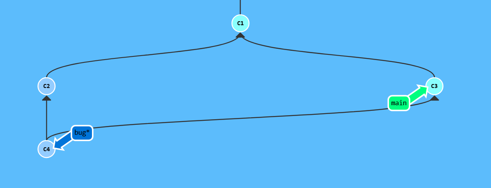
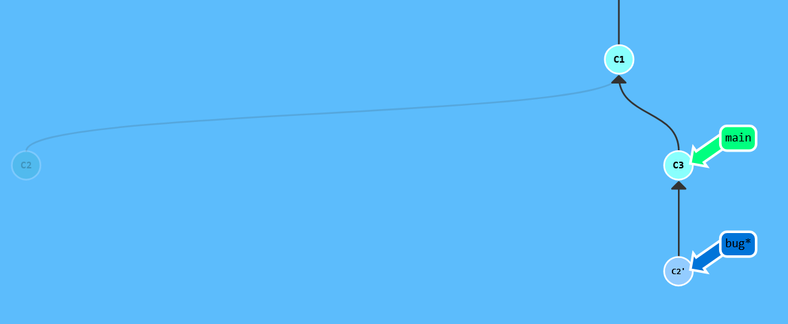
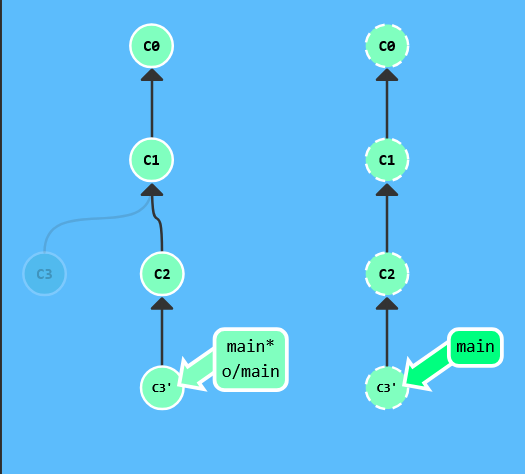
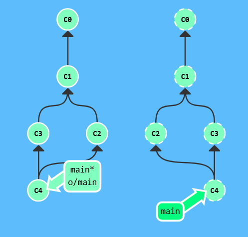

**git fetch**

从远程仓库拉取最近的提交，但并不会自动合并。会更新origin/main分支，但是本地的分支不变。

- ```git fetch <remote> <place>``` 不会更新本地的非远程分支

- ```git fetch <remote> <source>:<destination>``` 可以直接更新本地分支。o/source会被更新

如果<source>为空，则会在本地新建一个分支。

- ``` git fetch``` 拉取所有提交到本地的远程分支。

**git merge**

创建一个合并提交，保留两个分支的历史。



**git rebase**

git rebase upstream branch

upstream是reabase到哪个提交上，branch 会自动切换到这个分支。



将当前分支的提交"移动"到目标分支的最新提交之后，**重写提交历史**，使历史呈线性。不要在公共分支上使用。

**git pull**

=git fetch + git merge(origin/main)

git pull --rebase

=git fetch + git rebase(origin/main)

```
# 方法1：先看看有什么变化
git fetch origin
git log origin/main..main  # 查看差异
git merge origin/main      # 确认后再合并

# 方法2：追求干净历史
git pull --rebase origin main
```

注意：```git pull origin bar:bugFix```

git merge调用的是bugFix，而不是origin/bugFix

**git push**

- ```git push <remote> <place>```

```git push origin main```： 切换到本地仓库中的main分支，获取所有提交，提交到远程仓库中的main。

```<place>``` 指定的是同步的两个仓库的位置。

推送到远程仓库的同时，本地o/main也同时更新。 不关心当前分支在哪里。

- ```git push origin <source>:<destination>```

选取本地的某一个位置，提交到目的。source可以是git可以识别的任何位置。

解析该位置，上传所有未被包含到远程仓库里的main分支中的提交记录。

如果<destination>不存在会创建一个

如果<source>为空会删除远程仓库中的des分支


对于“模拟协作”的提交偏离，需要**先合并再push**，否则push会拒绝（应当让你的提交基于最新的远程分支）


**如何让你的提交基于最新的远程分支？**

> fetch + rebase/merge + push 常用工作流

都是先使用fetch拉取最新到本地的远程分支，接下来

- 使用rebase



- 使用merge

